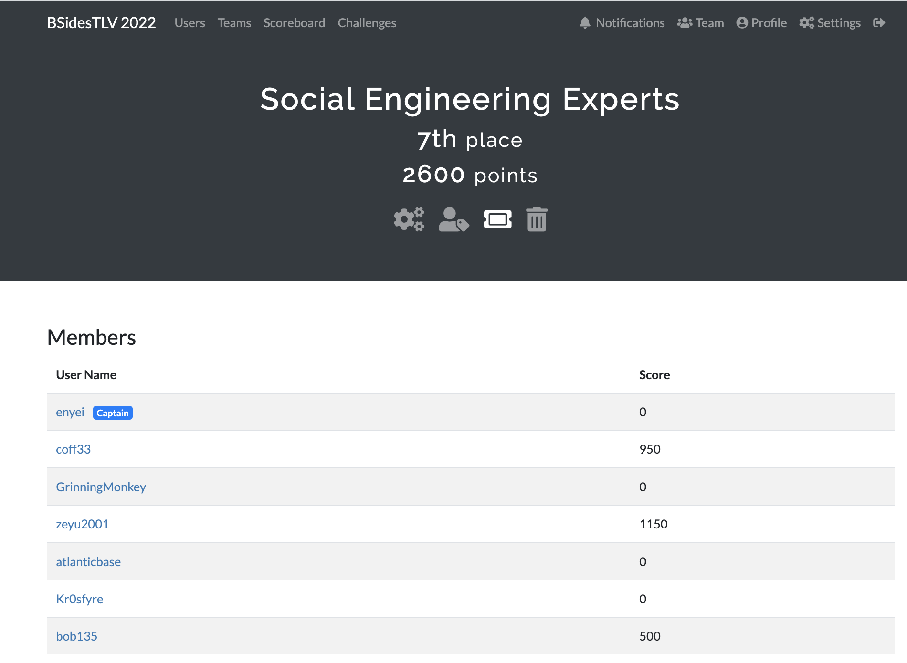

# BSidesTLV CTF 2022

<em>27 June = 29th June</em>

Was quite an enjoyable CTF with some high quality (and effort) challenges. Learnt quite a bit especially from the pwn challenges. Only problem was that the point weight wasn't particularly well thought out, as some 100 point challenges were significantly harder than 300 pt changes etc.

I played together with Social Engineering Experts and got 7th place.

| Challenge                  | Writeup Link                          | Tag                             |
| -------------------------- | ------------------------------------- | ------------------------------- |
| Pwn - We are hiring        | [here](./pwn/wearehiring.md)          | C operators, negative indices   |
| Pwn - n0tes                | [here](./pwn/n0tes/README.md)         | heap, tcache, unsorted bin, uaf |
| Crypto - High Expectations | [here](./crypto/high_expectations.md) | biased randomization            |
| Web - Roll the Impossible  | [here](./Web/roll_the_impossible.md)  | Decoding, Data Analysis         |
