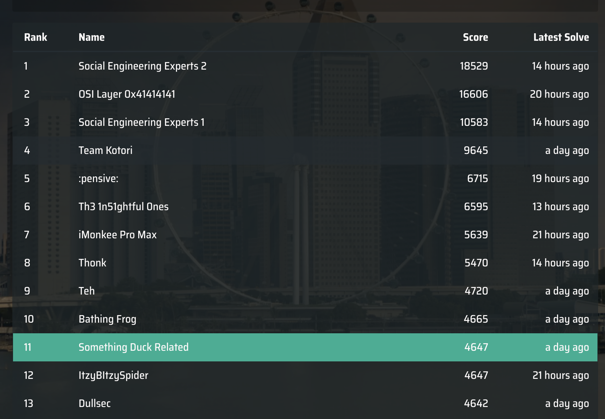

# CTF SG 2022

<em>12th March 2022</em>

A really fun CTF as well, the quality of challenges were really good and the infra was great as well.

I managed to solve 6 challenges and blood 2 of them as well which was quite fun.
I got 11th place with the Something Duck Related team.

Writeups available for

- Web (Wildest Dreams Part 2, Don't touch my flag)
- Crypto (Flag Secure Algorithm, XOR is not that hard)
- Misc (Chopsticks 1 & 2)

