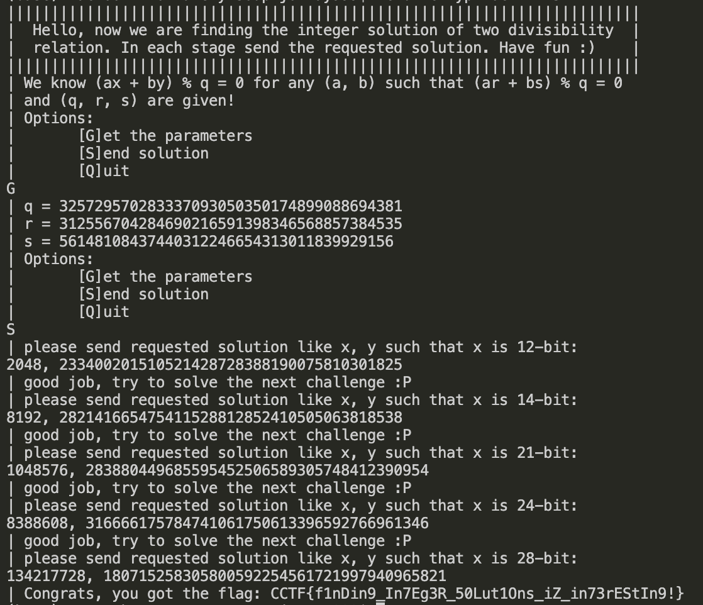

## Klamkin (Easy) - 83 solves

### Description/Source

```
||||||||||||||||||||||||||||||||||||||||||||||||||||||||||||||||||||||||
|  Hello, now we are finding the integer solution of two divisibility  |
|  relation. In each stage send the requested solution. Have fun :)    |
||||||||||||||||||||||||||||||||||||||||||||||||||||||||||||||||||||||||
| We know (ax + by) % q = 0 for any (a, b) such that (ar + bs) % q = 0
| and (q, r, s) are given!
| Options:
|       [G]et the parameters
|       [S]end solution
|       [Q]uit
G
| q = 224490285770321682606461173502326265411
| r = 36832841709076515032147614253207665787
| s = 30032559171722262237820217201429962140
```

The key of the challenge is that solving for 1 set of constants of `a` and `b` solves for every set of constant, so don't need to sweat the choice of `a` and `b`, just assuming one of them is 1 and do some basic modulo equation stuff to solve the other constant.

For solving the $(ax + by) \pmod{q} = 0$ equation, the key is just to assume any value of the constrained value, e.g. if $x$ has to be 12 bit, just set $x$ to be `1<<10 + 1` and then solve the equation for the remaining vairable. Similar to above, solving 1 equation solves every equation so don't sweat the choice of either $x$ or $y$

Just solve 5 of these and the solution pops out

### Solver

```python

q = 325729570283337093050350174899088694381
r = 312556704284690216591398346568857384535
s = 56148108437440312246654313011839929156

x = 1<<26 +1
print(x.bit_length())
# assert y.bit_length() == 12

a = 1
b = (-r * pow(s,-1,q)) % q
assert (a*r + b*s) % q == 0

y = ((-a*x) * pow(b,-1,q)) % q

assert (a*x + b*y) % q == 0
print(x,y)

```

### Flag

```
CCTF{f1nDin9_In7Eg3R_50Lut1Ons_iZ_in73rEStIn9!}
```


