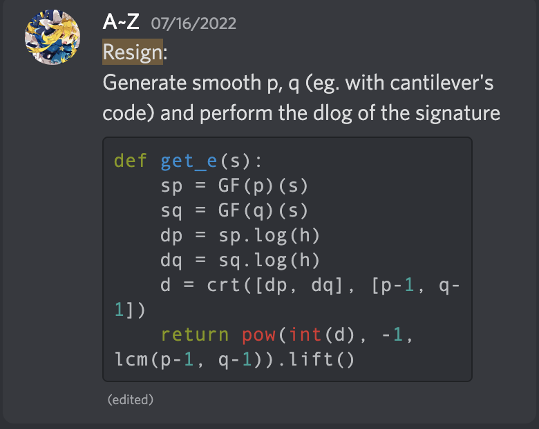

## Resign (Medium) - 35 solves

### Description/Source

```py
#!/usr/bin/env python3

from Crypto.Util.number import *
from hashlib import sha1
import sys
from flag import flag

def die(*args):
	pr(*args)
	quit()

def pr(*args):
	s = " ".join(map(str, args))
	sys.stdout.write(s + "\n")
	sys.stdout.flush()

def sc():
	return sys.stdin.readline().strip()

def main():
	border = "|"
	pr(border*72)
	pr(border, " Hi, Try to guess our RSA private key to sign my message, talented  ", border)
	pr(border, " hackers like you ;) are able to do it, they are *Super Guesser* :) ", border)
	pr(border*72)

	p, q = [getPrime(1024) for _ in '__']
	n, e = p * q, 65537
	phi = (p - 1) * (q - 1)
	d = inverse(e, phi)

	MSG = b'::. Can you forge any signature? .::'
	h = bytes_to_long(sha1(MSG).digest())
	SIGN = pow(h, d, n)

	while True:
		pr("| Options: \n|\t[G]uess the secret key \n|\t[R]eveal the parameters \n|\t[S]ign the message \n|\t[P]rint the signature \n|\t[Q]uit")
		ans = sc().lower()
		if ans == 'g':
			pr(border, f"please send the RSA public exponent and PARAMS p, q separated by comma like e, p, q: ")
			PARAMS = sc()
			try:
				E, P, Q = [int(_) for _ in PARAMS.split(',')]
				if P.bit_length() == Q.bit_length() == 1024 and P != Q:
					N = P * Q
					PHI = (P - 1) * (Q - 1)
					D = inverse(E, PHI)
					if pow(h, D, N) == SIGN:
						e, n, d = E, N, D
						pr(border, 'Great guess, now you are able to sign any message!!!')
					else:
						pr(border, 'Your RSA parameters are not correct!!')
				else: raise Exception('Invalid RSA parameters!!')
			except: pr(border, "Something went wrong!!")
		elif ans == 'r':
			pr(border, f'e = {e}')
			pr(border, f'n = {n}')
		elif ans == "p":
			pr(border, f'SIGN = {SIGN}')
		elif ans == 's':
			pr(border, "Please send the signature of this message: ")
			pr(border, f"MSG = {MSG[4:-4]}")
			sgn = sc()
			try:
				sgn = int(sgn)
				_continue = True
			except:
				pr(border, "Something went wrong!!")
				_continue = False
			if _continue:
				_MSG = MSG[4:-4]
				_h = bytes_to_long(sha1(_MSG).digest())
				if pow(sgn, e, n) == _h:
					die(border, "Congrats! your got the flag: " + flag)
				else:
					pr(border, "Sorry, your signature is not correct!")
		elif ans == 'q': die("Quitting ...")
		else: die("Bye bye ...")

if __name__ == "__main__": main()
```

We are given a signature $s = h^d \bmod n$ of a known message hash $h$, and the objective is to come up with new RSA parameters, $p,q,e$ such that the same equation holds.

The main logic is to come up with smooth primes such that the discrete log problem is easily solvable, however the problem is generating the primes properly. Not all primes will work, but they have a greater chance if $p-1$ and $q-1$ only share a gcd of 2.

The main logic for generating the answer to the discrete_log is through

```py
sp = GF(p)(s)
sq = GF(q)(s)
dp = sp.log(h)
dq = sq.log(h)
d = crt([dp, dq], [p-1, q-1])
```

There are 2 approaches, you can first generate your nice primes $p$ and $q$ that fulfil the above conditions and keep connecting to the server until your prime works, or connect to the server and keep generating primes that eventually work. (The first method is a bit faster in my opinion)

### Solver

```python
from pwn import *
from hashlib import sha1
from Crypto.Util.number import *
from sympy import *
from math import gcd

# nc 03.cr.yp.toc.tf 11137
host, port = "03.cr.yp.toc.tf" ,11137

MSG = b'::. Can you forge any signature? .::'
h = bytes_to_long(sha1(MSG).digest())

def gen_primes(nbit, imbalance):
	p = 2
	FACTORS = [p]
	while p.bit_length() < nbit - 2 * imbalance:
		factor = getPrime(imbalance)
		FACTORS.append(factor)
		p *= factor
	rbit = (nbit - p.bit_length()) // 2

	while True:
		r, s = [getPrime(rbit) for _ in '01']
		_p = p * r * s
		if _p.bit_length() < nbit: rbit += 1
		if _p.bit_length() > nbit: rbit -= 1
		if isPrime(_p + 1):
			FACTORS.extend((r, s))
			p = _p + 1
			break

	FACTORS.sort()
	return p


from sympy.ntheory import discrete_log
from sympy.ntheory.modular import crt

"""
x^e % n = h
x^e % p = h1
x^e % q = h2


crt([mods], [residues])
discrete_log(mod, residue, base b)
discrete_log(41, 15, 7)
3 ^ 15 mod 41 = 7
It's considerably faster when your prime modulus has the property where p - 1 factors into a lot of small primes.
"""
p = remote(host, port)
p.sendlineafter(b'[Q]uit\n', b'P')
p.recvuntil(b'| SIGN = ')
sig = eval(p.recvline().strip().decode('utf-8'))
print("Sig:", sig)
while True:
    try:
        smoothness = 19
        pp,qq = gen_primes(1024,smoothness), gen_primes(1024,smoothness)
        phi = (pp-1)*(qq-1)
        # qq = 165045206650908579037736019275164548249352748140140865322738536587413116145681609233642967749744281008958134740593406604658339451113831975908956806872350428377612084851874310998668516784031659539154269720702521805242048314447883854808775672025712387783452897368206696919953082560862496429977840059305487982379
        # pp = 127627165276150646228013123897934671386671336958649293289547113375201088762258735903915885724084167289865326800776388793004216358238960385154696784220029644083041122638902654996412115843230720296669976023045277346308988465696604295042658867337303262044646357732975568917957064182242973034717947923729341846679
        assert gcd(pp-1, qq-1) == 2, "GCD not 2"

        d1 = int(discrete_log(pp, sig % pp, h % pp))
        d2 = int(discrete_log(qq, sig % qq, h % qq))

        d = crt([pp-1, qq-1], [d1,d2])[0]
        e = pow(d,-1,phi)

        assert pow(h,d1, pp) == (sig % pp), "First Check"
        assert pow(h,d2, qq) == (sig % qq), "Second Check"
        assert pow(h,d, pp*qq) == sig, "Third Check"
        assert pp != qq and pp.bit_length() == 1024 and qq.bit_length() == 1024
        break
    except Exception as e:
        print("Error:", e)
        # p.close()


print(f"p: {pp}")
print(f"q: {qq}")
print(f"e: {e}")
print(f"d: {d}")

p.sendlineafter(b'[Q]uit\n', b'G')
p.sendlineafter(b"e, p, q: \n",f"{e}, {pp}, {qq}")
print('Res:',p.recvline().strip().decode('utf-8'))

MSG2 = MSG[4:-4]
h2 = bytes_to_long(sha1(MSG2).digest())
sig2 = pow(h2, d, pp*qq)

p.sendline(b'S')
p.sendline(str(sig2).encode())
p.interactive()

```

### Flag

```
CCTF{Unkn0wN_K3y_5h4rE_4t7aCk_0n_Th3_RSA!}
```


### References

- https://zhuanlan.zhihu.com/p/546270351
  
