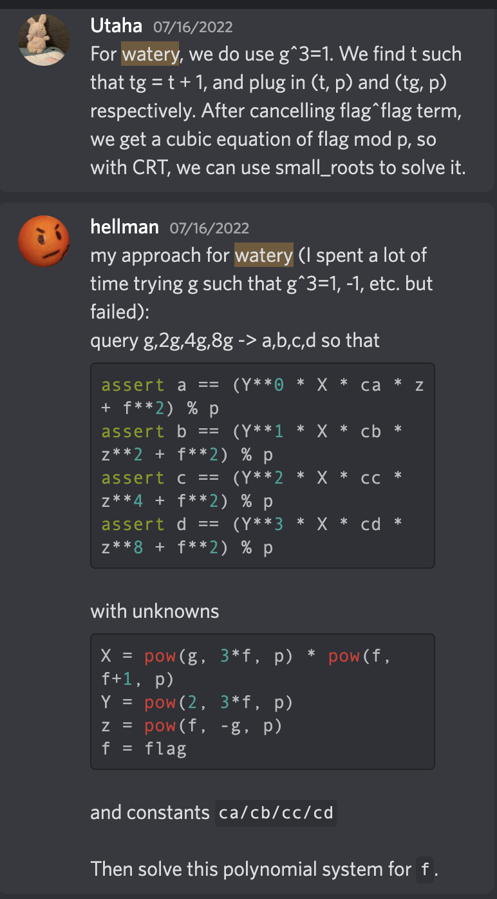

## Watery Soup ECC (Medium - Hard) - 15 solves

Note: solved after the CTF with heavy reference from other's solutions

This writeup is my own attempt to synthesize my understanding of this [writeup](https://zhuanlan-zhihu-com.translate.goog/p/546666004?_x_tr_sl=auto&_x_tr_tl=en&_x_tr_hl=en)

### Description/Source

```py
#!/usr/bin/env python3

from Crypto.Util.number import *
import sys
from flag import flag

flag = bytes_to_long(flag)
assert 256 < flag.bit_length() < 512

def die(*args):
	pr(*args)
	quit()

def pr(*args):
	s = " ".join(map(str, args))
	sys.stdout.write(s + "\n")
	sys.stdout.flush()

def sc(): return sys.stdin.readline().strip()

def main():
	border = "|"
	pr(border*72)
	pr(border, "Hi crypto-experts, send us your prime and we will mix the flag with ", border)
	pr(border, "it! Now can you find the flag in the mixed watery soup!? Good luck! ", border)
	pr(border*72)
	while True:
		pr("| Options: \n|\t[S]end the prime! \n|\t[Q]uit")
		ans = sc().lower()
		if ans == 's':
			pr(border, "Send your prime here: ")
			p = sc()
			try: p = int(p)
			except: die(border, "Your input is not valid!!")
			if not (128 <= p.bit_length() <= 224): die(border, "Your prime is out of bounds :(")
			if not isPrime(p): die(border, "Your input is NOT prime! Kidding me!?")
			pr(border, "Send the base here: ")
			g = sc()
			try: g = int(g) % p
			except: die("| Your base is not valid!!")
			if not (64 < g.bit_length() < 128): die(border, "Your base is too small!!")
			result = (pow(g ** 3 * flag, flag - g, p) * flag + flag * flag + g) % p
			pr(border, f"WooW, here is the mixed flag: {result}")
		elif ans == 'q': die(border, "Quitting ...")
		else: die(border, "Bye ...")

if __name__ == '__main__': main()
```

We are allowed to give a base $g$ which is 64 - 128 bits and a prime $p$ which is 128 to 224 bits. Assuming the `flag` is $f$, the server would return

$$
\begin{aligned}
    c &= \left((fg^3)^{f-g} f + f^2 + g\right) \bmod p \\
     &= \left(f^{f-g+1}g^{3f-3g} + f^2 + g \right) \bmod p
\end{aligned}
$$

We can use Fermat's little theorem to send a base $g$ and another base $p-g$

$$
\begin{aligned}
    a^{p-1} ≡ 1 \bmod p\\
    a^{p-g} ≡ a^{-g+1} \bmod p \\ \\

    f^{f-(p-g)+1} ≡ f^{f+g} \bmod p\\
    g^{3f- 3(p-g)} ≡ g^{3f+3g-3} \bmod p
\end{aligned}
$$

Note: $(p-g)^{3f+3g-3} ≡ (-g)^{3f+3g-3}$, if we take $g$ to be even, we can predict that $3f+3g-3$ will be even, so we can remove the negative sign

So we can send $g$ to receive $c_1$ and send $p-g$ to receive $c_2$. We can try to match the powers to eliminate the first complicated term

$$
\begin{gather*}
    c_1 = f^{f-g+1}g^{3f-3g} + f^2 + g \bmod p\\
    c_2 = f^{f+g}g^{3f+3g-3} + f^2 -g \bmod p\\
    f^{2g-1}g^{6g-3}c_1 = f^{f+g}g^{3f+3g-3} + (f^2 + g)f^{2g+1}g^{6g-3} \bmod p \\
    f^{2g-1}g^{6g-3}c_1 - c_2 = (f^2 + g)f^{2g-1}g^{6g-3}  - f^2 + g\bmod p
\end{gather*}
$$

If we set $2g = p-1, f^{2g-1} = f^{p-1-1} = f^{-1}$ by Fermat's little theorem

Because $g,c1,c2,p$ are all known, it turns into a univariate equation with $f$

$$
f^{-1}g^{6g-3}c_1 - c_2 = (f^2 + g)f^{-1}g^{6g-3}  - f^2 + g\bmod p \\
g^{6g-3}c_1 - fc_2 = f^2g^{6g-3} + g^{6g-2}  - f^3 + fg\bmod p \\
$$

So we can send a couple of primes to try to build out CRT because its unlikely that the flag would be 128 bits or less (because the answer we get back would be $f \bmod p$)

### Solver

```python
from pwn import *
from libnum import *
from Crypto.Util.number import *
from itertools import product
# nc 05.cr.yp.toc.tf 37377

def getParams():
    while True:
        p = getPrime(128)
        while p % 4 != 1:
            p = getPrime(128)
        g = (p-1)//2

        if not (128 <= int(p).bit_length() <= 224 and  64 < int(g).bit_length() < 128 and 2*g + 1 == p):
            continue
        return p,g, p-g

def getRes(prime, base, p):
    p.sendline(b'S')
    p.sendlineafter(b'| Send your prime here: \n', str(prime).encode())
    p.sendlineafter(b'| Send the base here: \n', str(base).encode())
    p.recvuntil(b'| WooW, here is the mixed flag: ')
    c = int(p.recvline().strip().decode('utf-8'))
    return c

def solve():
    ps, gs, c1s,c2s = [], [], [], []
    host, port = "05.cr.yp.toc.tf",37377
    p = remote(host, port)
    for _ in range(20):
        print(f"Round {_}")
        pp, g, pg = getParams()

        c1 = getRes(pp, g, p)
        c2 = getRes(pp, pp-g, p)

        ps.append(pp)
        gs.append(g)
        c1s.append(c1)
        c2s.append(c2)

    print(ps)
    print(gs)
    print(c1s)
    print(c2s)

solve()


ps = [189122750770716345060832558483765261409, 189157614141533518310144050881298491413, 314423930926420990340379752379783418313, 327932001194801205413693056006411264217, 320418503615392286449726579853353858613, 219765724954954896314480331996636117137, 265116422540484400257009326284244420593, 310938553349079772945773335497214618413, 305899273772530107943694689535683761361, 321296924242129358395867774007103742049, 327449103341902868998377185831156802109, 173115642911266271817070645416157666109, 171672836763328281223831050506543627537, 205401244883757703902918912418890042809, 249987617250477046425236535664922239777, 268860492144818573457319380530241941801, 317729860285166734371987867479421903949, 281988050374710655732917120508354222649, 194035720779228287915519872986366738449, 303170666560171648407471310623937985821]
gs = [94561375385358172530416279241882630704, 94578807070766759155072025440649245706, 157211965463210495170189876189891709156, 163966000597400602706846528003205632108, 160209251807696143224863289926676929306, 109882862477477448157240165998318058568, 132558211270242200128504663142122210296, 155469276674539886472886667748607309206, 152949636886265053971847344767841880680, 160648462121064679197933887003551871024, 163724551670951434499188592915578401054, 86557821455633135908535322708078833054, 85836418381664140611915525253271813768, 102700622441878851951459456209445021404, 124993808625238523212618267832461119888, 134430246072409286728659690265120970900, 158864930142583367185993933739710951974, 140994025187355327866458560254177111324, 97017860389614143957759936493183369224, 151585333280085824203735655311968992910]
c1s = [79304562451846618303323554861633486852, 112643535262555460834227915123617696577, 257870190767188438167001257458542653050, 65309662233198991619660116016919502966, 29472287739493747853350320832749602160, 184668051408180146504414179420410913383, 145893081058853054196569353457139280289, 144073798404070448087432273637856042836, 146684550042680681690177103138529259042, 131996612736065195535688244689017759264, 52058454499582608869990013427831682814, 57713321920321887697188422238143173008, 44354924502759783531074343711699298125, 178594695257661655818270605072386790773, 120812900949533861437167904217094333104, 66873073328828692587419097193048595961, 179606414310180914759829475254478011493, 136008060051205404690458545278417281795, 91767350892634951298669393288052736090, 3512898734308927295841643535115172537]
c2s = [85395882808898271777059545164412436438, 29577541900751186273814608979334897163, 80154854236870078978981709482408661149, 272996985960192376520122106864517199545, 293078420053436953976792139144891899732, 198625611998859221264090425054301586354, 193197268098353566469125147255343436177, 122876174504253187305523247159449903583, 197537349541832288207393969312098584269, 69680444957556389336305189731567258424, 91431680240005504192985816989205398508, 9135588543090050118619200015985611110, 98346399789104156441530117817225698634, 144158388328621038021947524451009467217, 27665671505768403374685766870371333779, 259243801244591756896749321044591484287, 59383869021345235256490374484872727722, 21547999223010659637810329517642879052, 87576216625646348352976653720076198456, 91731673358297809404221012993978651383]

primes = []
residues = []
for i in range(len(ps)):
    R.<x> = PolynomialRing(Zmod(ps[i]))
    LHS = pow(gs[i],6*gs[i]-3, ps[i])*c1s[i] - x*c2s[i]
    RHS = pow(gs[i],6*gs[i]-3,ps[i])* (x**2) + pow(gs[i],6*gs[i]-2, ps[i]) - x**3 + x*gs[i]

    f = LHS - RHS
    res = f.roots()

    if len(res)  > 0:
        primes.append(ps[i])
        res = [int(i[0]) for i in res]
        residues.append(res)


for res in product(*residues):
    r = list(map(int,res))
    flag = crt(r, primes)
    flag = (n2s(int(flag)))
    if b'CCTF' in flag:
        print(flag)
        exit()
```

### Flag

```
CCTF{Pl34se_S!r_i_w4N7_5omE_M0R3_5OuP!!}
```

### References / Other solutions

- https://zhuanlan-zhihu-com.translate.goog/p/546666004?_x_tr_sl=auto&_x_tr_tl=en&_x_tr_hl=en
- https://remyoudompheng-github-io.translate.goog/ctf/cryptoctf2022/watery_soup.html?_x_tr_sl=auto&_x_tr_tl=en&_x_tr_hl=en


