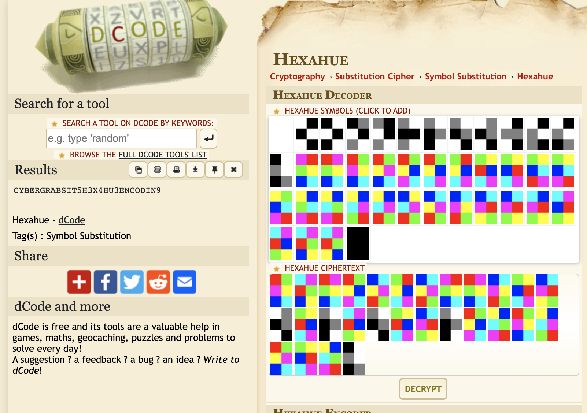
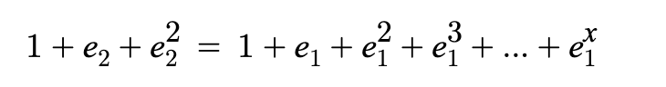

# CyberGrabs 0x03 2022 – Crypto Challenges

## Challenge 1: RSA

We are given 3 moduli and 3 cipher texts. Finding the prime factors is just a matter of finding the gcd and decrypting RSA in a standard fashion.

```
n1 (n1 = p*q)
n2 (n2 = q*r)
n3 (n3 = r*p)

c1 , c2, c3
```

### Solution

Exploit Solution

```
q = gcd(n1,n2)
r = gcd(n2,n3)
p = gcd(n1,n3)
assert p*q == n1
assert r*q == n2
assert p*r == n3

e = 65537

def decrypt(p1,p2,ct,exponent):
    phi = (p1-1)*(p2-1)
    n = p1*p2
    divisor, d, b = egcd(exponent, phi)
    pt = pow(ct,d,n)
    return n2s(pt)

print(decrypt(p,q,c1,e) + decrypt(r,q,c2,e) + decrypt(p,r,c3,e))
```

### Flag

```
Flag{Bas!c_R5A_but_wi7H_extra_SpIc3}
```

## Challenge 2: #031337

A pdf of an image with some bright colors was shown


### Solution

Searching cipher encoding with colored squares led me to hexahue encoding. Using dcode's hexahue decoder we get the flag



### Flag

```
cybergrabs{IT5_H3X4HU3_ENCODIN9}
```

## Challenge 3: t0ti3nt

We are given the source encrypting file and the output text

```
from sympy import totient

flag = REDACTED

def functor(n):
    val = 0
    for j in tqdm(range(1,n+1)):
        for i in range(1,j+1):
            val += j//i * totient(i)
    return val

lest = []
for i in flag:
    lest.append(functor(ord(i)*6969696969))

print(lest)
```

### Solution

The numbers were too slow and big to rerun the script so I wanted to find a pattern

Running the numbers 1 to 100, it showed that the difference in successive numbers increased by one which indicated triangular numbers. More research showed that it was just a binomial coefficient of (i+1) and 3 for the ith number.

```
def testing():
    prev = 0
    for i in range(100):
        res = functor(i)
        check = scipy.special.comb(i+2,3,exact=True)
        print(f"{i}: {res}, Diff: {res-prev}, Check: {check}")
        prev = res
```

The solution was then to just do a mapping using the resultant values of ascii numbers and the resultant binomial coefficient numbers.

```
def getFlag():
    flag = ""
    multiplier = 6969696969
    d = {}
    for i in range(128):
        d[scipy.special.comb((i*multiplier+2),3,exact=True)] = chr(i)
    for i in output:
        flag += d[i]
    print(flag)
```

### Flag

```
cybergrabs{50m3_func710nS_n3v3r_c3A5e_t0_4m4z3_m3}
```

## Challenge 4: asrysae (50 points)

We are given encrypting script and the output text.

```
p = getPrime(512)
q = getPrime(512)
e = 65537

m = bytes_to_long(flag)

ciphertext = pow(m, e, p*q)

ciphertext = long_to_bytes(ciphertext)
obj1 = open("ciphertext.txt",'w')
obj1.write(f"p={p}\n\n")
obj1.write(f"q={q}\n\n")
obj1.write(f"ct={ciphertext.hex()}")
```

### Solution

It was just a very basic RSA decryption because all the values were there already.

```
from libnum import n2s
def decrypt(p1,p2,ct,exponent):
    phi = (p1-1)*(p2-1)
    n = p1*p2
    divisor, d, b = egcd(exponent, phi)
    pt = pow(ct,d,n)
    return n2s(pt)
e = 65537
print(decrypt(p,q,ct,e))
```

### Flag

```
cybergrabs{N0w_eVEN_RS4_i5_HAcKA81e}
```

## Challenge 5: Unbr34k4bl3

### Disclaimer: I did not manage to solve this during the challenge

References taken heavily from [here](https://flag-poisoning.fr/writeup/unbreakable-cybergrabsctf/), [here](https://ctftime.org/writeup/16770) and with help from the author

We are given a few variables

```
n = p * q * r (made up of ~1024 bit primes)
ip = inverse(p,q)
iq = inverse(q,p)

#and 2 cipher texts
c1 and c2
```

### Step 1: Find e1, e2, x

We are not given the exponents but we are given some conditions to work with

```
assert (x>2 and x%2 == 0)
assert (isPrime(e1) and isPrime(e2))
def functor():
	val1 , val2 = 0,0
	for i in range(x+1):
		val1 += pow(e1,i)
	for j in range(3):
		val2 += pow(e2,j)
	assert (val1 == val2)
```

We can write a script to brute force e1,e2 and x respectively. The equation is essentially



```
#assume e1 and e2 < 1000
possible_primes = [i for i in range(1000) if isPrime(i)]
d = {} #to store all possible values of e2+e2^2
maximum = possible_primes[-1]**2 + possible_primes[-1]
for i in possible_primes:
    d[i**2+i] = i
for prime in possible_primes:
    curr = 0
    degree = 1
    while curr < maximum:
        curr += prime**degree
        if(curr in d):
            print(f"e1: {prime}, e2:{d[curr]}, x: {degree}")
            break
```

Which gives the values

```
e1: 2, e2:5. x: 4
```

### Step 2: Find r

Part of the prime generation function shows how r can be derived once x is known

```
def keygen():
	while True:
		p,q = [getStrongPrime(1024) for _ in range(2)]
		if p%4==3 and q%4==3:
			break

	r = 2
	while True:
		r = r*x
		if r.bit_length()>1024 and isPrime(r-1):
			r = r-1
			break

	return p,q,r
```

Using the similar function we can derive r. Had to switch it over to sage because the isPrime function from python would error out as it cannot check primality of such a big number.

```
def getR():
    x = 4
    r = 2
    while True:
        r *= x
        if(len(r.bits())>1024 and is_prime(r-1)):
            r -= 1
            break
    print(f"r is: {r}")
```

Using this value of `r` we can derive `pq`

```
pq = n//r
assert n%r == 0
```

### Step 3: Derive p and q

Now this is the tough part, and there were a lot of equations that I will do my best to explain for reference (for future me)

For integers `k` and `t`:

```
(1) ip = inverse(p,q) => ip x p = 1 + kq
(2) iq = inverse(q,p) => iq x q = 1 + tp
```

Flipping both equations around, we get

```
(3) -k x q = 1 - ip x p => -k = inv(q,p)
(4) -t x p = 1 - iq x q => -t = inv(p,q)
```

Note: inverse mod of `(a,b)` only exists if `a` and `b` are coprime

With equations (3) and (4), and for arbitrary integers `𝑥` and `y`

```
(5) ip + t = 𝑥 x q => ip = 𝑥q - t
(6) iq + k = y x p => iq = yp - k
```

Subbing (5) and (6) into (1) and (2) respectively, we get

```
(7) (𝑥q - t) x p = 1 + kq => 𝑥 x pq  = 1 + kq + qt
(8) (yp - k) x q = 1 + tp => y x pq = 1 + kq + qt
```

That means 𝑥 == y, so I will just refer to them as z from now on

Because of some magic that I don't fully understand `ip, iq, p, q, k, t` are all approximately the same size, and this approximation can be made, that essentially entails that z is a small number ~ 2 and can be brute forced

```
#Reusing the equations with z
(9) ip + t = qz
(10) iq + k = pz

(11) z = (ip + t + iq + k)/ (p + q) ≈ 2 or small integer
```

### To do fill in this part to brute-force z

Now bringing it all together to get some actually solvable equations

```
Eqn (1) + (2)
ip x p + iq x q = 2 + tp + kq

Sub in values of t and k from (9) and (10)

ip x p + iq x q = 2 + (qz - ip) x p + (pz - iq) x q
(13) ip x p + iq x q = 1 + pq x z

```

Equation (13) is basically a quadratic equation that can be solved using sage

```
from sympy import Symbol,Eq,solve

p=Symbol('p')
q=Symbol('q')
equation1 = Eq(ip*p+iq*q-pq-1,0)
equation2 = Eq(p*q-pq,0)
solution = solve((equation1,equation2),(p,q))

p,q = None, None
for poss_p,poss_q in solution:
    if(poss_p % 4 == 3 and poss_q % 4 == 3):
        p = poss_p
        q = poss_q
        break
assert n % q == 0
assert n % p == 0

```

### Step 4: Find the first half of the flag

The first half of the flag was encrypted using e1 which basically amounts to

```
pt = m^2 mod n
```

Given that the exponent is 2, normal RSA decryption is not possible as there wouldn't exist an inverse between the exponent and phi, (because gcd(e,phi) != 1)

However the squaring of the ciphertext is signature of the Rabin cryptosystem as detailed [here](https://en.wikipedia.org/wiki/Rabin_cryptosystem#Computing_square_roots)

This finally makes sense why p and q mod 4 must both be equal to 3 so that this decryption process can function properly with integers.

Using the steps as outline from wikipedia. I used most of my code from niteCTF's similar challenge [here](https://github.com/jontay999/CTF-writeups/tree/master/niteCTF/Crypto/Rabin_to_the_rescue)

The main twist is that there are 3 primes now instead of 2, so there are 8 possible answers

Step 1: Compute the square root of c mod p, and c mod q

```
mp = pow(c1, (p+1)//4, p)
mq = pow(c1, (q+1)//4, q)
mr = pow(c1, (r+1)//4, r)
```

Step 2: Use Extended euclidean algorithm to find yp and yq such that `yp x p + yq x q + yr x r = 1 mod n`

I used [this](https://math.stackexchange.com/questions/735093/method-of-solving-extended-euclidean-algorithm-for-three-numbers) stack overflow post
`Notice that 𝑔𝑐𝑑(𝑥,𝑦,𝑧)=𝑔𝑐𝑑(𝑥,𝑔𝑐𝑑(𝑦,𝑧)). First we find 𝑎, 𝑏 such that 𝑔𝑐𝑑(𝑥,𝑔𝑐𝑑(𝑦,𝑧))=𝑎𝑥+𝑏𝑔𝑐𝑑(𝑦,𝑧), then 𝑐, 𝑑 such that 𝑔𝑐𝑑(𝑦,𝑧)=𝑐𝑦+𝑑𝑧. Finally we obtain 𝑔𝑐𝑑(𝑥,𝑦,𝑧)=𝑎𝑥+𝑏𝑐𝑦+𝑏𝑑𝑧.`

```
_mp = -mp % p
_mq = -mq % q
_mr = -mr % r

b1 = pow((q*r ) % p,-1,p)*1
b2 = pow((p*r ) % q,-1,q)*1
b3 = pow((p*q ) % r,-1,r)*1

```

Step 3: Use Chinese Remainder Theorem to find the eight roots

```
x1 = (mp*b1*(q*r)+mq*b2*p*r +mr*b3*p*q)%(n)
x2 = (_mp*b1*(q*r)+mq*b2*p*r +mr*b3*p*q)%(n)
x3 = (mp*b1*(q*r)+_mq*b2*p*r +mr*b3*p*q)%(n)
x4 = (mp*b1*(q*r)+mq*b2*p*r +_mr*b3*p*q)%(n)
x5 = n-x1
x6 = n-x2
x7 = n-x3
x8 = n-x4
```

Step 4: Check all possible solutions

```
for pt in [x1,x2,x3,x4,x5,x6,x7,x8]:
    try:
        test = n2s(pt).decode('utf-8')
        print(test)
    except:
        pass
```

### Step 5: Find Second half of Flag

Thank goodness the second half is just straightforward rsa decryption because the exponent is prime (5)

```
phi = (p-1)* (q-1) * (r-1)
d = int(invert(e2,phi))
m = pow(c2, d, n)
print(n2s(m))
```

Putting it all together we get the plaintext

```
Congratulations, You found the first part of flag cybergrabs{r481n_cryp70sy5t3m_15_1nt3r35t1n6_
The last part of the flag is: 8ut_num83r_sy5t3m_15_3v3n_m0r3_1nt3r35t1n6}
```

### Flag:

```
cybergrabs{r481n_cryp70sy5t3m_15_1nt3r35t1n6_8ut_num83r_sy5t3m_15_3v3n_m0r3_1nt3r35t1n6}
```
