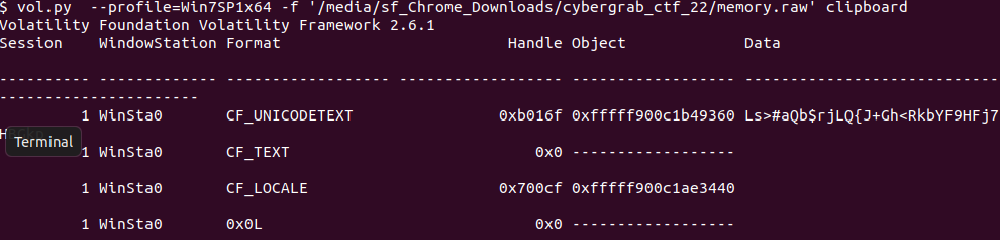

# CyberGrabs 0x03 2022 – Forensic Challenges

## Challenge 1: Deep Dive

We are given a .docx file. Because all microsoft files are essentially zip files, running `7z x hacker.docx` showed a bunch of files. Trawling through the files and some of the images, we find an image with the flag

### Flag

```
cybergrabs{1337_c3r531_1_w4n7_h3r_70_kn0w_17_w45_m3}
```

## Challenge 2: Mr Robot

We are given a .wav file which seems to be a classic steganography problem.

### Solution

Opening it up in Sonic Visualiser didn't seem to give any clues in the spectrogram.

Using this [tool](https://github.com/ragibson/Steganography) and running this command to extract the first 100 bytes hidden gave the flag

```
stegolsb wavsteg -r -i morse_code.wav -o output.txt -b 100
```

### Flag

```
CYBERGRABS{3VERY_8YTE_4RE_REAL_VALUE}
```

## Challenge 3: Super Secret Storage

### Disclaimer: I didn't manage to solve this during the challenge

We are given a `memory.raw` file. There was a strange string in the clipboard after running volatility to check it



This was the part during the challenge that we got stuck and couldn't find the proper encoding. Turns out that it was just Base85 with IPv6 alphabet. (Which apparently there was a hint about this encoding in the screenshots)

```
Ls>#aQb$rjLQ{J+Gh<RkbYF9HFj7HBGkp
```

### Flag

```
CYBERGRABS{53cREt_st0RAG3}
```
