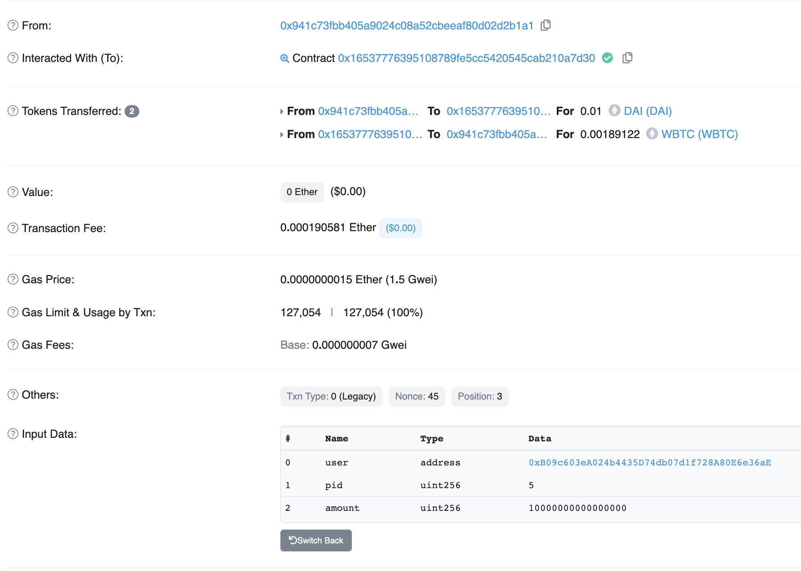
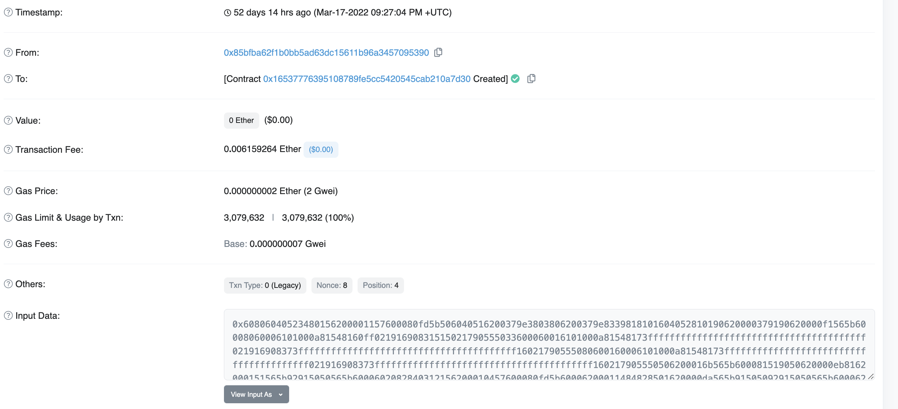
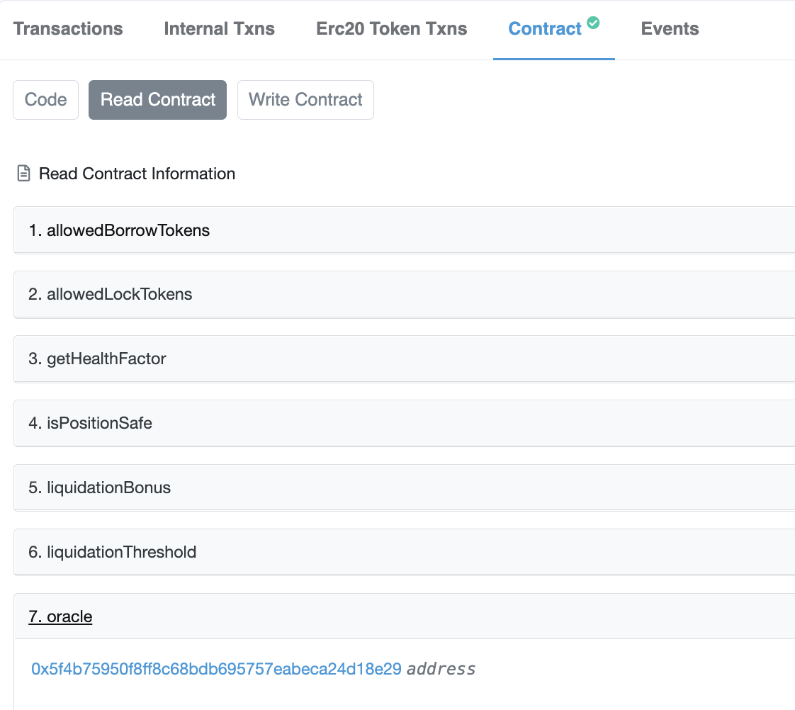
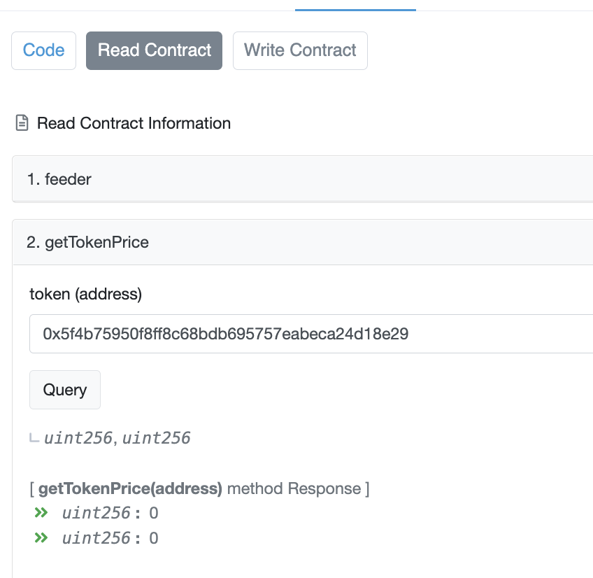
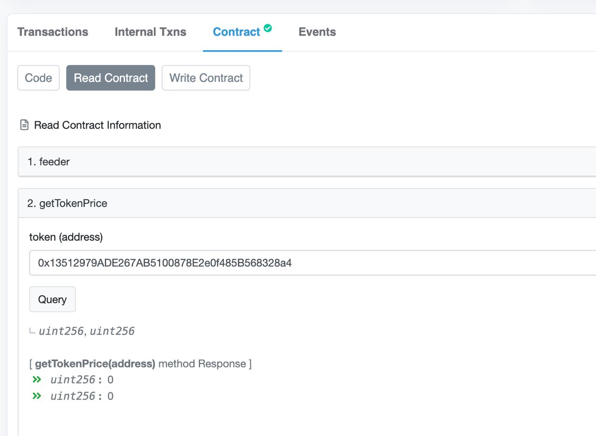

# CyberLeague 2022 – Space Contract

## Challenge

The original challenge stated that we had to look for an image in the CTFd platform itself. Downloading all the images, and running `exiftool` on them shows this suspicious image which had data, the challenge description, appended to the end of the png chunk.

```
Warning                         : [minor] Trailer data after PNG IEND chunk
```


-Challenge Description-

```
Our motherland have engaged a vendor to develop smart contract embedded in our fuel tank. We wanna make sure that the amount of fuel is recorded in an immutable blockchain. (In russian) Chert by pobral etikh idiotov! The smart contract is broken and our funds are stolen. Investigate and find out the culprit immediately!

Smart contract link: https://kovan.etherscan.io/address/0x16537776395108789FE5cC5420545CAb210a7D30
```

## Solution

1. Analyzing the Code

The first thing that should be analyzed of a Smart Contract is its code. The code not included before this was the standard IERC20 token contract and a basic Pausable parent class to freeze all transactions after the contract has been paused.

```java
pragma solidity ^0.8.0;


interface IOracle {
    function getTokenPrice(address token) external view returns (uint, uint);
}

contract Market is Pausable {
    using SafeERC20 for IERC20;

    struct Position {
        uint locked;
        address lockedToken;
        uint borrowed;
        address borrowedToken;
    }

    address public owner;
    address public oracle;
    uint public liquidationThreshold; // in bps
    uint public liquidationBonus; // in bps
    address constant internal WETH = 0xd0A1E359811322d97991E03f863a0C30C2cF029C;
    uint constant internal ONE = 10 ** 18;
    mapping (address => bool) public allowedLockTokens;
    mapping (address => bool) public allowedBorrowTokens;
    mapping (address => uint8) public tokenDecimals;
    mapping (address => Position[]) public positions;

    event CreatePosition(address user, uint pid);
    event Lock(address user, uint pid, address token, uint amount);
    event Unlock(address user, uint pid, address token, uint amount);
    event Borrow(address user, uint pid, address token, uint amount);
    event Repay(address user, uint pid, address token, uint amount);
    event Liquidated(address liquidator, address user, uint pid, address token, uint amount);

    modifier onlyOwner() {
        require(msg.sender == owner, "onlyOwner");
        _;
    }

    constructor(address _oracle) {
        owner = msg.sender;
        oracle = _oracle;
    }

    function getTokenPrice(address token) internal view returns (uint) {
        if (token == address(0) || token == WETH) return ONE;
        (uint price, ) = IOracle(oracle).getTokenPrice(token);
        return price;
    }

    function getHealthFactor(Position storage position) internal view returns (uint) {
        uint lockedTokenPrice = getTokenPrice(position.lockedToken);
        uint borrowedTokenPrice = getTokenPrice(position.borrowedToken);
        uint scaledLocked = position.locked * 10 ** (18 - tokenDecimals[position.lockedToken]);
        uint scaledBorrowed = position.borrowed * 10 ** (18 - tokenDecimals[position.borrowedToken]);
        uint lockedValue = scaledLocked * lockedTokenPrice / ONE;
        uint borrowedValue = scaledBorrowed * borrowedTokenPrice / ONE;
        if (borrowedValue == 0) return ONE;
        uint healthFactor = lockedValue * liquidationThreshold * ONE / (borrowedValue * 10000);
        return healthFactor;
    }

    function getHealthFactor(address user, uint pid) public view returns (uint) {
        require(pid < positions[user].length, "InvalidPID");
        Position storage position = positions[user][pid];
        return getHealthFactor(position);
    }

    function isPositionSafe(Position storage position) internal view returns (bool) {
        uint healthFactor = getHealthFactor(position);
        return healthFactor >= ONE;
    }

    function isPositionSafe(address user, uint pid) public view returns (bool) {
        require(pid < positions[user].length, "InvalidPID");
        Position storage position = positions[user][pid];
        return isPositionSafe(position);
    }

    function createPosition(address lockedToken, address borrowedToken) public whenNotPaused {
        require(allowedLockTokens[lockedToken] && allowedBorrowTokens[borrowedToken], "InvalidToken");
        uint pid = positions[msg.sender].length;
        Position memory position = Position({
            locked: 0,
            lockedToken: lockedToken,
            borrowed: 0,
            borrowedToken: borrowedToken
        });
        positions[msg.sender].push(position);
        emit CreatePosition(msg.sender, pid);
    }

    function lock(uint pid, uint amount) public payable whenNotPaused {
        require(pid < positions[msg.sender].length, "InvalidPID");
        Position storage position = positions[msg.sender][pid];
        position.locked += amount;
        receiveToken(position.lockedToken, amount);
        emit Lock(msg.sender, pid, position.lockedToken, amount);
    }

    function unlock(uint pid, uint amount) public whenNotPaused {
        require(pid < positions[msg.sender].length, "InvalidPID");
        Position storage position = positions[msg.sender][pid];
        position.locked -= amount;
        sendToken(position.lockedToken, amount);
        require(isPositionSafe(position), "UnsafePosition");
        emit Unlock(msg.sender, pid, position.lockedToken, amount);
    }

    function borrow(uint pid, uint amount) public whenNotPaused {
        require(pid < positions[msg.sender].length, "InvalidPID");
        Position storage position = positions[msg.sender][pid];
        position.borrowed += amount;
        sendToken(position.borrowedToken, amount);
        require(isPositionSafe(position), "UnsafePosition");
        emit Borrow(msg.sender, pid, position.borrowedToken, amount);
    }

    function repay(uint pid, uint amount) public payable whenNotPaused {
        require(pid < positions[msg.sender].length, "InvalidPID");
        Position storage position = positions[msg.sender][pid];
        position.borrowed -= amount;
        receiveToken(position.borrowedToken, amount);
        emit Repay(msg.sender, pid, position.borrowedToken, amount);
    }

    function liquidate(address user, uint pid, uint amount) public whenNotPaused {
        require(pid < positions[user].length, "InvalidPID");
        Position storage position = positions[user][pid];
        require(!isPositionSafe(position), "SafePosition");
        uint borrowedTokenPrice = getTokenPrice(position.borrowedToken);
        uint lockedTokenPrice = getTokenPrice(position.lockedToken);

        uint scaledAmount = amount * 10 ** (18 - tokenDecimals[position.borrowedToken]);
        uint borrowedValue = scaledAmount * borrowedTokenPrice / ONE;
        uint scaledLiquidated = borrowedValue * (10000 + liquidationBonus) * ONE / (lockedTokenPrice * 10000);
        uint liquidated = scaledLiquidated / 10 ** (18 - tokenDecimals[position.lockedToken]);
        if (liquidated > position.locked) liquidated = position.locked;
        position.borrowed -= amount;
        position.locked -= liquidated;

        receiveToken(position.borrowedToken, amount);
        sendToken(position.lockedToken, liquidated);
        emit Liquidated(msg.sender, user, pid, position.lockedToken, liquidated);
    }

    function receiveToken(address token, uint amount) internal {
        if (token == address(0)) {
            require(msg.value >= amount, "NotEnoughFunds");
        } else {
            IERC20(token).safeTransferFrom(msg.sender, address(this), amount);
        }
    }

    function sendToken(address token, uint amount) internal {
        if (token == address(0)) {
            (bool success,) = msg.sender.call{value: amount}("");
            require(success, "SendETHError");
        } else {
            IERC20(token).safeTransfer(msg.sender, amount);
        }
    }

    function pause() public onlyOwner {
        _pause();
    }

    function setAllowedLockToken(address token) public onlyOwner {
        allowedLockTokens[token] = true;
    }


    function setAllowedBorrowToken(address token) public onlyOwner {
        allowedBorrowTokens[token] = true;
    }

    function setTokenDecimals(address token, uint8 decimals) public onlyOwner {
        tokenDecimals[token] = decimals;
    }

    function setLiquidationThreshold(uint _liquidationThreshold) public onlyOwner {
        liquidationThreshold = _liquidationThreshold;
    }

    function setLiquidationBonus(uint _liquidationBonus) public onlyOwner {
        liquidationBonus = _liquidationBonus;
    }
}
```

2. Wild Goose Chase 1 - Liquidate

Here are the things that I thought were strange about the code

- The liquidate function looked extremely suspicious, as it was the only function that took in an address of user. I have truncated to the important parts

```java
function liquidate(address user, uint pid, uint amount) public whenNotPaused {
    require(pid < positions[user].length, "InvalidPID");
    Position storage position = positions[user][pid];
    ...
    receiveToken(position.borrowedToken, amount);
    sendToken(position.lockedToken, liquidated);
    emit Liquidated(msg.sender, user, pid, position.lockedToken, liquidated);
}
```

I suspected that this would allow malicious attackers to call the `liquidate` function and pass in the address of the user that they would like to drain funds from along with a valid pid (from observing past transactions in the contract).

This would fetch the position of the target user, while the subsequent call to `sendToken` would use `msg.sender` as the final address to send the tokens to.

```java
function sendToken(address token, uint amount) internal {
    if (token == address(0)) {
        (bool success,) = msg.sender.call{value: amount}("");
        require(success, "SendETHError");
    } else {
        IERC20(token).safeTransfer(msg.sender, amount);
    }
}
```

Here is an example of a transaction that I thought was suspicious


It passed in an input user address parameter of `0xB09c603eA024b4435D74db07d1f728A80E6e36aE` which was not the caller's actual address `0x941c73fbb405a9024c08a52cbeeaf80d02d2b1a1`.

However, closer analysis of code showed that while you can pass in arbitrary user addresses, the `receiveToken` function that gets called _before_ the `sendToken` function will transfer funds from the `msg.sender` to the smart contract address. This means that an equivalent amount of tokens will be transferred from the attacker despite passing in another victim user's address. Since this call happens before the `sendToken`, it cannot be manipulated. The user's address passed in simply calculates the equivlaent amount of tokens to be transferred as well as the type of tokens to be transferred based on the user's position in the respective `pid`

```java
function receiveToken(address token, uint amount) internal {
    if (token == address(0)) {
        require(msg.value >= amount, "NotEnoughFunds");
    } else {
        IERC20(token).safeTransferFrom(msg.sender, address(this), amount);
    }
}
```

Thus while it seems extremely strange, it doesn't appear to be vulnerable (I would love to chat about this with the authors and whether my assumptions here are correct)

3. Slowly piecing it together

Given the _hint(?)_ in the discord chat about how its a "new" thing, I started looking at recent exploits in smart contracts


There was a curious declaration of an `IOracle` at the start of the code and I wondered whether there was any exploit related to that. I came across this article [https://hackernoon.com/how-dollar100m-got-stolen-from-defi-in-2021-price-oracle-manipulation-and-flash-loan-attacks-explained-3n6q33r1](https://hackernoon.com/how-dollar100m-got-stolen-from-defi-in-2021-price-oracle-manipulation-and-flash-loan-attacks-explained-3n6q33r1)

The article detailed how the attacker was able to influence the price ratio of `ETH/BAT` by using a flash loan to borrow heavy amounts of ETH and basically upset the balance between ETH and BAT. The price oracle was vulnerable because it used the available pool of ETH to BAT to determine the ratio/rate of exchange.

I was then curious to see how the oracle determined the token price in this case.

```java
function getTokenPrice(address token) internal view returns (uint) {
    if (token == address(0) || token == WETH) return ONE;
    (uint price, ) = IOracle(oracle).getTokenPrice(token);
    return price;
}
```

This function had to be called whenever `liquidate` was called or `getHealthFactor` was called which determines whether the loaner is allowed to borrow (more on this later....)

At first, I thought that I could find the `oracle` address by looking at the first transaction hash, given that it was a parameter passed into the contract's constructor but I couldn't decode the input.



Turns out, I was just a noob at smart contracts, as `oracle` was a public variable, so I could simply read directly from the contract without viewing the transaction logs.



However, looking at the oracle's smart contract source code, it didn't seem like there were obvious vulnerabilities

```java

pragma solidity ^0.8.0;

contract Oracle {

    struct PriceInfo {
        uint priceToETH;
        uint lastUpdate;
    }

    mapping (address => PriceInfo) priceInfo;
    address public feeder;
    uint constant internal ONE = 10 ** 18;

    modifier onlyFeeder() {
        require(msg.sender == feeder, "OnlyFeeder");
        _;
    }

    constructor(address _feeder) {
        feeder = _feeder;
    }

    function getTokenPrice(address token) public view returns (uint, uint) {
        return (priceInfo[token].priceToETH, priceInfo[token].lastUpdate);
    }

    function setTokenPrice(address token, uint price) public onlyFeeder {
        priceInfo[token].priceToETH = price;
        priceInfo[token].lastUpdate = block.timestamp;
    }
}
```

On a call to `getTokenPrice`, it just returns the hardcoded price that was set with `setTokenPrice`. However what happens if it tries to get the token price of a token that was not set? I tried testing with a "token" address that did not have a price (the oracle address itself) and it returned 0!



This could be the main flaw of the smart contract! I decided to test all the `allowedBorrowedTokens` and `allowedLockTokens` manually. (because I couldn't figure out how to work the api) and this particular borrowedToken was not set, so it returned 0.



Returning to the original smart contract code, I checked to see what would fail if the `getTokenPrice` call returned 0 and found the solution

4. Solution

If a user would like to borrow from the contract, it first has to pass a check

```java
function borrow(uint pid, uint amount) public whenNotPaused {
    require(pid < positions[msg.sender].length, "InvalidPID");
    Position storage position = positions[msg.sender][pid];
    position.borrowed += amount;
    sendToken(position.borrowedToken, amount);
    require(isPositionSafe(position), "UnsafePosition");
    emit Borrow(msg.sender, pid, position.borrowedToken, amount);
}
```

This check, `isPositionSafe` eventually calls `getHealthFactor` which is the main vulnerability

```java
function isPositionSafe(Position storage position) internal view returns (bool) {
    uint healthFactor = getHealthFactor(position);
    return healthFactor >= ONE;
}

function getHealthFactor(Position storage position) internal view returns (uint) {
    uint lockedTokenPrice = getTokenPrice(position.lockedToken);
    uint borrowedTokenPrice = getTokenPrice(position.borrowedToken);
    uint scaledLocked = position.locked * 10 ** (18 - tokenDecimals[position.lockedToken]);
    uint scaledBorrowed = position.borrowed * 10 ** (18 - tokenDecimals[position.borrowedToken]);
    uint lockedValue = scaledLocked * lockedTokenPrice / ONE;
    uint borrowedValue = scaledBorrowed * borrowedTokenPrice / ONE;
    if (borrowedValue == 0) return ONE;
    uint healthFactor = lockedValue * liquidationThreshold * ONE / (borrowedValue * 10000);
    return healthFactor;
}
```

Particularly, `if (borrowedValue == 0) return ONE;`, this would pass the `isPositionSafe` check that checks whether `healthFactor >= ONE`. In other words, any transactions that involve borrowing this particular token with the `0x13512979ADE267AB5100878E2e0f485B568328a4` address (which is USDT), is able to borrow infinitely!

Now it is just a matter of finding all the transactions that involve the creating of this vulnerable position and the borrowings correlated to this token address. The next part is just the manual work of checking input data of each transaction and copy pasting the relevant transaction hash.

5. Final Script

```python
import hashlib

txs = [
#from 0x488dad0ce94f34e33069b8ae5e16826b63f0f575
'0x6705735d1d4c526cd5db6c5810de6b11ba196fb93715a67ae855d037bfeaeaec', #borrow
'0x657b24138cea98eca019de351d60c69210334926c46d9bfb7a59f5c0db5d16f4', #borrow
'0xdb3f9da9cc6600ba9c2ca0685cd5c29818dae632fb3be65d530ef404b3ade202', #borrow
'0x6b52684eda64076701e647911f55019fb18b30d980554dd2df5ee0e777506c3a', #borrow
'0x95bc3879debc5ffbe9932d5a60dd53146374e7dd553fef5f00152371bbb75f38', #borrow
'0xf8cb1d747b53bbd4b4346eb8522fa3df36025dafedeb5b19bf54a9fff946ae8a', #borrow
'0xef40506ae849c17dfbb75f97331860750217602f9c0a9c7718e50d04f0e233b8', #create position
'0xcc8ff167cc6a1014f5c4b7445f26b17f68cc95bcc0c578c5330278dda8229d0b', #create position

#from 0x941c73fbb405a9024c08a52cbeeaf80d02d2b1a1
'0x99a5722bb73a73c6b47967f9b457e888d6503b0f9e1bf23fbf36de56ebad1522', #borrow
'0x8beb80929a026d68fe9e80d0e46dadf43f9b8c68dc1db7e53b996e9654a3c71c', #borrow
'0x13240bc2ce9333db092704b057083d23fa4e365b1b049ea839eb9955591ffd4d', #borrow
'0x3a109f0754113742eaae4bad747261aa7d9a1a9e2fb4d12704631b333b790006', #borrow
'0x8b0b5a0d65a1272d811f1db90cf7a24e43c64cf0d4767a78accf0dd9afce954c', #borrow
'0xdd588f3c2a9f25aa57d27e3257fe93882cf211470bd92e56b5271f95ab3c955f', #borrow
'0x6287be53eb87e475cfdabfe85c7db800c5262a469a4c270e55b8ddf481b6dae3', #borrow
'0x6ce3f133f0d925b125b6d8861b582cfd3b9abc8df4ce6ecd9607751b5fa6e796', #borrow
'0xcfb692d772f8acb90bc14a5da06f72c8ed9d871bbe76787ac0fa8a40e1ef11aa', #borrow
'0x0635eeabe77d53672c227c0938f73f43c8f43b984e2c02d4e4a7b4e4d9740a09', #borrow
'0xc20e2ac5792a3350febd9a7e62527faccf4e07de2c1454572380e6f629ecca18', #create position
'0xb1f54b9969ba60075775a3168d2ad16482e672cbf386ba4f9d6f433fe9d86fbe', #create position

#from 0xb09c603ea024b4435d74db07d1f728a80e6e36ae
'0xea24903d0a72b56457b88bdfd842f4065b0371b9c118dae08aca8dadb43c81b4', #borrow
'0xf7a6068687cfd85a24c8fd169c3c95133ff7a957c843171733902925990b4b74', #create position


]

assert len(txs) == 22
salt = b'hint: find abnormal transactions'
m = hashlib.sha256()
for tx_hash in sorted(txs):
    assert len(tx_hash) == 66 and tx_hash[:2] == '0x'
    m.update(salt + tx_hash.encode() + m.digest())
print(m.hexdigest())
assert m.hexdigest()[:16] == 'bf22a2d63563554c'
print('flag{' + m.hexdigest() + '}')

```

6. Finally!

```
flag{bf22a2d63563554c2073f9480867794e17297ce17c7ec4cc3502979828e4253f}
CYBERLEAGUE{bf22a2d63563554c2073f9480867794e17297ce17c7ec4cc3502979828e4253f}
```

7. Thoughts

I was really quite new to solidity code and smart contract vulnerabilities, so this was a good opportunity to learn. I'm sure there might be many mistakes in my writeup but I hope that readers can follow my train of thought as well as point out any of aforementioned mistakes
