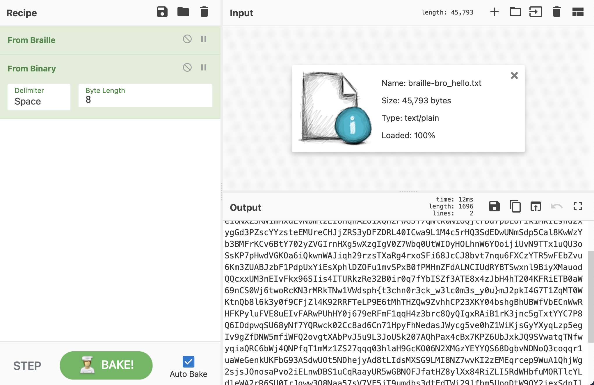

# Never_gone_a_giveup Writeup

## Info

Category: Fool  
Difficulty: Easy, 80 points

 

### **TLDR**

Decode the first text file from braille, then from binary, then to ASCII to find the flag.
  

## Initial

We are given 2 txt files. One called `hello-bro.txt` and the other `bro-hello.txt`.
 

Inside the 2 files are some braille characters, that decode to binary numbers which can then be converted to regular text.

 
There were quite a few red herrings, including the `"Can you find the diff?"` challenge prompt that led me to create a script to extract the difference in characters between both pieces of text. The only difference between the texts was that some 49s were 48s and vice versa. But going down that route yielded no fruit.

 

After decoding, one of the files was just gibberish but the other had a flag looking string - `{t3chn0r3ck_w3lc0m3s_y0u}`
 

I got stuck here for a very silly reason because I was expecting the flag to show up in the format DSPH{flag} but the prefix of the flag in this case was dsph{flag}.

 

## Thoughts

- Not much learnt from this challenge, apart from being more thorough and not letting my assumptions of flag format deter me
- I'm still not very used to red herrings being thrown around in CTFs
