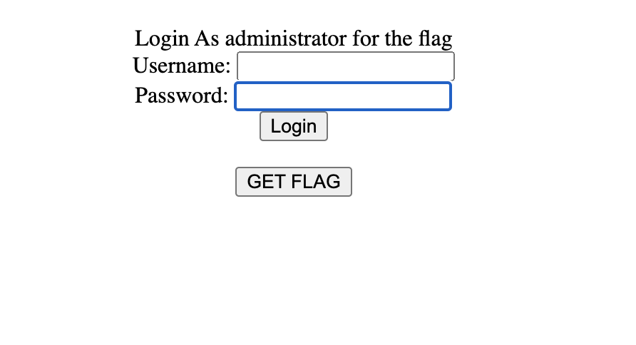
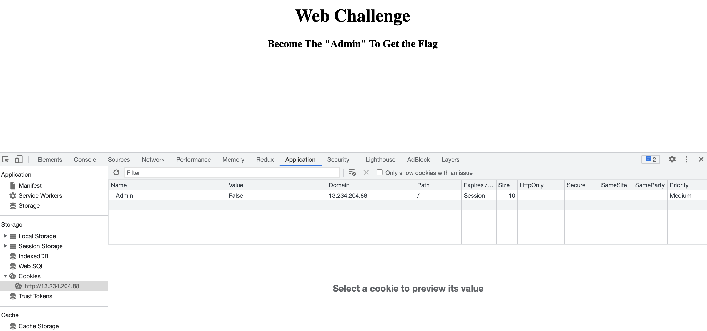
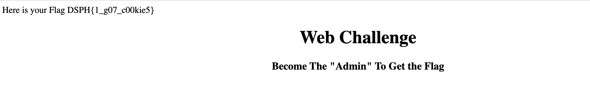

# G07_C00K3D Writeup

## Info

Category: Web  
Difficulty: Easy

 

### **tl;dr**

Change cookie for admin to true.
  

## Initial

We are given a site that shows a username and password with a GET FLAG button
 

## Method

Clicking on GET FLAG sent me to this page which hinted at becoming Admin. Upon checking the cookies, I noticed there was a cookie called Admin set to false.
 

After changing it to true, and refreshing.

The flag was found.

 

## Thoughts

- Very basic challenge but good to get warmed up.
