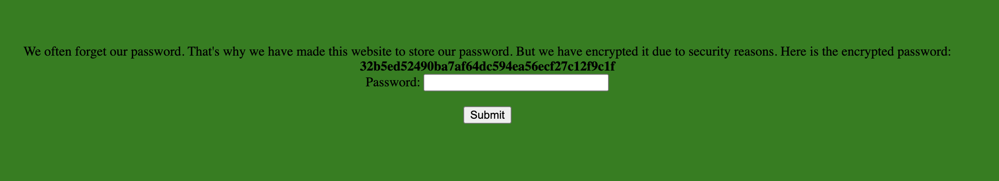
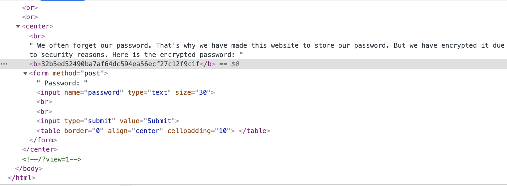
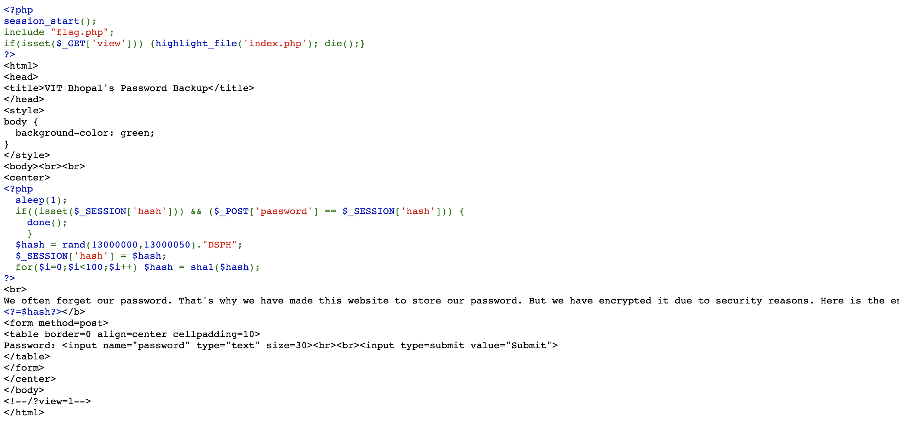
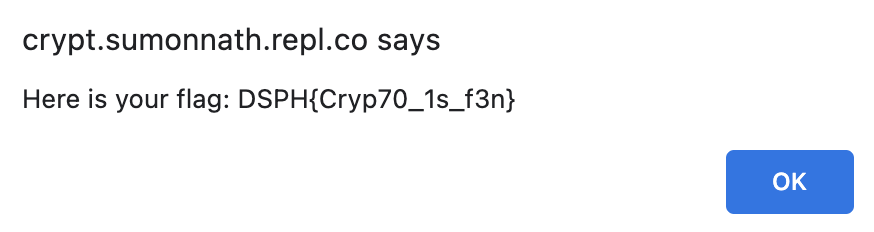

# cy3tic_web Writeup

## Info

Category: Web <br/>
Difficulty: Easy

<br/>

### **tl;dr**

Find source code from comment in source code. Password has 50 possible options and is hashed 100 times using SHA1 and exposed. Run python script to get correct password from hash.
<br /><br />

## Initial

We are given a site that shows a hashed password and a password input field.

<br/>

## Method

Running dcode's [cipher identifier](https://www.dcode.fr/cipher-identifier) showed that it was a SHA1 hash.

<br/>
I ran through a few common SHA1 hash databases but the results were inconclusive. Each time a password was submitted the hash changed, suggesting that the password was randomly generated each time.

<br/>

Looking at the source code showed a comment with a url parameter of - `/?view=1`



Entering it into the url showed the source code for generating the hash.


The first part of the code showed that if the `GET` parameter 'view' was present, then the `index.php` file would be highlighted and shown.

Seeing the `$_SESSION` variable being used and compared to the password parameter being sent in the POST request, I thought I had to set a session storage key as "hash" and the value matching the password.

However subsequently it showed that the `hash` variable was a randomly generated string between (13000000,13000050) and concatenated with "DSPH". The hash was then hashed with SHA1 100 times and displayed to the user.

Given that there were only 50 options I could easily run a script to check for all possible options of the password and figure out which one matched the hash.

```
import hashlib

target = "86e6b53978acaba4401bd838b3aff9c74565ce84"
def sha(n):
    original = n
    for i in range(100):
        n = str.encode(n)
        n = hashlib.sha1(n).hexdigest()
        if(n == target):
            print("Answer:",original)

for i in range(13000000,13000051):
    test = str(i) + "DSPH"
    sha(test)

```

And when I keyed in the matching password for the hash.


<br/>

## Thoughts

- Quite a fun challenge, and a simple password crack from looking at the source code
