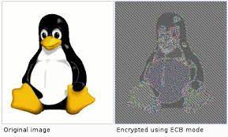
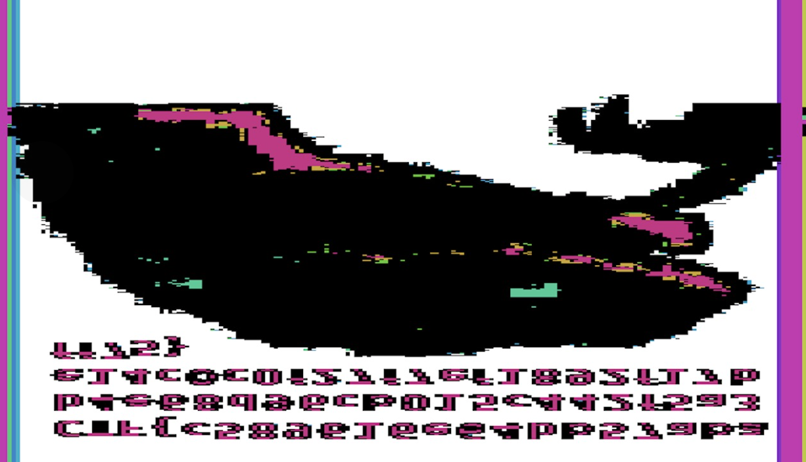
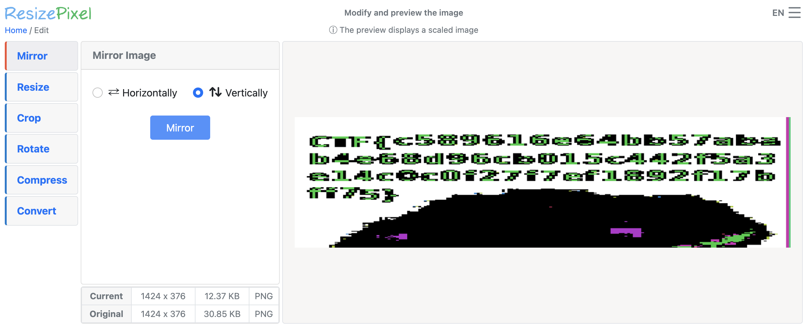

# DCTF 2022 – Crypto Challenges

## Algorithm (Medium)

We are given an encryption algorithm in python. Essentially, it transforms the original flag into a hex number

```
flag = ' [test]'
hflag = flag.encode('hex')
iflag = int(hflag[2:], 16)

def polinom(n, m):
   i = 0
   z = []
   s = 0
   while n > 0:
   	if n % 2 != 0:
   		z.append(2 - (n % 4))
   	else:
   		z.append(0)
   	n = (n - z[i])/2
   	i = i + 1
   z = z[::-1]
   l = len(z)
   for i in range(0, l):
       s += z[i] * m ** (l - 1 - i)
   return s

i = 0
r = ''
while i < len(str(iflag)):
   d = str(iflag)[i:i+2]
   nf = polinom(int(d), 3)
   r += str(nf)
   i += 2

print r
```

### Solution

```
def FAN(n, m):
    i = 0
    z = []
    s = 0
    while n > 0:
        # print(n)
        if n % 2 != 0:
            z.append(2 - (n % 4))
        else:
            z.append(0)
        n = (n - z[i])//2
        i = i + 1
    z = z[::-1]
    l = len(z)
    for i in range(0, l):
        s += z[i] * m ** (l - 1 - i)
    return s

xxx={}
for kk in range(0,100):
    xxx[FAN(kk, 3)]=kk
ff=open('flag_enc.txt','r')
dd=ff.read()
print dd
str1=''
jj=0
while jj<len(dd):
    if xxx.has_key(int(dd[jj:jj+4])):
        str1+='%d'%(xxx[int(dd[jj:jj+4])])
        jj+=4
    elif xxx.has_key(int(dd[jj:jj+3])):
        str1+='%02d'%(xxx[int(dd[jj:jj+3])])
        jj+=3
    elif xxx.has_key(int(dd[jj:jj+2])):
        str1+='%02d'%(xxx[int(dd[jj:jj+2])])
        jj+=2
    elif xxx.has_key(int(dd[jj:jj+1])):
        str1+='%02d'%(xxx[int(dd[jj:jj+1])])
        jj+=1
print str1
str2='%x'%(int(str1))
print str2.decode('hex')
```

### Flag

```
[ola_th1s_1s_p0l]
```

## Raw Image (Medium)

We are given `raw-image.bin` and the prompt that "my friend messed up decryption of this image"

Running `file` on this gives

```

raw-image.bin: openssl enc'd data with salted password

```

### Solution

The algorithm used to encrypt the image was AES-ECB, which still retains details of the original image, like in this famous example



In order to fix it, I used an online [repo](https://github.com/doegox/ElectronicColoringBook/blob/master/ElectronicColoringBook.py), that tried to guess the bytes based off repeated blocks and providing a predicted pixel size

Running `python3 ecb.py raw-image.bin --pixel-size=4` gives this image



Mirroring it horizontally and vertically gives the final flag


```

```
