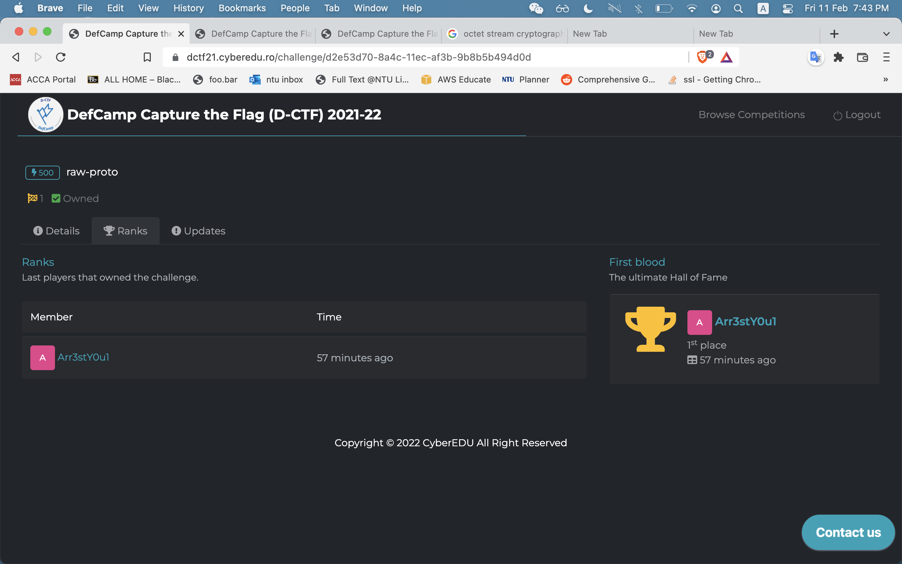
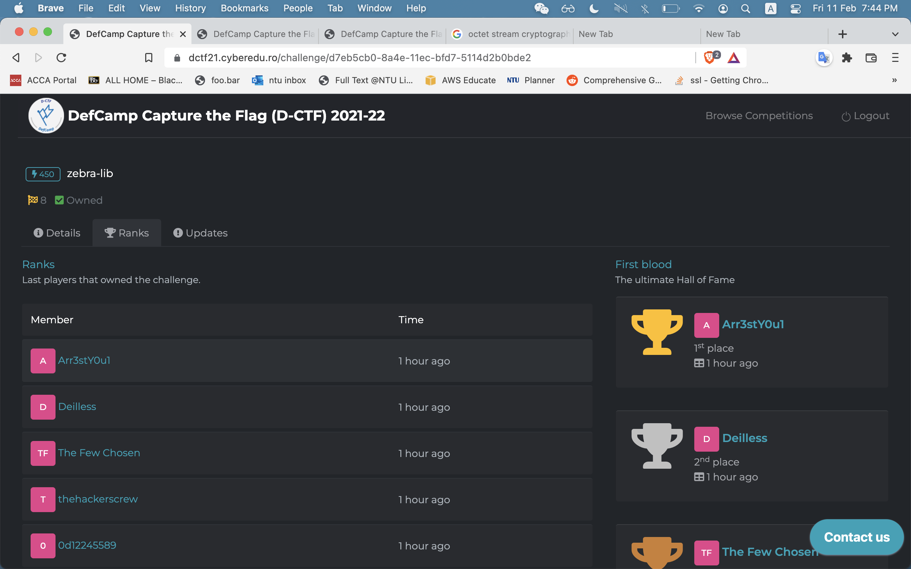
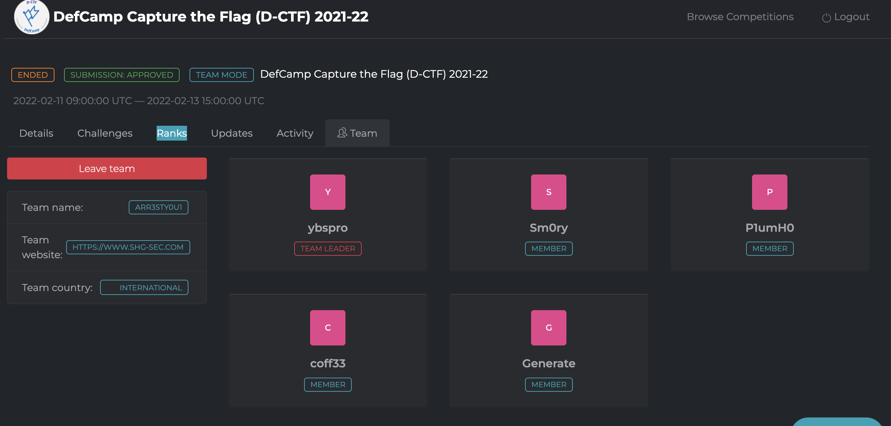
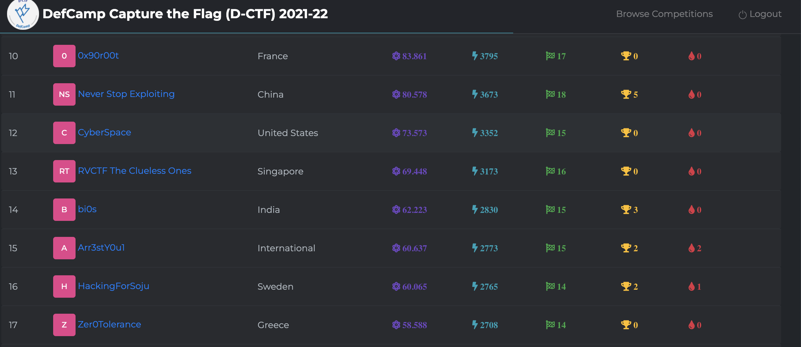

# DefCamp CTF (d-ctf) 2021-2022

<em>11th - 13th Feb 2022 </em>

Organised by [Cyber Edu](https://app.cyberedu.ro/)

Really great CTF. Enjoyable challenges that were just the right mix of challenging.

I managed to solve quite a few problems on my own, which was a first for a rated CTF like this one.

Also was the first time I managed to get first bloods on challenges. I managed to get both first bloods for the YAML injection challenge `raw-proto` and the Zlib challenge `zebra-lib`

The team I played with [Arr3stY0u](https://www.shg-sec.com) managed 15th place out of 1035 teams

