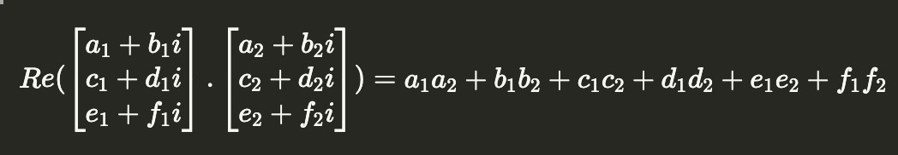

# Crypto - Dot (252)

## Challenge

```python
#complex.py
class ComplexVector():
    def __init__(self, vec):
        for i in vec:
            assert isinstance(i, ComplexNumber)
        self.internal = vec
        self.n = len(vec)

    def __str__(self):
        return f"({', '.join(map(str,self.internal))})"

    def __mul__(self, other):
        assert self.n == other.n
        res = ComplexNumber(0, 0)
        for i in range(self.n):
            res += (~self.internal[i]) * other.internal[i]
        return res

    def __eq__(self, __o: object):
        if not isinstance(__o, ComplexVector):
            return False
        if self.n != __o.n:
            return False
        for i in range(self.n):
            if self.internal[i] != __o.internal[i]:
                return False
        return True

class ComplexNumber():
    def __init__(self, a, b):
        self.a = a
        self.b = b

    def __str__(self):
        return f'{self.a} + {self.b}i'

    def __mul__(self, other):
        return ComplexNumber(
            self.a * other.a - self.b * other.b,
            self.a * other.b + self.b * other.a
        )

    def __add__(self, other):
        return ComplexNumber(self.a + other.a, self.b + other.b)

    def __invert__(self):
        return ComplexNumber(self.a, -self.b)

    def __eq__(self, __o: object):
        if isinstance(__o, ComplexNumber):
            return self.a == __o.a and self.b == __o.b
        return False
```

```python
#main.py

from complex import ComplexVector, ComplexNumber
from secrets import randbits

v1 = []

n = 3
bits = 64

FLAG = <REDACTED>

def gen():
    global v1
    v1 = ComplexVector([
        ComplexNumber(randbits(bits), randbits(bits)) for _ in range(n)
    ])

def welcome():
    print('''
---+---+---+---+---+---+---+---+---+---+---+---+---+---+---+---+---+--
 o | o   o | o   o | o   o | o   o | o   o | o   o | o   o | o   o | o
---+---+---+---+---+---+---+---+---+---+---+---+---+---+---+---+---+--
 o   o | o   o | o   o | o   o | o   o | o   o | o   o | o   o | o   o
---+---+---+---+---+---+---+---+---+---+---+---+---+---+---+---+---+--
 o | o   o | o   o | o   o | o   o | o   o | o   o | o   o | o   o | o
---+---+---+---+---+---+---+---+---+---+---+---+---+---+---+---+---+--
 o   o | o   o | o   o | o   o | o   o | o   o | o   o | o   o | o   o
---+---+---+---+---+---+---+---+---+---+---+---+---+---+---+---+---+--
 o | o   o | o   o | o   o | o   o | o   o | o   o | o   o | o   o | o
---+---+---+---+---+---+---+---+---+---+---+---+---+---+---+---+---+--
 o   o | o   o | o   o | o   o | o   o | o   o | o   o | o   o | o   o
---+---+---+---+---+---+---+---+---+---+---+---+---+---+---+---+---+--
 o | o   o | o   o | o   o | o   o | o   o | o   o | o   o | o   o | o
---+---+---+---+---+---+---+---+---+---+---+---+---+---+---+---+---+--
 o   o | o   o | o   o | o   o | o   o | o   o | o   o | o   o | o   o
---+---+---+---+---+---+---+---+---+---+---+---+---+---+---+---+---+--
 o | o   o | o   o | o   o | o   o | o   o | o   o | o   o | o   o | o
---+---+---+---+---+---+---+---+---+---+---+---+---+---+---+---+---+--
 o   o | o   o | o   o | o   o | o   o | o   o | o   o | o   o | o   o
---+---+---+---+---+---+---+---+---+---+---+---+---+---+---+---+---+--
 o | o   o | o   o | o   o | o   o | o   o | o   o | o   o | o   o | o
---+---+---+---+---+---+---+---+---+---+---+---+---+---+---+---+---+--
    ''')
    print("I have v1, you have v2. Uh! \(^ヮ^)/ <v1, v2>")
    print("Guess my v1 and I give you flag\n", flush=True)

def inputToVec(userIn):
    v = list(map(lambda x : list(map(int, x.strip().split())), userIn.split(',')))
    if (len(v) != n):
        print(f"Your vector must have {n} entries")
        exit(0)
    for i in v:
        if i[0].bit_length() >= 400 or i[1].bit_length() >= 400:
            print("Why your vector so big ヾ( ￣O￣)ツ")
            exit(0)
    return ComplexVector(list(map(lambda x : ComplexNumber(x[0], x[1]), v)))

if __name__ == '__main__':
    welcome()
    print("Generating v1...", flush=True)
    gen()
    print("Finish generation!\n", flush=True)
    print("Split real and imaginary part of an entry by space and split entries by comma")
    print("Example: `1 2, 3 4, 5 6` for vector (1 + 2i, 3 + 4i, 5 + 6i)\n")
    userIn = input("Enter v2: ")
    v2 = inputToVec(userIn)
    print(f"Re(<v1, v2>) = {(v1 * v2).a}")
    print("I only give you real part because you can imagine the imaginary part (҂ `з´)\n")
    userIn = input("Enter v1: ")
    guess = inputToVec(userIn)
    if (guess == v1):
        print("FLAG for you!", flush=True)
        print(FLAG)
    else:
        print("...")

```

The `complex.py` file is not too important, it just has the standard implementation of Complex Numbers. There is a secret vector $v_1$ that we are supposed to guess all the We provide a complex vector $v_2$. We are then given the $Re(v_1 * v_2)$ and are supposed to guess what $v_1$ is.

Note: In this case, the multiplication is the dot product, not the cross product



The solution is very similar to what we had for the [Root](./root.md) challenge. Send big enough numbers so that we can just extract the numbers. We are given a limit this time on the absolute value of coefficients

```python
if i[0].bit_length() >= 400 or i[1].bit_length() >= 400:
    print("Why your vector so big ヾ( ￣O￣)ツ")
    exit(0)
```

So we just need to apportion the coefficients well. I started with an upper limit of $2^{399}$, and found that the biggest power of 10 I could make was $10^{120}$. So since I have 6 coefficients to extract

$$\begin{bmatrix} a_1 & b_1 & c_1 & d_1 &  e_1 & f_1 \end{bmatrix}$$

I can split the coefficients of $v_2$:

$$
\begin{bmatrix} a_2 & b_2 & c_2 & d_2 &  e_2 & f_2 \end
{bmatrix} = \begin{bmatrix}1  & 10^{24} & 10^{48} & 10^{72} &  10^{96} & 10^{120}\end
{bmatrix}
$$

Sending this to the server gave me a result like

$2278367996175269944000001391854838249725383000017728696593460103555000016569556801210618969000004464971701323379261000016135942957835141883$

And it's obvious where all the coefficients are, based on the preceding zeros, and from there, we are able to derive $v_1$

No full script for this because it can be done manually.

## Flag

```
grey{.........................................UsDJk3ENW55hG9ktZG4X}
```
