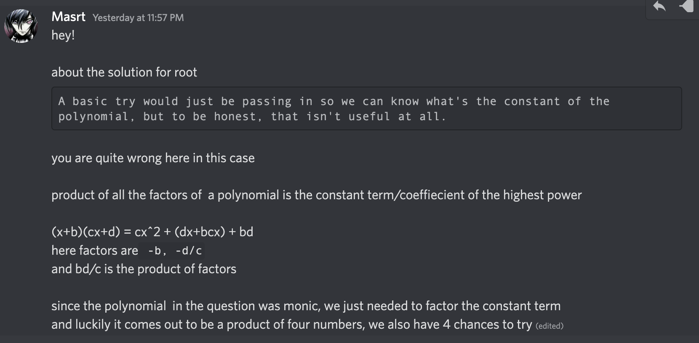

# GreyCat Finals: Crypto - Root (424)

## Challenge

```python
FLAG = <REDACTED>

coeff = []

# Fills in the coeff array
# Post Conditions :
# 1. len(coeff) > 30
# 2. coeff[len(coeff) - 1] == 1
# 3. There exists at least one input x, where 0 < x < 2**70 and eval(input) == 0
def fillCoeff():
    # Implementation hidden
    ...
    assert len(coeff) > 30
    assert coeff[len(coeff) - 1] == 1

def eval(userInput):
    s = 0
    for i in range(len(coeff)):
        s += coeff[i] * (userInput**i)
    return s

def isCitizen(userInput):
    if not (0 < userInput < 2**70):
        return False
    return eval(userInput) == 0

def welcome():
    print('''
                             -|             |-
         -|                  [-_-_-_-_-_-_-_-]                  |-
         [-_-_-_-_-]          |             |          [-_-_-_-_-]
          | o   o |           [  0   0   0  ]           | o   o |
           |     |    -|       |           |       |-    |     |
           |     |_-___-___-___-|         |-___-___-___-_|     |
           |  o  ]              [    0    ]              [  o  |
           |     ]   o   o   o  [ _______ ]  o   o   o   [     | ----__________
_____----- |     ]              [ ||||||| ]              [     |
           |     ]              [ ||||||| ]              [     |
       _-_-|_____]--------------[_|||||||_]--------------[_____|-_-_
      ( (__________------------_____________-------------_________) )
''')
    print("Welcome to The Root Kingdom!!!")
    print("Only citizen of Root are allowed to enter the country.")
    print("Choose the action that you wish to perform.")
    print("1. Have a taste of our beetroot.")
    print("2. Prove that you are a citizen of Root by solving the riddle")

if __name__ == "__main__":
    welcome()
    fillCoeff()
    for i in range(5):
        option = int(input("Option: "))
        if (option == 1):
            x = int(input("How much beetroot do you want?\n"))
            print(f"Here you go! {eval(x)}")
        elif (option == 2):
            x = int(input("What goes through cities and fields, but never moves?\n"))
            if (isCitizen(x)):
                print(f'Welcome Home! {FLAG}')
            else:
                print("Are you sure that you live here?")
        else:
            print("What you say?")
```

There is a polynomial, $f(x)$ of degree > 30 with unknown coefficients, that has a root,a value of $x$ such that $f(x) = 0$ and $0 < x < 2^70$. The implementation of how the coefficients are chosen are hidden, and the only coefficient known is that the highest degree coefficient is $1$.

```python
assert coeff[len(coeff) - 1] == 1
```

We are allowed to give at most 4 inputs of $x$ into the polynomial and get to see the result, and within these 5 tries, we have to give the root of the equation.

My first thought was that this was some weird variant of Shamir's Secret Sharing Scheme, but there is no modulus. In order to find the roots of the equation, we need to know all the coefficients, and plug it into `sage` and pray that `f.roots()` gives you the root.

> Edit: I am wrong please see note at bottom for probably the better way to solve it
> A basic try would just be passing in $f(0)$ so we can know what's the constant of the polynomial, but to be honest, that isn't useful at all. But it does give us an idea of what the coefficients are like, which are approximately 70+ digits, and could be positive or negative.

Since there is no limit to the $x$ that you pass in, my idea was to pass in a very large number, such as $10^y$, where $y$ is a large number, such that the coefficients will play a very small role in the final output, and largely dominated by the `x`. This would then review the coefficients which either trail behind a string of zeroes or nines. For e.g., if the equation was something like

$f(x) = x^3 + 5x^2 - 7x + 19$

$f(10^y) = 1000...0000...5000...0000...999..3000...000...19000...000$

The coefficients would then pop up. Positive coefficients are preceded by sequences of $0$ and negative coefficients would be preceded by sequences of $9$. We are guaranteed that the final coefficient would be positive, because the highest degree coefficient is $1$.

If I send in $10^{1000}$ and the degree is, let's say $46$, I should expect to get back a number that is $46,000$ digits long or $46001$, but if I get the latter case, I just try again to make sure my code is simpler.

Each coefficient should be hidden in every $1000$ digits, so I first split them up. Check if its positive or negative, and extract the coefficient.

```python
#line is the result of f(10^1000)

#remove the preceding 1
if line[0] == '1':
    line = line[1:]

coefficients = []
split_result = [line[i:i+length] for i in range(0,len(line), length)]
for i in split_result:
    if i[0] == '9':
        coeff = (int('1'+'0'*(length)) - int(i)) * -1
    else:
        for j in range(len(i)):
            if i[j] != '0':
                coeff = int(i[j:])
                break
    coefficients.append(coeff)
```

After getting it, I reverse the order, such that the coefficients of the higher degrees would be at the back and append the first coefficient

```python
coefficients.reverse()
coefficients.append(1)
```

However, these coefficients are actually incorrect, there are a few off by ones in the coefficients, so the easiest way to fix it is to compare the result from the server, $z$, with the result of my slightly off polynomial $f'(x)$ and take  
$z - f'( 10^{1000})$  
and tweak the coefficients based on the results which should be something like $10010101...$, where a $1$ means that the coefficient is off for that particular degree.

```python
def getEqn(coeff):
    s = 0
    for i in range(len(coeff)):
        s += coeff[i] * (x)^i
    return s

f = getEqn(coefficients)
payload = 10^1000

#target is the result from the server
def compare(f, target, num):
    res = str(target - f(num))
    length = (len(res)//1000)

    for i in range(len(res)):
        if res[i] == '1':
            coefficients[length - i//1000] += 1
    return getEqn(coefficients)

```

And we can assert that our polynomial matches the output given the input $10^{1000}$.

All that's needed is to bundle all of it together in the full solve script.

## Solution

```python
from pwn import *
from sage.all import *

# nc 34.142.228.44 10521
host, port = '34.142.228.44', 10521
length = 1000
p = remote(host, port)
payload = b'1' + b'0'*length
p.sendlineafter(b'Option:', b'1')
p.sendlineafter(b'want?\n', payload)
line = p.recvline().strip().decode()
line = line.split('go! ')[-1]
coefficients = []

original = line
if line[0] == '1':
    line = line[1:]

split_result = [line[i:i+length] for i in range(0,len(line), length)]

for i in split_result:
    if i[0] == '9':
        coeff = (int('1'+'0'*(length)) - int(i)) * -1
        # is negative
    else:
        for j in range(len(i)):
            if i[j] != '0':
                coeff = int(i[j:])
                break
        # is positive
    coefficients.append(coeff)

coefficients.reverse()
coefficients.append(1)

def getEqn(coeff):
    s = 0
    for i in range(len(coeff)):
        s += coeff[i] * (x)^i
    return s
f = getEqn(coefficients)
payload = 10^1000

def compare(f, target, num):
    res = str(target - f(num))
    length = (len(res)//1000)

    for i in range(len(res)):
        if res[i] == '1':
            coefficients[length - i//1000] += 1
    return getEqn(coefficients)

f = compare(f, Integer(original), payload)

root = f.roots()[0][0]
p.sendline(b'2')
p.sendline(str(root).encode())
p.interactive()
```

## Flag

```
grey{The_Answer_To_The_Riddle_Is_"Road"!_ZvBtTpyA4GXuuwjB}
```

## Notes:

Honestly, I have no idea how people solved this so fast hahaha, I find its a lot simpler than the next challenge `Dot` and would love to see how other people do it. Tbh, this method is quite potato brain, and I'm sure there's easier ways to do it, and to figure out why I have all these off by 1 errors. Feel free to dm me if you know any of these :)

## Edit:

Thank you @Masrt for pointing this out.


- So literally send $0$, Alpertron or sage to factorise, send 4 factors ....no wonder the implementation was hidden and we had 4 tries....
