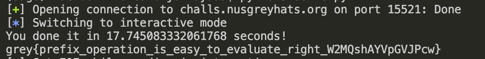

# Crypto - Calculator (50)

## Challenge

We are basically given some mathematical operations and asked to evaluate the prefix notation of it. Some operations take 2 operands, and some take 1 which will be relevant.

```python
Operations include:
1. add x y -> returns x + y
2. mul x y -> returns x * y
3. sub x y -> returns x - y
4. neg x -> returns -x
5. inc x -> returns x + 1

Example1: mul add 1 2 sub 5 1
Ans1: (1 + 2) * (5 - 1) = 12

Example2: add mul sub 3 2 inc 5 3
Ans2: (3 - 2) * (5 + 1) + 3 = 9
```

We can just evaluate this using a stack which is a typical data structure for this kind of problem. We reverse it first, and push all operands to the stack. When we encounter an operator that needs 2 operands, we pop 2 items off the stack and evaluate, otherwise we pop off 1 and evaluate. The result is pushed back onto the stack and this continues until there's only one element left in the stack and that's your answer!

## Solution

```python
from pwn import *

def evaluate(expression):
    """
    Evaluate a given expression in prefix notation.
    Asserts that the given expression is valid.
    """
    stack = []
    expression = expression.split()
    # iterate over the string in reverse order
    for c in expression[::-1]:

        # push operand to stack
        try:
            stack.append(int(c))

        except:
            # pop values from stack can calculate the result
            # push the result onto the stack again
            o1 = stack.pop()

            if c == 'inc':
                stack.append(o1+1)
                continue

            if c == 'neg':
                stack.append(o1*-1)
                continue

            o2 = stack.pop()

            if c == 'add':
                stack.append(o1 + o2)

            elif c == 'sub':
                stack.append(o1 - o2)

            elif c == 'mul':
                stack.append(o1 * o2)

    return stack.pop()


def test():
    assert evaluate("mul add 1 2 sub 5 1") == 12
    assert evaluate("add mul sub 3 2 inc 5 3") == 9
    print("yay")

p = remote("challs.nusgreyhats.org",15521)
p.sendlineafter(b'ready!\n', b'START')

for i in range(100):
    exp = p.recvline().decode('utf-8')
    p.sendline(str(evaluate(exp)).encode())
    p.recvline()
p.interactive()


```

## Flag



```
#grey{prefix_operation_is_easy_to_evaluate_right_W2MQshAYVpGVJPcw}
```
