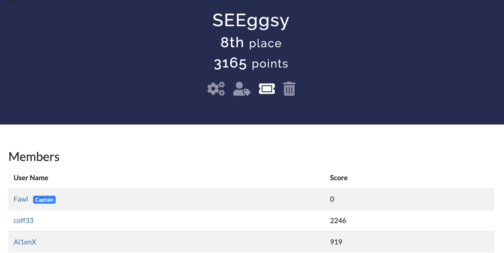

# GreyCTF 2022

> Writeups for Finals are below

## Qualifiers

<em>6th - 10th June</em>

Participated in a team of 3 and got top 10, sufficient to qualify for finals. Was quite a fun CTF with good quality challenges, definitely learnt something new with each challenge I solved.

| Challenge                | Writeup Link                          | Tag                                                        |
| ------------------------ | ------------------------------------- | ---------------------------------------------------------- |
| Crypto - Baby            | [here](./Crypto/baby.md)              | Modular Arithmetic                                         |
| Crypto - Cube            | [here](./Crypto/cube.md)              | DLP                                                        |
| Crypto - Block           | [here](./Crypto/block.md)             | Reversing (Actually)                                       |
| Crypto - Equation 1      | [here](./Crypto/equation1.md)         | Algebra                                                    |
| Crypto - Equation 2      | [here](./Crypto/equation2.md)         | Algebra                                                    |
| Crypto - Permutation     | [here](./Crypto/permutation.md)       | Symmetric Groups, Key Exchange                             |
| Crypto - Catino          | TBD when I learn how to solve it :(   | Integer Relation Algorithm, LLL                            |
| Crypto - Hypersphere     | [here](./Crypto/hypersphere.md)       | Quaternions, Key Exchange                                  |
| Misc - Firmware          | No need                               | `binwalk -e`, `7z x` , `grep -rnw . -e grey`               |
| Misc - Calculator        | [here](./Misc/Calculator.md)          | Algorithms, Prefix Notation                                |
| Misc - Slow Down         | [here](./Misc/Slow%20Down.md)         | Hash table collisions                                      |
| Misc - Data Degeneration | [here](./Misc/Data%20Degeneration.md) | Data analysis-ish                                          |
| Misc - Logical Computers | [here](./Misc/Logical%20Computers)    | Machine Learning                                           |
| Web - SelNode            | [here](./Web/SelNode.md)              | Selenium Standalone/Grid                                   |
| Web - Shero              | [here](./Web/Shero.md)                | PHP funkyness and bash magic (Blooded by teammate @Al1enX) |
| Rev - Memory Game 2      | TBD when I learn how to use Frida :(  | Mobile Game RE, Java decompilation                         |

## Finals

<em>18th - 19th June</em>

Was held physically, and the challenges were a lot more challenging. Felt they were still quite educational and still learnt a lot with each challenge.

Our team managed to get 8th place out of the finalists.

| Challenge                 | Writeup Link                             | Tag                                                 |
| ------------------------- | ---------------------------------------- | --------------------------------------------------- |
| Crypto - Root             | [here](./Crypto/root.md)                 | Polynomial Equations                                |
| Crypto - Dot              | [here](./Crypto/dot.md)                  | Complex Numbers                                     |
| Crypto - Equation 3       | TBD, [here](./Crypto/eqn3.md)            | Quotient Groups, Coppersmith small roots            |
| Misc - Noisy              | TBD, [here](./Misc/Noisy.md)             | Decoding, Data Analysis                             |
| Misc - Pursuit            | TBD, [here](./Misc/Pursuit.md)           | Directed Graphs                                     |
| Misc - QFC                | TBD, [here](./Misc/QFC.md)               | Qubits                                              |
| Web - Hello_GreyCat_Alpha | [here](./Web/hello_greycat_alpha.md)     | PHP environment variables, Bash magic functions     |
| Web - Hello_GreyCat_Beta  | TBD, [here](./Web/hello_greycat_beta.md) | phpinfo, LD_PRELOAD, tmp files, Race Condition, RCE |
| Rev - Oneliner            | [here](./Rev/Oneliner.ipynb)             | Obfuscated Python, and Flag Guessing                |
