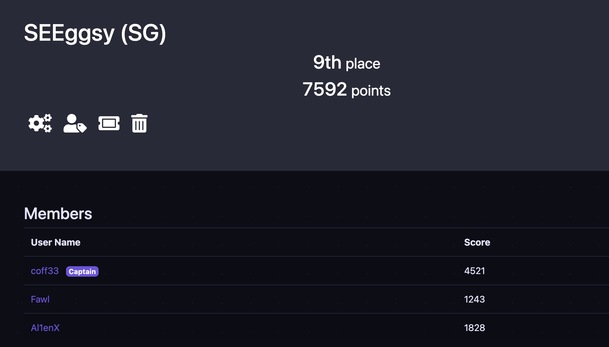
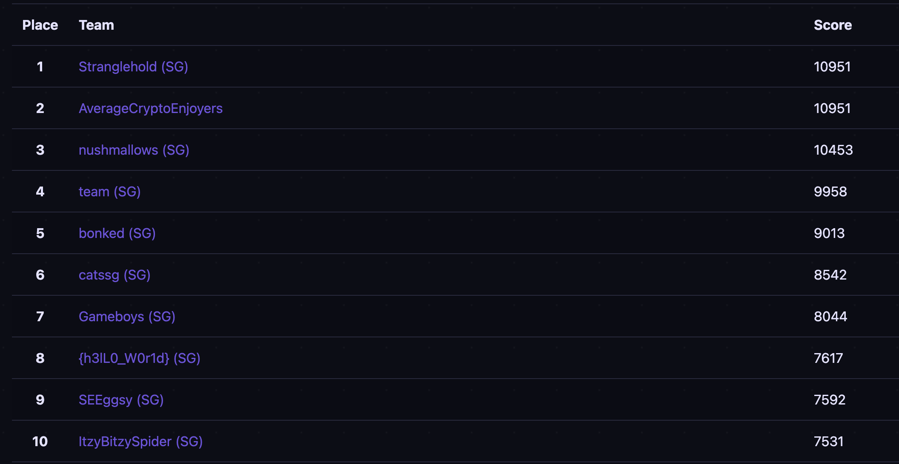

# GreyCTF 2022

<em>6th - 10th June</em>

Participated in a team of 3 and got top 10, sufficient to qualify for finals. Was quite a fun CTF with good quality challenges, definitely learnt something new with each challenge I solved.

| Challenge                | Writeup Link             | Tag                                          |
| ------------------------ | ------------------------ | -------------------------------------------- |
| Crypto - Baby            | [here](./Crypto/baby.md) | Modular Arithmetic                           |
| Crypto - Cube            | TBD                      | TBD                                          |
| Crypto - Equation 1      | TBD                      | TBD                                          |
| Crypto - Equation 2      | TBD                      | TBD                                          |
| Crypto - Perm            | [here](./Crypto/perm.md) | Symmetric Groups                             |
| Misc - Firmware          | No need                  | `binwalk -e`, `7z x` , `grep -rnw . -e grey` |
| Misc - Calculator        | TBD                      | TBD                                          |
| Misc - Slow Down         | TBD                      | TBD                                          |
| Misc - Data Degenerator  | TBD                      | TBD                                          |
| Misc - Logical Computers | TBD                      | TBD                                          |
| Web - SelNode            | TBD                      | TBD                                          |
| Web - Shero              | TBD                      | TBD (Blooded by teammate @Al13nX)            |

