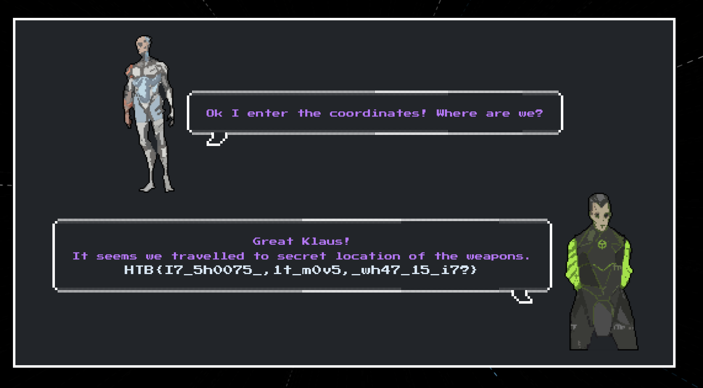

# HTB Cyberpocalypse 2022 – Crypto Challenges

## Category Challenge 1: Android in the Middle

### Description/Source

```python
from Crypto.Cipher import AES
from Crypto.Util.number import long_to_bytes
import hashlib
import random
import socketserver
import signal


FLAG = "HTB{--REDACTED--}"
DEBUG_MSG = "DEBUG MSG - "
p = 0x509efab16c5e2772fa00fc180766b6e62c09bdbd65637793c70b6094f6a7bb8189172685d2bddf87564fe2a6bc596ce28867fd7bbc300fd241b8e3348df6a0b076a0b438824517e0a87c38946fa69511f4201505fca11bc08f257e7a4bb009b4f16b34b3c15ec63c55a9dac306f4daa6f4e8b31ae700eba47766d0d907e2b9633a957f19398151111a879563cbe719ddb4a4078dd4ba42ebbf15203d75a4ed3dcd126cb86937222d2ee8bddc973df44435f3f9335f062b7b68c3da300e88bf1013847af1203402a3147b6f7ddab422d29d56fc7dcb8ad7297b04ccc52f7bc5fdd90bf9e36d01902e0e16aa4c387294c1605c6859b40dad12ae28fdfd3250a2e9
g = 2


class Handler(socketserver.BaseRequestHandler):
    def handle(self):
        signal.alarm(0)
        main(self.request)


class ReusableTCPServer(socketserver.ForkingMixIn, socketserver.TCPServer):
    pass


def sendMessage(s, msg):
    s.send(msg.encode())


def recieveMessage(s, msg):
    sendMessage(s, msg)
    return s.recv(4096).decode().strip()


def decrypt(encrypted, shared_secret):
    key = hashlib.md5(long_to_bytes(shared_secret)).digest()
    cipher = AES.new(key, AES.MODE_ECB)
    message = cipher.decrypt(encrypted)
    return message


def main(s):
    sendMessage(s, DEBUG_MSG + "Generating The Global DH Parameters\n")
    sendMessage(s, DEBUG_MSG + f"g = {g}, p = {p}\n")
    sendMessage(s, DEBUG_MSG + "Calculation Complete\n\n")

    sendMessage(s, DEBUG_MSG + "Generating The Public Key of CPU...\n")
    c = random.randrange(2, p - 1)
    C = pow(g, c, p)
    sendMessage(s, DEBUG_MSG + "Calculation Complete\n")
    sendMessage(s, DEBUG_MSG + "Public Key is: ???\n\n")

    M = recieveMessage(s, "Enter The Public Key of The Memory: ")

    try:
        M = int(M)
    except:
        sendMessage(s, DEBUG_MSG + "Unexpected Error Occured\n")
        exit()

    sendMessage(s, "\n" + DEBUG_MSG + "The CPU Calculates The Shared Secret\n")
    shared_secret = pow(M, c, p)
    sendMessage(s, DEBUG_MSG + "Calculation Complete\n\n")

    encrypted_sequence = recieveMessage(
        s, "Enter The Encrypted Initialization Sequence: ")

    try:
        encrypted_sequence = bytes.fromhex(encrypted_sequence)
        assert len(encrypted_sequence) % 16 == 0
    except:
        sendMessage(s, DEBUG_MSG + "Unexpected Error Occured\n")
        exit()

    sequence = decrypt(encrypted_sequence, shared_secret)

    if sequence == b"Initialization Sequence - Code 0":
        sendMessage(s, "\n" + DEBUG_MSG +
                    "Reseting The Protocol With The New Shared Key\n")
        sendMessage(s, DEBUG_MSG + f"{FLAG}")
    else:
        exit()


if __name__ == '__main__':
    socketserver.TCPServer.allow_reuse_address = True
    server = ReusableTCPServer(("0.0.0.0", 1337), Handler)
    server.serve_forever()

```

A very basic form of Diffie Hellman but you have control over the public key. If you set the public key `M` to 0, since `shared_secret = pow(M, c, p)`, the shared secret will be 0, and hence you can derive the key use for AES encryption.

```
key = hashlib.md5(long_to_bytes(0)).digest()
```

### Solver

```python
from pwn import *
from libnum import n2s
import hashlib

host, port = "167.71.137.43",32742
p = remote(host,port)
g = 2
p.recvuntil(b'p = ')
mod = int(p.recvline().strip().decode('utf-8'))
print("mod:", mod)

key = hashlib.md5(n2s(0)).digest()
shared_secret= 0
key = hashlib.md5(long_to_bytes(shared_secret)).digest()
cipher = AES.new(key, AES.MODE_ECB)
payload = cipher.encrypt(b"Initialization Sequence - Code 0").hex()
p.sendline(payload)
p.interactive()
```

### Flag

```
HTB{7h15_p2070c0l_15_pr0tec73d_8y_D@nb3er_c0pyr1gh7_1aws}
```

## Crypto Challenge 2: Jenny from the Block

### Description/Source

```python
from hashlib import sha256
from Crypto.Util.Padding import pad, unpad
import signal
import subprocess
import socketserver
import os

allowed_commands = [b'whoami', b'ls', b'cat secret.txt', b'pwd']
BLOCK_SIZE = 32


def encrypt_block(block, secret):
    enc_block = b''
    for i in range(BLOCK_SIZE):
        val = (block[i]+secret[i]) % 256
        enc_block += bytes([val])
    return enc_block


def encrypt(msg, password):
    h = sha256(password).digest()
    if len(msg) % BLOCK_SIZE != 0:
        msg = pad(msg, BLOCK_SIZE)
    blocks = [msg[i:i+BLOCK_SIZE] for i in range(0, len(msg), BLOCK_SIZE)]
    ct = b''
    for block in blocks:
        enc_block = encrypt_block(block, h)
        h = sha256(enc_block + block).digest()
        ct += enc_block

    return ct.hex()


def run_command(cmd):
    if cmd in allowed_commands:
        try:
            resp = subprocess.run(
                cmd.decode().split(' '),  capture_output=True)
            output = resp.stdout
            return output
        except:
            return b'Something went wrong!\n'
    else:
        return b'Invalid command!\n'


def challenge(req):
    req.sendall(b'This is Jenny! I am the heart and soul of this spaceship.\n' +
                b'Welcome to the debug terminal. For security purposes I will encrypt any responses.')
    while True:
        req.sendall(b'\n> ')
        command = req.recv(4096).strip()
        output = run_command(command)
        response = b'Command executed: ' + command + b'\n' + output
        password = os.urandom(32)
        ct = encrypt(response, password)
        req.sendall(ct.encode())


class incoming(socketserver.BaseRequestHandler):
    def handle(self):
        signal.alarm(30)
        req = self.request
        challenge(req)


class ReusableTCPServer(socketserver.ForkingMixIn, socketserver.TCPServer):
    pass


def main():
    socketserver.TCPServer.allow_reuse_address = True
    server = ReusableTCPServer(("0.0.0.0", 1337), incoming)
    server.serve_forever()


if __name__ == "__main__":
    main()

```

Note that if you send a payload of `cat secret.txt` the real text that is encrypted is `Command executed: cat secret.txt\n` which is just nice above 32 characters (above the block size). Since we know the value of the block, we can derive the value of the secret.

### Solver

```python
from hashlib import sha256
from Crypto.Util.Padding import pad, unpad
BLOCK_SIZE=32
def encrypt_block(block, secret):
    enc_block = b''
    for i in range(BLOCK_SIZE):
        val = (block[i]+secret[i]) % 256
        enc_block += bytes([val])
    return enc_block
pt = (b'Command executed: cat secret.txt\n')
ct = bytes.fromhex("d2b08f3f60ccf1d1455f0ddcf0912e47d357f45e5bdbface36130868e92b9ce4a070b8a630ccda442341e2a05662d2a221a738016c6f5a64ce509e7844f498904307eda2c53ae10e8e0be2fa2274cefc914bdd51d118fbda0a5c5763543f64dbf0959cdb9df57ba20ca2924a904596bb9792a8e90d4bdd78c3e5c25c6b92f5b493297b5af7e731ff40069d5224661e16af2306319254b041d3b844cbd890d17fc80b1646acc37bce5a56efcb1acc07cde86fc20bb6884b6b12ee0b91bb5d4bf4903e13d1e2b8ecc18f45aaed24b29f1f214c18bbdddae3f8fa6b52fc7dfb50846081b6d40e9b6f7690f6c1f9ae69705cfc177d29edafec72b7f9f317b1c0ed16")
ct = [ct[i:i+BLOCK_SIZE] for i in range(0,len(ct),BLOCK_SIZE)]
def decrypt_block(block, secret):
    dec = b''
    for i in range(BLOCK_SIZE):
        val = (block[i]-secret[i]) % 256
        dec += bytes([val])
    return dec

flag = ""
sec = sha256(ct[0] + pt[:BLOCK_SIZE]).digest()
for i in range(1,len(ct)):
    res = (decrypt_block(ct[i], sec))
    sec = sha256(ct[i] + res).digest()
    flag += res.decode('utf-8')
print(flag)

```

### Flag

```
HTB{b451c_b10ck_c1ph3r_15_w34k!!!}
```

## Crypto Challenge 3: The Three Eyed Oracle

### Description/Source

```python
from Crypto.Cipher import AES
from Crypto.Util.Padding import pad
import random
import signal
import subprocess
import socketserver

FLAG = b'HTB{--REDACTED--}'
prefix = random.randbytes(12)
key = random.randbytes(16)


def encrypt(key, msg):
    msg = bytes.fromhex(msg)
    crypto = AES.new(key, AES.MODE_ECB)
    padded = pad(prefix + msg + FLAG, 16)
    return crypto.encrypt(padded).hex()


def challenge(req):
    req.sendall(b'Welcome to Klaus\'s crypto lab.\n' +
                b'It seems like there is a prefix appended to the real firmware\n' +
                b'Can you somehow extract the firmware and fix the chip?\n')
    while True:
        req.sendall(b'> ')
        try:
            msg = req.recv(4096).decode()

            ct = encrypt(key, msg)
        except:
            req.sendall(b'An error occurred! Please try again!')

        req.sendall(ct.encode() + b'\n')


class incoming(socketserver.BaseRequestHandler):
    def handle(self):
        signal.alarm(1500)
        req = self.request
        challenge(req)


class ReusableTCPServer(socketserver.ForkingMixIn, socketserver.TCPServer):
    pass


def main():
    socketserver.TCPServer.allow_reuse_address = True
    server = ReusableTCPServer(("0.0.0.0", 1337), incoming)
    server.serve_forever()


if __name__ == "__main__":
    main()

```

Honestly, not much to say about this challenge, its just the token ECB decryption attack. Because encryption of a certain block of 16 characters will always lead to the same encryption, (hello ECB penguin), we can use paddings of known blocks (e.g. strings of long As) and leak out the flag one byte at a time.

[This](https://braincoke.fr/write-up/cryptopals/cryptopals-byte-a-time-ecb-decryption-simple/) is a relatively good primer for this attack.

### Solver

```python
from pwn import *

host, port = "134.209.31.115",30298
p = remote(host, port)

def send(payload):
    p.sendlineafter(b'>', payload.hex().encode())
    res =  p.recvline().strip().decode('utf-8')
    # print("response:", res)
    return res

flag = b""
bs = 16
from string import printable
def getChar(orig, idx):
    target = send(orig)
    target = target[bs*idx:i*bs*idx+bs]

    for i in printable:
        payload = orig  + i.encode('utf-8')
        res = send(payload)

from tqdm import tqdm
test_length = 76
for i in range(len(flag), 76):
    fail = True
    for j in tqdm(list(printable)):
        try:
            char = (j).encode('utf-8')
            text = b'AAAA' + b"A"*(80 - i -1) + flag + char + b"A"*(80 - 1 - i)
            code = send(text)
            code = code[32:]
            c1, c2 = code[:160], code[160:320]
            assert len(c1) == len(c2)
            if c1 == c2:
                flag += char
                fail = False
                print(flag)
                break
        except Exception as e:
            print(e)
            p.close()
            exit()
    if fail:
        print("something wrong")
        print(flag)
        exit()
print("The flag is: " + flag)
```

### Flag

```
HTB{345y_53cr37_r3c0v3ry}
```

## Crypto Challenge 4: MOVS like jagger

### Description/Source

An interestingly presented ECC MOV attack challenge. We are given the Generator point (from the code), and two public keys `P` and `Q` and we are supposed to derive the value of `P` \* `nQ` which is difficult to do without knowledge of the private key `n`

```python
#relevant parts


from ecdsa import ellipticcurve as ecc
from random import randint

a = -35
b = 98
p = 434252269029337012720086440207
Gx = 16378704336066569231287640165
Gy = 377857010369614774097663166640
ec_order = 434252269029337012720086440208

E = ecc.CurveFp(p, a, b)
G = ecc.Point(E, Gx, Gy, ec_order)

# we are given
P = (XXX,XXX)
Q = (XXX,XXX)

def generateKeyPair():
    private = randint(1, 2**64)
    public = G * private
    return(public, private)


#pass this function to win
def checkDestinationPoint(data: dict, P: ecc.Point, nQ: int, E: ecc.CurveFp) -> list:
    destination_x, destination_y = checkCoordinates(data)
    destination_point = ecc.Point(E, destination_x, destination_y, ec_order)
    secret_point = P * nQ
    same_x = destination_point.x() == secret_point.x()
    same_y = destination_point.y() == secret_point.y()

    if (same_x and same_y):
        return True
    else:
        return False

```

Like the name suggests, it is a MOV attack, basically shifting the group from a hard Elliptical Curve DLP to a regular DLP in finite field. Due to the fact that it is a supersingular curve which basically means that the embedding degree of the curve, `k`, which is the smallest integer such that `(p^k - 1) % E.order() == 0`, is `k ≤ 6`. From there we have 2 necessary points, we can change the group we are operating in and calculate the equivalent points using weil pairings, then let `sage` do the hard work of solving our DLP for us.

This is heavily referenced off [here](https://giacomopope.com/tools/mov.html)

### Solver

```python
a = -35
b = 98
p = 434252269029337012720086440207
Gx = 16378704336066569231287640165
Gy = 377857010369614774097663166640
ec_order = 434252269029337012720086440208
N = Zmod(p)
E = EllipticCurve(N, [a,b])
G = E(Gx,Gy)
P = E(0x46397178a5dac1fbbe886a518,0x2c507fca651b9ad29cf43b8ce)
Q = E(0x109a049c7420fa485d39dd4a8,0x55d47de105d148003c93bdb5c)


# Embedding degree is the smallest integer such that
# (p^k - 1) % E.order() == 0
# It is vital to the MOV attack that k is small.
# For supersingular curves, k ≤	6

# for k in range(1,7):
#     print((p^k - 1) % order == 0)
k = 2
assert(p^k - 1) % ec_order == 0


Go = G.order()
F2.<x> = GF(p^k)
E2 = E.change_ring(F2)
G2 = E2(G)
Q2 = E2(Q)

while True:
    R = E2.random_point()
    Ro = R.order()
    g = gcd(Ro, Go)
    S = (Ro//g)*R
    So = S.order()
    if Go/So in ZZ and Go == So:
        break

# Generate pairings
alpha = G2.weil_pairing(S,Go)
beta = Q2.weil_pairing(S,Go)
print("Done with Pairings\n")

# Solve dlog in GF(p^k) instead of E / GF(p)
dd = beta.log(alpha)
print(dd)

nQ = ec_order - dd
nQ = dd
secret = nQ * P
d = {
    'destination_x': str(secret[0]),
    'destination_y': str(secret[1])
}
import requests
url = "http://178.62.73.26:32384/api/get_flag"
r = requests.post(url,json=d)
print(r.text)
```

### Flag

```

```

## Crypto Challenge 5: Find Marher's Secret

### Description/Source

```python
import random
import signal
import subprocess
import socketserver
import json
import os
from Crypto.Cipher import ARC4, AES
import os
import hashlib
from secret import FLAG, KEY


def encrypt(key, iv, pt):
    return ARC4.new(iv + key).encrypt(pt).hex()


def challenge(req):
    key = bytes.fromhex(KEY)
    assert(len(key) == 27)
    req.sendall(b'Connected to the cyborg\'s debugging interface\n')
    while True:
        req.sendall(
            b'\nOptions:\n1. Encrypt your text.\n2. Claim the key.\n> ')
        try:
            response = json.loads(req.recv(4096).decode())
            if response['option'] == 'encrypt':
                iv = bytes.fromhex(response['iv'])
                pt = bytes.fromhex(response['pt'])
                ct = encrypt(key, iv, pt)
                payload = {'response': 'success',
                           'pt': response['pt'], 'ct': ct}
                payload = json.dumps(payload)
                req.sendall(payload.encode())
            elif response['option'] == 'claim':
                answer = bytes.fromhex(response['key'])
                if hashlib.sha256(answer).hexdigest() == hashlib.sha256(key).hexdigest():
                    payload = {'response': 'success', 'flag': FLAG}
                    payload = json.dumps(payload)
                    req.sendall(payload.encode())
                else:
                    payload = {'response': 'fail',
                               'message': 'Better luck next time.'}
                    payload = json.dumps(payload)
                    req.sendall(payload.encode())

            else:
                payload = {'response': 'error', 'message': 'Invalid option!'}
                payload = json.dumps(payload)
                req.sendall(payload.encode())
        except Exception as e:
            payload = json.dumps(
                {'response': 'error', 'message': 'An error occured!'})
            req.sendall(payload.encode())
            return


class incoming(socketserver.BaseRequestHandler):
    def handle(self):
        signal.alarm(6000)
        req = self.request
        challenge(req)


class ReusableTCPServer(socketserver.ForkingMixIn, socketserver.TCPServer):
    pass


def main():
    socketserver.TCPServer.allow_reuse_address = True
    server = ReusableTCPServer(("0.0.0.0", 1337), incoming)
    server.serve_forever()


if __name__ == "__main__":
    main()

```

Essentially, we are allowed to request encryptions of any text, passing in our own custom IVs and messages to encrypt, while receiving back the encrypted version. This is basically exactly the scenario of breaking RC4 encryption with the [Fluhrer, Mantin, Shamir attack](https://kevinl10.github.io/posts/RC4/)

Essentially we pass in the weakest IV prefixes possible `[3,255,X]` where we will cycle through X and basically find out what's the greatest probability of the next key byte. Because RC4 encryption basically generates a keystream from the IV and uses that to XOR our plaintext, to recover the keystream, simply send in a plaintext of `0`s, because something XORed with 0 is itself. And then the next step is just slapping in some filler code over the main copy pasted code of someone else's implementation of the attack

### Solver

```python
#https://kevinl10.github.io/posts/RC4/
from pwn import *

host, port ="178.62.73.26", 31532
# 178.62.73.26:31532
p = remote(host, port)

def send(option, key=None,iv=None,pt=None):
    p.recvuntil(b'>')
    if option == "claim":
        payload = {"option": "claim", "key": key}
    else:
        payload = {"option": "encrypt", "iv":iv, "pt":pt}
    payload = str(payload).replace("'", '"').encode()
    p.sendline(payload)
    p.interactive()
    return eval(p.recvline().decode('utf-8'))


exit()

keyLength = 27
A = 0
curKey = b''

from tqdm import tqdm

while len(curKey) < keyLength:
    results = []
    for x in tqdm(range(256)):
        # Construct weak IVS
        IV = bytes([A + 3, 255, x])
        PT = (bytes([0]) * 64).hex()
        keystream = send("encrypt", None, IV.hex(), PT)
        keystream = bytes.fromhex(keystream["ct"])

        knownKey = IV + curKey

        # Run KSA iterations with known key bytes
        S = [i for i in range(256)]
        j = 0
        for i in range(A + 3):
            j = (j + S[i] + knownKey[i % len(knownKey)]) % 256
            S[i], S[j] = S[j], S[i]
        i += 1
        # Store the most likely next key byte
        results.append((keystream[0] - j - S[i]) % 256)

    # Next byte of the key should be the most common one
    nextByte = max(set(results), key = results.count)
    curKey += bytes([nextByte])
    print(f'Current Key: {curKey}')

    # Repeat for the next byte
    A += 1
send("claim", curKey.hex())
p.interactive()
```

### Flag

```
HTB{f1uhr3r_m4n71n_p1u5_5h4m1r_15_4_cl4ss1c_0n3!!!}
```

## Crypto Challenge 6: Down the Rabin Hole

### Description/Source

```python
from Crypto.Util.number import getPrime, isPrime, bytes_to_long
from Crypto.Util.Padding import pad
import os


FLAG = b"HTB{--REDACTED--}"


def getPrimes(coefficient):
    while True:
        a = getPrime(512)
        p = 3 * coefficient * a + 2
        if isPrime(p):
            break
    while True:
        b = getPrime(512)
        q = 3 * coefficient * b + 2
        if isPrime(q):
            break
    return p, q


def encrypt(message, coefficient):
    p, q = getPrimes(coefficient)
    n = p * q

    padded_message = bytes_to_long(pad(message, 64))
    message = bytes_to_long(message)

    c1 = (message * (message + coefficient)) % n
    c2 = (padded_message * (padded_message + coefficient)) % n
    return (n, c1, c2)


def main():
    coefficient = getPrime(128)
    out = ""

    message = FLAG[0:len(FLAG)//2]
    n1, c1, c2 = encrypt(message, coefficient)
    out += f"{n1}\n{c1}\n{c2}\n"

    message = FLAG[len(FLAG)//2:]
    n2, c3, c4 = encrypt(message, coefficient)
    out += f"{n2}\n{c3}\n{c4}"

    with open("out.txt", "w") as f:
        f.write(out)


if __name__ == '__main__':
    main()

```

We are given 2 moduli, and 2 encryptions of both halfs of the flag. One is padded and the other not padded. The prime generation looks a bit funky and if we examine it closely we can see that

```python
def getPrimes(coefficient):
    while True:
        a = getPrime(512)
        p = 3 * coefficient * a + 2
        if isPrime(p):
            break
    while True:
        b = getPrime(512)
        q = 3 * coefficient * b + 2
        if isPrime(q):
            break
    return p, q
```

would result in primes that can allow us to recover the `coefficient` as `x`

```
n1 = (3 * x * p1 + 2)(3 * x * p2 +2)
n2 = (3 * x * p3 + 2)(3 * x * p4 +2)

gcd(n1-4,n2-4) = x * 3^2
```

We basically need to solve each half of the flag separately. We have 2 equations where the second equation is with the padded message.

```
ct1 = m * (m + x) % n
ct2 = (a*m + b) * (a * m + b + x) % n
```

If we guess the padding to be an integer between 1 and 64 (as is the case for this padding), we can derive

```
a = 2^(padding*8)
b = s2n(bytes([padding]) * padding)
```

From then on, we have 2 equations, and 1 unknown `m` which is easy to solve. I wasn't sure whether `sage` had an internal implementation of solving simultaneous equations in Finite Fields so I just did the subtraction myself using the `f.monic()` method.

So the strategy is to brute force all the possible paddings. If we have an answer (that decodes to valid ASCII), that means we have guessed the padding correctly. Otherwise increase the padding. (Note that the first block doesn't need to guess the padding)

### Solver

```python
from libnum import n2s, s2n

n1 = 59695566410375916085091065597867624599396247120105936423853186912270957035981683790353782357813780840261434564512137529316306287245132306537487688075992115491809442873176686026221661043777720872604111654524551850568278941757944240802222861051514726510684250078771979880364039814240006038057748087210740783689350438039317498789505078530402846140787188830971536805605748267334628057592989
c11 = 206131769237721955001530863959688756686125485413899261197125641745745636359058664398433013356663394210624150086689905532
c12 = 14350341133918883930676906390648724486852266960811870561648194176794020698141189777337348951219934072588842789694987397861496993878758159916334335632468891342228755755695273096621152247970509517996580512069034691932835017774636881861331636331496873041705094768329156701838193429109420730982051593645140188946
n2 = 56438641309774959123579452414864548345708278641778632906871133633348990457713200426806112132039095059800662176837023585166134224681069774331148738554157081531312104961252755406614635488382297434171375724135403083446853715913787796744272218693049072693460001363598351151832646947233969595478647666992523249343972394051106514947235445828889363124242280013397047951812688863313932909903047
c21 = 429546912004731012886527767254149694574730322956287028161761007271362927652041138366004560890773167255588200792979452452
c22 = 29903904396126887576044949247400308530425862142675118500848365445245957090320752747039056821346410855821626622960719507094119542088455732058232895757115241568569663893434035594991241152575495936972994239671806350060725033375704703416762794475486000391074743029264587481673930383986479738961452214727157980946

x = gcd(n1-4, n2-4) //9
x = 263063435253385937926984981365320113271


flag = ""

real_padding = 0
for padding in range(1,65):
    print("Trying padding:", padding)
    a = 2^(padding*8)
    b = s2n(bytes([padding]) * padding)
    R.<m1> = Zmod(n1)[]
    f1 = (m1) * (m1 + x) - c11
    f2 = (m1*a + b) * (m1*a + b + x) - c12
    f3 = f2.monic() - f1
    possible = int(list(f3.monic())[0])
    t1 = (n2s(int(n1-possible)))
    try:
        flag += t1.decode('utf-8')
        break
    except:
        continue

a = 2^(padding*8)
b = s2n(bytes([padding]) * padding)
R.<m2> = Zmod(n2)[]
f1 = (m2) * (m2 + x) - c21
f2 = (m2*a + b) * (m2*a + b + x) - c22
f3 = f2.monic() - f1
possible = int(list(f3.monic())[0])
t1 = (n2s(int((n2-possible))))
flag += t1.decode('utf-8')
print(flag)
```

### Flag

```
HTB{gcd_+_2_*_R@6in_.|5_thi5_@_cro55over_epi5ode?}
```

## Crypto Challenge 7: One Step Closer

### Description/Source

```python
from Crypto.Util.number import long_to_bytes, bytes_to_long, getPrime, inverse
import random

FLAG = b'HTB{--REDACTED--}'
p = getPrime(1024)
q = getPrime(1024)
n = p * q
e = 257


def encrypt_flag():
    a = random.getrandbits(1024)
    b = random.getrandbits(1024)

    flag = bytes_to_long(FLAG)

    msg = a*flag + b

    ct = pow(msg, e, n)
    return {'ct': format(ct, 'x'), 'n': format(n, 'x'), 'e': format(e, 'x'), 'a': format(a, 'x'), 'b': format(b, 'x')}

```

We basically have an endpoint that gives us multiple encrypted versions of `a*flag + b`. We can reduce this to Franklin Reiter's related message attack, as long as we know the fixed difference between the two messages. Given the coefficients `a` and `b`, we are able to reduce it down to a monic polynomial (elminate the `a`) and we're left with the `b` which is the known difference between two ciphertexts, then after that its the standard attack.

### Solver

```python

d1 =  {'a': '686a981f7c725e59f848882ce3f4666e57b5c10caf4f11c70da1432f8cca03cf70140d98a6e433d4080e7477c1cb9cfd80bb6acf007165086dab26b9b929f207ee07f0c78a44821e458fc7598885e5baa3df05268d13550b815a28953c91c835ed5686385018321facc091cf7c6fcb3fe34b53cc58ba4ad09717553a5a55bf9f', 'b': 'cb912683944f3508926dc3c3eb0709ea0917f8e9a3b2e7a3813baaf8839e3de184ee8f224922ecc420b82cbc83dc163100bd9640b8d3efcb2091ff640a0f8729690f54c5089435218e9d29614288a4e209b9400f56a0a6949b2d6bf83089643deeaaf01a70da1cf077d836d6a1f8a8f75aa95a47ad745d8882f5ea2d20f416a8', 'ct': '674b9f16532c633bdea570aeadc26feb9e7c67b811aef5276cc62a320198e8f705364d41c30bf33bff3e3a11ba31fc4fdb9525fe2c2f0221a4c8c36498e6ee1e7dedf990a9a8aa4f17f72801ae0eb909b08909d56bf19e52564fd1f7da52f621ee546e892d5e9624c45bc9316149d5b81933382287c098862e51b22fc46be3e5992ca00dea0fa0bb0910292ab52039d630b09b51c07da80f6b6de98a4a191a6925e18d6b6feec835a96ed2289ee3ed3c44345ce33bdda7563d56c4db842edc8a797ebf09781ca2f74d34a93ef73f2462b9569ce48158276c08fdfc5e965b6d41db69a854671eb5f3d7780d1fbc3c037be1f259a9076a41c21bd431ed4c84bd3b', 'e': '101', 'n': 'd97d1cbbd4083601207b06d25beb671b9cf5584d5dd5e00d241b1c362bb4ff5129ec21902e18dedab046a8b8149e575e73f850231cfa1b79b1e61ce6155a0aa3d080a73b8903d1e29bd3a06fa3693633e714bb3eea2769590cce3c0809083314e8684a27dfc69e3cde124591e61fd3d568719a8d16c6f814b432bd7e3a1d461d7c4338822f18a278edee4cf0864ef74f8d78e3b1c3f826b727686754f0da991cdf96ef42e324540e55d173ec89a3ab68289380af412ebcf91b1fd573486bd1e6cd86ac7ff640e11925ee47d86fa724847940bd475d13bc764ea2cfd1e7cb21f5b3efeff1fdea533d4e3925bba5e7e9d555c6122a055aafbe18b9b560c79ba4db'}
d2 = {'a': '9f575e26ffe831c0b36ee5c426d2c10e2f51a648a8f4d896fdaaf97a7c7759b7f133c03f0377f5a9c5f6edde9e9d95756ce69c012662108337e991c949f83e618ee01806172a09de11b6990d96cd4b3d7fa57b749592af3dfb73e32681544ac62991828c4549649ab39ea8f4d9bbdf3f3bc40cc34ae86e6714e502df371e551f', 'b': 'ea2647ebc5d95bf7a488cc5038ab63ac12577f240c8a24d334114e8b136f946c6bee4ad719aed3a9189bb311012875c97864d67665b78a8120eb9a4a539468831659ca154b8679925162bf68744f309eb388d4ffceeff3876f1d0883ddc2ca08f08960832b065f3f9802550879a3c6e39ce44fd8d89af05301e059c1f23c5685', 'ct': '80ff2ace268679f125e02193c24492a6060a08b0af6aed51bebfb1dc3a36f559d1346feb8ca9810d2d51d02a0c676cf120e9278e05312283c09fea28ec5e9a5c1234d25b7c6730f1c8bf8c665ed4f0ce552e38eb2577fff4060463815163c29905f71a3af639200c5f8c9990a9a6b8cd4441e73fbb449f7b01e25a2bec8786520dbbac5188390987f763f3f8b66eb5172f6415eae40505b2715186a2826931996059c9ca054e63e01d786c317b7d1ef548c13854f21c29a706b602758ded470e1b38e211b8bd2c040437e4b12a5991c7ddf2dd4ffad6c95ba1a60bcf107cc4b102293fbff2194e3e35724cd40438a84ed98d7a428592a7fda93ed9030064d907', 'e': '101', 'n': 'd97d1cbbd4083601207b06d25beb671b9cf5584d5dd5e00d241b1c362bb4ff5129ec21902e18dedab046a8b8149e575e73f850231cfa1b79b1e61ce6155a0aa3d080a73b8903d1e29bd3a06fa3693633e714bb3eea2769590cce3c0809083314e8684a27dfc69e3cde124591e61fd3d568719a8d16c6f814b432bd7e3a1d461d7c4338822f18a278edee4cf0864ef74f8d78e3b1c3f826b727686754f0da991cdf96ef42e324540e55d173ec89a3ab68289380af412ebcf91b1fd573486bd1e6cd86ac7ff640e11925ee47d86fa724847940bd475d13bc764ea2cfd1e7cb21f5b3efeff1fdea533d4e3925bba5e7e9d555c6122a055aafbe18b9b560c79ba4db'}
n = int(d1['n'],16)
e = int(d1['e'],16)
for i in d1:
    d1[i] = int(d1[i],16)
    d2[i] = int(d2[i],16)

arr1 = [d1['a'], d1['b'], d1['ct']]
arr2 = [d2['a'], d2['b'], d2['ct']]


i1 = int(inverse_mod(d1['a'],n))
i11 =pow(i1,e,n)

i2 = int(inverse_mod(d2['a'],n))
i22 =pow(i2,e,n)

b1 = (d1['b']*i1) % n
b2 = (d2['b']*i2) % n
#b2 is bigger

ct1 = (d1['ct']*i11) % n
ct2 = (d2['ct']*i22) % n


def franklinReiter(n,e,r,c1,c2):
    R.<X> = Zmod(n)[]
    f1 = X^e - c1
    f2 = (X + r)^e - c2
    # coefficient 0 = -m, which is what we wanted!
    return Integer(n-(compositeModulusGCD(f1,f2)).coefficients()[0])

def compositeModulusGCD(a, b):
    if(b == 0):
        return a.monic()
    else:
        return compositeModulusGCD(b, a % b)


print(n2s(franklinReiter(n,e,b2-b1,ct1,ct2) - b1))
```

### Flag

```
HTB{f1n1t3_d1ff3r3nc35_134d_70_r31473d_m355493_4774ck5}
```
