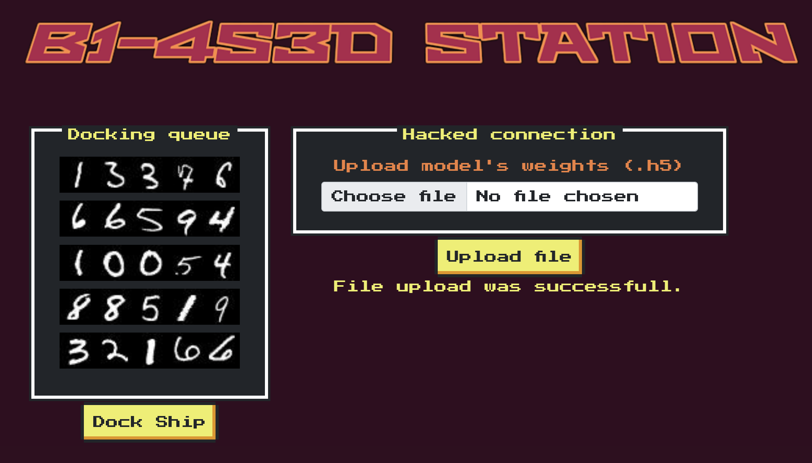
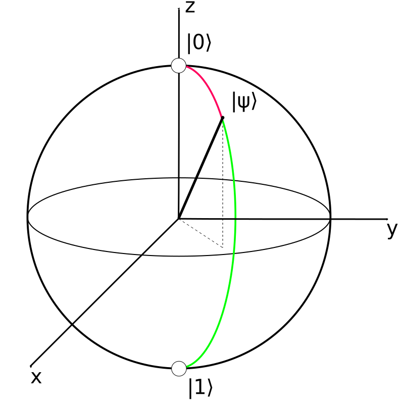
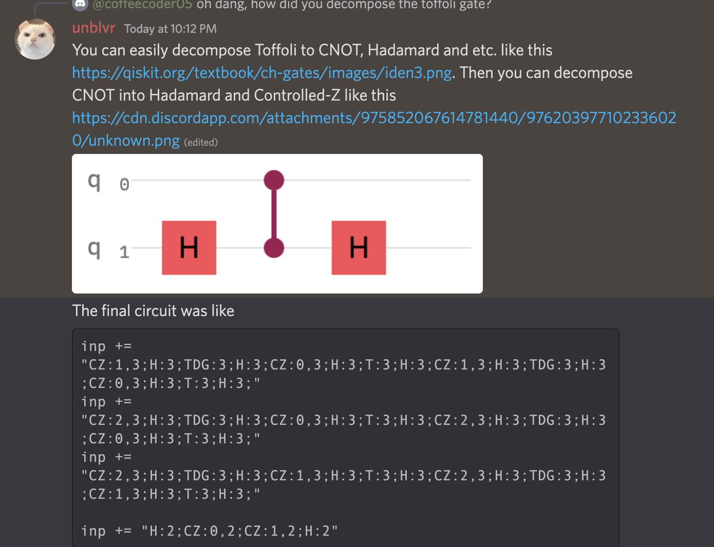

# HTB Cyberpocalypse 2022 – Misc Challenges (TBD)

## Misc Challenge 1: Fuel Crisis

### Description/Source

The full application code is in the [here](./misc_fuel_crisis_application/) but the relevant part is

```python

#in app.py
@app.route('/dock', methods=['POST'])
def dock():
    try:
        for spaceship in b1_4s3d_station.spaceships:
            id, id_confidence = b1_4s3d_station.passFirstGate(spaceship.id_image)
            if spaceship.name == "Phalcon":
                b1_4s3d_station.passSecondGate(id, spaceship.id_image, id_confidence, validation_check=False)
            else:
                b1_4s3d_station.passSecondGate(id, spaceship.id_image, id_confidence)
    except DockingException as de:
        return render_template('dock.html', response = spaceship.name+str(de))
    except Exception as e:
        return render_template('dock.html', response = 'Unexpected error while docking.')
    return render_template('dock.html', response = flag)

# in utils.py
def passSecondGate(self, id,  id_image, id_confidence, validation_check = True):
    validated_id = ""
    for i in range(len(id_image)):
        num = id_image[i].reshape(1,28,28,1)
        pred = self.second_gate.predict(num)
        print("Valid check:", validation_check, id_confidence[i])
        if validation_check:
            if round(pred[0][int(id[i])],1) == round(id_confidence[i],1):
                pass
            else:
                raise DockingException("'s ID was misclassified.")

        validated_id = validated_id + str(np.argmax(pred))

    if validated_id == self.bannedId:
        raise DockingException("'s ID is banned from the station.")
```

Here is the nice little site they did up


We need to bypass this machine learning model that basically recognizes numbers from images, the basic MNIST dataset. We only need to bypass the 32166 check (because it is banned) and note that 2 is the only other number present in that number and not in other numbers, hence we just need to make it misclassify the 2 into any other number.

Note that we cannot just train a random model, but it has to still pass the first gate (which is a properly trained model) and has to pass all other checks except the one for the banned id

Essentially, basically pull the same data, edit the y-values, retrain then save, then upload the model

### Solver

```python
import tensorflow as tf
from tensorflow.keras.utils import to_categorical

second_model = tf.keras.models.load_model('./application/models/model.h5')
(x, y), _ = tf.keras.datasets.mnist.load_data()


#make sure to misclassify the 2s
z = y[:]
for i in range(len(z)):
    if z[i] == 2:
        z[i] = 0


# ensure inputs have a single channel
x = x.reshape((x.shape[0],28,28,1))

#ensure prediction is categorical
z = tf.keras.utils.to_categorical(z)

#train model on out edited data tee hee
second_model.fit(x,z,epochs=1, batch_size=32)

# # save the model to upload
second_model.save('test.h5')

# then upload it
```

### Flag

```
HTB{4ttack1ng_l4st_l4yers}
```

## Misc Challenge 2: Quantum Engine

### Description/Source

```python
import socketserver
from secrets import flag
import signal
from qiskit import *
import itertools

class CircuitException(Exception):
    pass


class Circuit:

    def __init__(self, inputGates) -> None:
        self.a = 0
        self.b = 0
        self.c = 0
        self.inputGates = inputGates

    def append_HGate(self, qbit):
        qbit = int(qbit)
        if qbit in range(4):
            self.circuit.h(qbit)
        else:
            raise CircuitException('Non-valid qbit position given...')

    def append_TGate(self, qbit):
        qbit = int(qbit)
        if qbit in range(4):
            self.circuit.t(qbit)
        else:
            raise CircuitException('Non-valid qbit position given...')

    def append_TdgGate(self, qbit):
        qbit = int(qbit)
        if qbit in range(4):
            self.circuit.tdg(qbit)
        else:
            raise CircuitException('Non-valid qbit position given...')

    def append_CZGate(self, qbits):
        qbits = qbits.split(',')
        c_qubit = int(qbits[0])
        t_qubit = int(qbits[1])

        if c_qubit in range(4) and t_qubit in range(4):
            self.circuit.cz(c_qubit, t_qubit)
        else:
            raise CircuitException('Non-valid qbit position given...')


    def generate_Circuit(self):

        # 4 qubits, 3 classical bits
        self.circuit = QuantumCircuit(4,3)

        if self.a == 1:
            self.circuit.x(0)
        if self.b == 1:
            self.circuit.x(1)
        if self.c == 1:
            self.circuit.x(2)

        for gate in self.inputGates:
            gate = gate.split(':')
            if gate[0] == 'H':
                self.append_HGate(gate[1])
            elif gate[0] == 'T':
                self.append_TGate(gate[1])
            elif gate[0] == 'TDG':
                self.append_TdgGate(gate[1])
            elif gate[0] == 'CZ':
                self.append_CZGate(gate[1])
            else:
                raise CircuitException('Non-valid gate given...')

        self.circuit.measure([0,2,3],[0,1,2])
        if self.circuit.depth() > 43:
            raise CircuitException('Circuit is too big...')

    def check_Circuit(self):
        inputs = list(itertools.product([0, 1], repeat=3))

        for input in inputs:
            self.a = input[0]
            self.b = input[1]
            self.c = input[2]

            self.generate_Circuit()

            simulator = Aer.get_backend('qasm_simulator')
            counts = execute(self.circuit,backend=simulator, shots = 1).result().get_counts()
            counts = next(iter(counts))[::-1]
            if (int(counts[0]) == self.a) and int(counts[1]) == self.c ^self.a ^ self.b and (int(counts[2]) == self.a&self.b|self.b&self.c|self.c&self.a):
                pass
            else:
                return False
            # print("Expected:", str(self.a) + str(self.c ^self.a ^ self.b) + str(self.a&self.b|self.b&self.c|self.c&self.a), counts)

        return True


def challenge(req):
    try:
        req.sendall(b'|--------------------------------|\n'+
                    b'| Phalcon\'s Accelaration System |\n'+
                    b'|--------------------------------|\n'+
                    b'| > Send quantum circuit for the |\n'+
                    b'| system to analyze...           |\n'+
                    b'|--------------------------------|\n'+
                    b'\n> '
                    )
        input = req.recv(4096).decode().strip().split(';')

        if len(input) < 0 or len(input) > 100:
            raise CircuitException('Non-valid circuit length...')

        quantumCircuit = Circuit(input)

        if quantumCircuit.check_Circuit():
            req.sendall(flag.encode()+b"\n")
            req.close()
            exit()
        else:
            req.sendall(b'The circuit failed to pass the test...\n')
            req.close()
            exit()


    except CircuitException as ce:
        try:
            req.sendall(ce.encode()+b'\n')
            req.close()
        except:
            pass
        exit()

    except Exception as e:
        try:
            req.sendall(b'Unexpected error.\n')
            req.close()
        except:
            pass
        exit()

class incoming(socketserver.BaseRequestHandler):
    def handle(self):
        signal.alarm(300)
        req = self.request
        print("starting server")
        while True:
            challenge(req)

class ReusableTCPServer(socketserver.ForkingMixIn, socketserver.TCPServer):
    pass

socketserver.TCPServer.allow_reuse_address = False
server = ReusableTCPServer(("0.0.0.0", 1339), incoming)
server.serve_forever()
```

A very fun challenge! I had no idea what the heck quantum computing was before I started this challenge, and after I've solved it, I still have no idea. But i have more of an idea now.

Essentially, we are supposed to build some classical logic gates using quantum gates and qubits.

We have 4 qubits and 3 classical bits.

```
QuantumCircuit(4,3) --> initializes 4 qubits and 3 classical bits
measure([0,2,3],[0,1,2])
  maps qbit 0 --> classical bit 0
  maps qbit 2 --> classical bit 1
  maps qbit 3 --> classical bit 2
```

And we are given 3 input bits of every permutation (000 - 111) and we are supposed to give the correct output based on these conditions

```javascript
let bit 0,1,2 = a,b,c
a = a
b = a^b^c
c = a&b|b&c|c&a
```

To achieve this we are given 4 possible gates we can use

```
H-gate --> Hadamard gate  --> maps to a 50% 50% chance of either 0 or 1 | or in quantum talk, "convert qubit from clustering state to uniform superimposed state"
T- gate --> induces a  π / 4 phase shift in the qubit
Tdg (T dagger) --> inverse of T, induces a − π / 4 phase shift in the qubit
CZ gate --> controlled Z gate, apply Z gate to a target qubit "t", if the controlled bit "c" was 1

"The Z-gate is a unitary gate that acts on only one qubit. Specifically it maps 1 to -1 and leaves 0 unchanged. It does this by rotating around the Z axis of the qubit by π radians (180 degrees). By doing this it flips the phase of the qubit"
 - taken straight from Introduction to the Z gate with code - Quantum Computing UK https://quantumcomputinguk.org
```

However, we can't just use these gates infinitely and we need to pass the check that

```python
if self.circuit.depth() > 43:
    raise CircuitException('Circuit is too big...')
```

We are initialized some values in the circuit based to map the input bits a,b,c to the respective qubits at the start

```python
if self.a == 1:
    self.circuit.x(0)
if self.b == 1:
    self.circuit.x(1)
if self.c == 1:
    self.circuit.x(2)
```

I found the QiSkit documentation really helpful, here is [one](https://qiskit.org/textbook/ch-states/single-qubit-gates.html) of many that I trawled through. I had the greatest difficulty in understanding T and Tdg gates but this image, the bloch sphere, and its [site](https://kblagoev.com/blog/quantum-programming-abstraction-level-1-logic-gates/) helped to understand what a phase shift meant to the qubit and its probabilities



What helped in understanding, was also just doing general empirical analysis of what happens when you include particular gates.

Here's a little helper function that I used to test out what happens after you put certain gates into the quantum circuit

```python
c = QuantumCircuit(4,3)

#any gates to include
c.t(0);c.t(0);c.h(0)
c.tdg(2);c.tdg(2);c.h(2);

c.measure([0,2,3],[0,1,2]) # collapse the states
c.draw() # this is an amazing function
simulator = Aer.get_backend('qasm_simulator')
execute(c,backend=simulator, shots = 1).result().get_counts()
```

Now that we have a better understanding of what we have here let's try to solve each of the conditions

- Step 1:
  q bits are initialized to 0 at the start, adding the x(0) basically flips the q0 bit from 0 to 1 at the start
  qbit 0 has to be left at whatever a is initialized as

```
if self.a == 1:
    self.circuit.x(0)
```

- Step 2:

`qbit2 --> a ^ b ^ c`
In order to construct XOR gate we need a CX (CNOT gate), which can be constructed with CZ and H gates.
to make `qy = qx ^ qy`, we set --> `H - CZ(qx,qy) - H` so in order to make

```
qbit2 = qbit0 ^ qbit2 ^ qbit3
qbit2 = H - CZ(q0,q2) - H - H - CZ(q3,q2) - H
```

- Step 3

Last step is the hardest step and we need to make
`q2 = q0 & q2 | q2 & q3 | q3&q0 `

Which essentially means recreating the classical AND and OR gates. Since AND and OR do not have equal amount of 1s, they need an extra (ancilla bit) which is probably the main reason why we were given 4 qubits but only 3 output bits. This was where I got stuck.

However I realised that I just needed a unique combination of 8 bits and if I have a Hadamard gate at the 3rd position, I have a 1/256 chance of getting it right. So yay for cheesing it.

### Solver

```python
from pwn import *

host, port = "138.68.175.87",32066
while True:
    p = remote(host, port)

    p.recvuntil(b'\n> ')
    circuit = "H:2;CZ:0,2;H:2;H:2;CZ:1,2;H:2"
    circuit += ";H:3"

    p.sendline(circuit.encode())
    line = p.recvline()
    if b'failed' in line:
        p.close()
    else:
        print(line)
        p.interactive()
        break

```

### Flag

```
HTB{Qu4ntum_SooPr3m4cy}
```

### Post Solve

@unblvr had a great idea (and probably the intended way) of decomposing a Toffoli gate into the 4 gates that we were given, but you probably have to be smart about the way you construct it in a parallel manner to not exceed the depth of 43.


