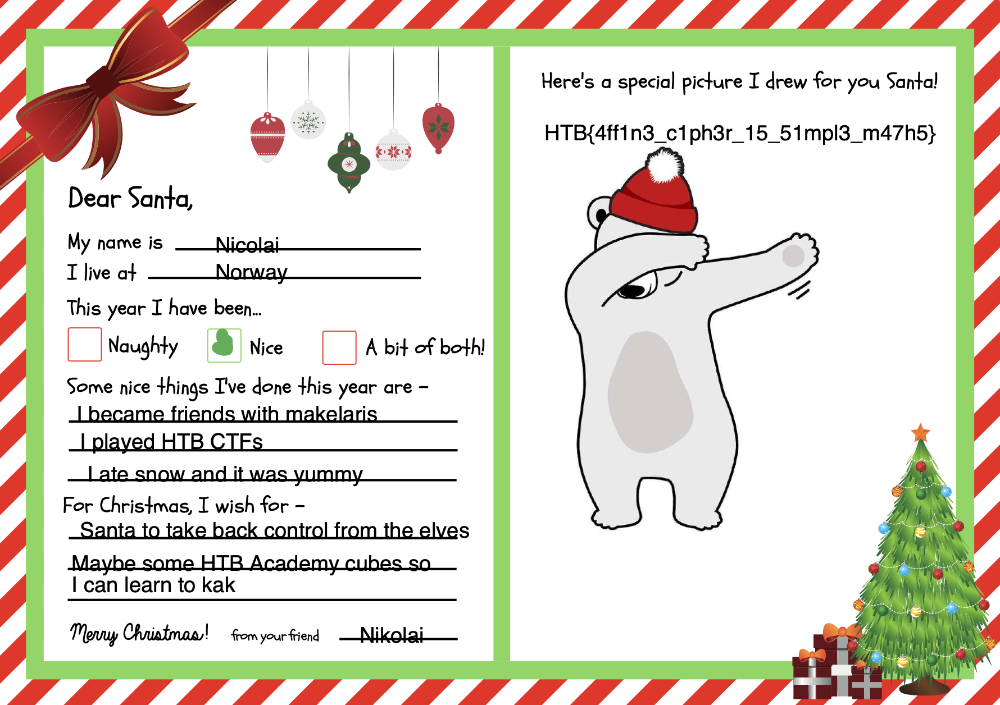

# Cyber Santa 2021 – Xmas Spirit

- **Category:** Cryptography Day 2
- **Points:** 300
- **Difficulty:** ★☆☆☆

## Challenge

We are given 2 files. An `encrypted.bin` and a `challenge.py` script. The script showed the encryption that was used to convert a pdf file to the encrypted file by using 2 random constants in the range [0,256] to convert every byte. The constant `a` was shown to have a GCD of 1 with 256. (I think this was only significant later on to ensure there was a unique value of `a` and `b`)

```
def encrypt(dt):
	mod = 256
	while True:
		a = random.randint(1,mod)
		if gcd(a, mod) == 1: break
	b = random.randint(1,mod)

	res = b''
	for byte in dt:
		enc = (a*byte + b) % mod
		res += bytes([enc])
	return res
```

## Solution

The biggest hint was the fact that the original file was a pdf.

```
dt = open('letter.pdf', 'rb').read()

res = encrypt(dt)

f = open('encrypted.bin', 'wb')
f.write(res)
f.close()
```

Like most file types, PDFs start with a few magic bytes that identify their filetype. I could have googled the common bytes but I wanted to be able to derive it for myself. So I opened a few sample pdfs in my computer and read their bytes into a few different arrays and retrieved the common bytes

```
magic = []

def checkPdfBytes(name):
	res = []
	with open(name, 'rb') as f:
		a = f.read()
		for i in a[:20]:
			res.append(i)
	magic.append(res)

checkPdfBytes('test.pdf')
checkPdfBytes('timetable.pdf')
checkPdfBytes('test2.pdf')

finalBytes = []
for i in range(20):
	if(magic[0][i] == magic[1][i] and magic[1][i] == magic[2][i]):
		finalBytes.append(magic[0][i])
	else:
		break
print("target", finalBytes)
```

We know that the first few bytes of the original pdf are those magic bytes, so we know that the resultant first few bytes of the `encrypted.bin` file correspond directly. Using the following script, we can deduce the values of the 2 constants. (Note: `possibleA()` is just a function that retrieves all numbers that have GCD of 1 with 256)

```
def buildDict(curr, target):
	a = possibleA()
	b = [i+1 for i in range(256)]
	possible = set()
	notPossible = set()
	for i in range(len(target)):
		for j in a:
			for k in b:
				if (j,k) in notPossible: continue
				cipherByte = (j*target[i] + k)%256
				if(cipherByte == curr[i]):
					possible.add((j,k))
				else:
					if((j,k) in possible):
						possible.remove((j,k))
					notPossible.add((j,k))
	return list(possible)[0]
```

With this script, we get the values a = 169 and b = 160.

Given a byte, we can deduce its encrypted version. So the next step was to build a reverse dictionary of sorts, where the key would be the encrypted byte, and the value would be the original byte. This is because we only have the encrypted bytes, but we want to somehow pull out the original bytes from it.

```
d = {}
def buildRealDict():
	cryptA = 169
	cryptB = 160
	for i in range(256):
		digit = (cryptA*i+cryptB)%256
		d[digit] = i
buildRealDict()
```

From there, we just iterate through all the bytes of `encrypted.bin` and write to a new pdf file.

```
res = b''
with open('encrypted.bin', 'rb') as f:
	cipherText = f.read()
	for byte in cipherText:
		enc = d[byte]
		res += bytes([enc])
	with open('result.pdf', 'wb') as g:
		g.write(res)
```

And we get the original pdf (of a dabbing polar bear).



```
HTB{4ff1n3_c1ph3r_15_51mpl3_m47h5}
```

## Thoughts

- The gratification on completing the challenge was immense (particularly boosted by the fact that I was one of the first few to complete the challenge)
- This was the first challenge done without googling...
