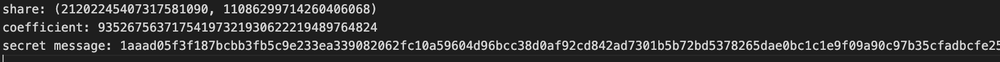
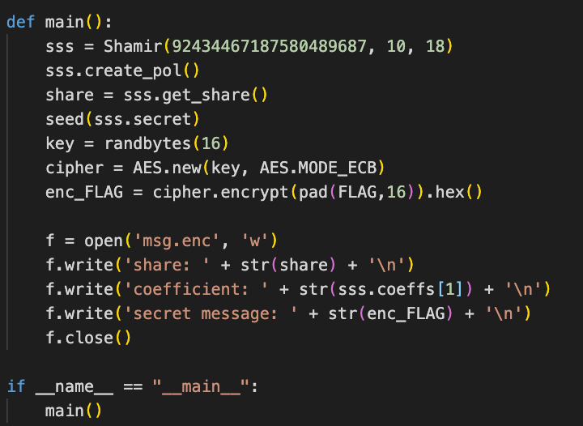

# Space Pirates Writeup

## Info

Category: Cryptography  
Difficulty: ★☆☆☆

 

### **tl;dr**

Use math to find the Shamir secret from the 2nd element of the coefficients. Re-generate the random bytes that form the key using the ecret as the seed. AES decrypt the message using the key.
  

## Initial

We are given a `msg.enc` file that contained 3 pieces of information. The share, coefficient and the encrypted text.

 

 

The other file was a `chall.py` file that showed how the values in the `msg.enc` file were generated.

From the main function looked like Shamir's Secret Sharing was used to generate a random key, that was used to encrypt the FLAG using AES encryption.

 

 

## Method

The goal was to be able to retrieve `sss.secret` which could then give the key. The `seed` function in python's random module always gives the same starting value for a given seed.

 

 

## Thoughts

-
