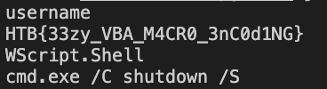

# Upgrades Writeup

## Info

Category: Forensics <br/>
Difficulty: ★☆☆☆

<br/>

### **tl;dr**

Run olevba to examine macros. Extract flag from macros.
<br /><br />

## Initial

We are given a .pptm file that when opened, warned about macros.

<br/>


<br/>

I preferred to err on the safe side and disabled the macros and opened the .pptm which showed "Free robot Upgrades". There was nothing much in the slides but I figured there had to have been something about the macros.

<br/>


<br/>

Given that I'm still new to CTFs, I didn't have experience with anything like this before but a quick Google search on Microsoft Files with macros in past CTFs pointed me towards [oletools](https://github.com/decalage2/oletools) which was geared towards analyzing Microsoft Documents.

<br/>

## Method

Running `olevba` on the Powerpoint file revealed a few suspicious hex strings.

<br/>


<br/>

There seemed to be a function called `q` that was used decode a bunch of hex strings from arrays.

<br/>


<br/>

After a quick search into VBA syntax and creating a python script to decode the arrays.

```
arr =  [
    [81, 107, 33, 120, 172, 85, 185, 33],
    [154, 254, 232, 3, 171, 171, 16, 29, 111, 228, 232, 245, 111, 89, 158, 219, 24, 210, 111, 171, 172, 219, 210, 46, 197, 76, 167, 233],
    [215, 11, 59, 120, 237, 146, 94, 236, 11, 250, 33, 198, 198],
    [59, 185, 46, 236, 33, 42, 33, 162, 223, 219, 162, 107, 250, 81, 94, 46, 159, 55, 172, 162, 223, 11]
]

def q(array):
    result = ""
    for i in array:
        result += chr((i*59-54)&255)
    return result

for i in arr:
    print(q(i))

```

which gave the flag.



It seemed like if I had enabled macros, and triggered it, it would have shutdown my laptop.

## Thoughts

- Quite an easy introduction to malicious macros embedded in Microsoft documents
- Was quite a straightforward solution that didn't require much thinking
