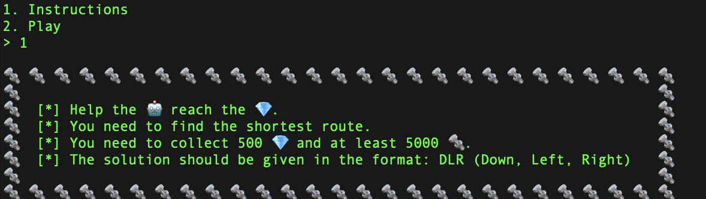
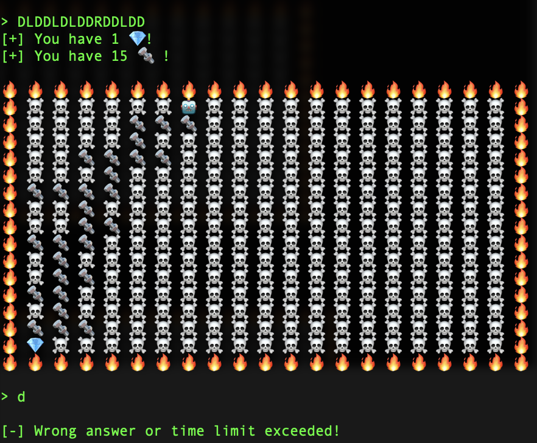
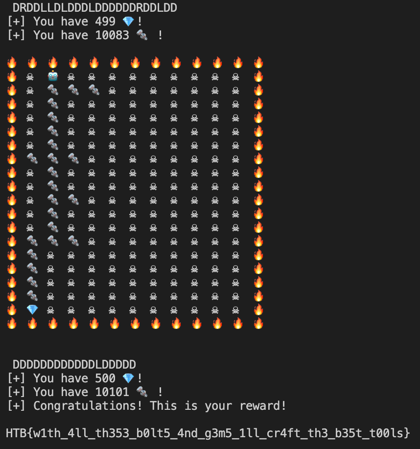

# Insane Bolt Writeup

### **TLDR**

Connect to instance, take in input as a grid, run BFS to get shortest paths, and send to standard input.
  

## Initial

When we connect to the Docker Instance, we are given two options.

It is a command line game where you have to input the shortest path for the 🤖 to reach 💎 via instructions DLR (Down, Left, Right). For some reason Up was not needed in this game.

From the grid given, it can be seen that the valid path always passes through a 🔩 at every step

  

## First Try

At first, I thought I could slowly play the game but after a while I realised this was not meant to be brute-forced played normally.

There is a time limit, approximately 10-15 seconds, that if exceeded, would end the game. One mistake and the game would end as well. There are also a minimum of 500 levels to be completed which requires scripting



  

## Main Idea

The problem was a classic shortest path problem which could be solved via Breadth First Search.

The main steps were to

- Connect to the Docker instance provided
- Transform the command line output and parse into a matrix
- Make the BFS function that would output the shortest path
- Send the Shortest Path as input

Code is in insane-bolts.py
  

## Tools Used

- `pexpect` module from python to read and write to standard input and ouput.
- `nc` command to connect to instance
  
   

## Success

After collecting 500 diamonds, the final flag was outputted.



 

## Thoughts

- I didn't have much problem coming up with the BFS solution but the real problem I had was trying to run commands using the python script
- I tried using `sys.stdin` and `sys.stdout` to read and write but they were blocking each other (I didn't know how to interchange between reading and writing)
- After doing some research to find a way to read and write in a non-blocking manner I found the `pexpect` module which could fit my use case
- Was quite a fun problem that required a bit of knowledge of graph traversal algorithms
