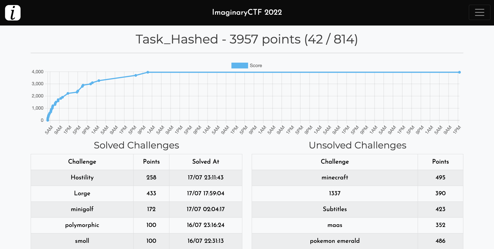

# Imaginary CTF 2022

<em>July 15 - July 18th 2022</em>

Played with the team Task_Hashed for a friend, enjoyed quite some of the challenges in there and learnt a few things

We got 42nd out of ~800 teams

| Challenge       | Writeup Link           | Tag                  |
| --------------- | ---------------------- | -------------------- |
| Web - Hostility | [here](./hostility.md) | /etc/hosts overwrite |
| Web - Minigolf  | [here](./minigolf.md)  | SSTI, filter bypass  |
| Crypto - lorge  | [here](./lorge.md)     | p-1 method           |
| Crypto - hash   | [here](./hash.md)      | Z3, Custom Hash      |
