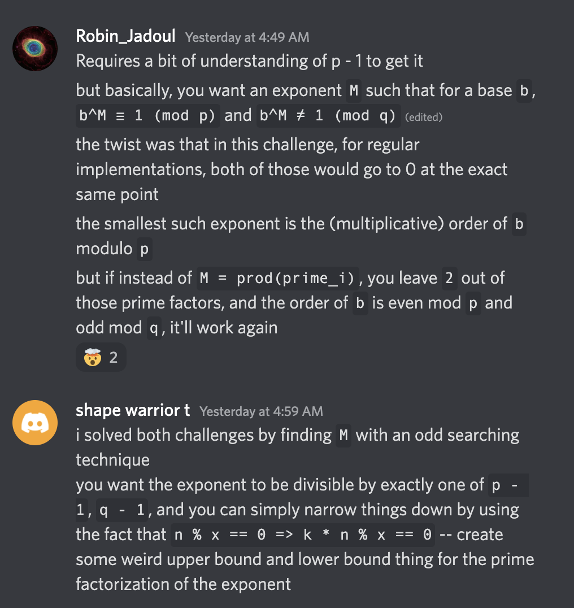

# Crypto - Lorge (433) - 29 solves

## Challenge

```python
from secret import p, q
from sage.all import factor

for r in [p, q]:
    for s, _ in factor(r - 1):
        assert int(s).bit_length() <= 25

n = p * q
e = 0x10001

with open("flag.txt", "rb") as f:
    flag = int.from_bytes(f.read().strip(), "big")
assert flag < n

ct = pow(flag, e, n)
print(f"{n = }")
print(f"{e = }")
print(f"{ct = }")

```

We have the modulus $n$ whose factors $p$ and $q$ that are $p-1$ and $q-1$ smooth up to 25 bit primes. However the standard decryption of pollard's p-1 attack didn't seem to work, because $p$ and $q$ shared some prime factor so I reimplemented a dummy version of it. It starts with a generator $2$ and keeps raising it to the power of a prime factor until the result is $1$ which means that the last power that it was raised to is a factor of the order. Repeat until all the factors have been found and reconstruct phi. (Took about 40-50 mins to fully run)

## Full Solution

```python
from tqdm import trange
from sympy import sieve
from functools import reduce
from operator import mul
from libnum import n2s
from time import time

n = 63038895359658613740840475285214364620931775593017844102959979092033246293689886425959090682918827974981982265129797739561818809641574878138225207990868931316825055004052189441093747106855659893695637218915533940578672431813317992655224496134300271524374912502175195904393797412770270676558054466831561609036199966477
e = 65537
ct = 60515029337308681079476677877525631415600527185785323978384495461916047877351538207473264679842349366162035496831534576192102896080638477601954951097077261305183669746007206897469286005836283690807247174941785091487066018014838515240575628587875110061769222088950451112650700101446260617299040589650363814995825303369

t1 = time()
B = (2**25)-1

prime_list = list(sieve.primerange(1,B))

original = 2

order_factors = []

while True:
    base = original
    for i in order_factors:
        base = pow(base, i, n)
    if base == 1:
        break

    print(prime_list[0], prime_list[-1])
    for i in trange(len(prime_list)):
        base = pow(base, prime_list[i], n)
        if base == 1:
            order_factors.append(prime_list[i])
            print(prime_list[i])
            break
phi = reduce(mul,order_factors)
# phi = 25593705330304732769148601769798442389863204942542820754787790157204241290219588798387040194121241939050244079847785792268461321290397387444518501751868825837871883942077556726770633298060784541375475560470986322452173855890600045740459337050706655243378283831649832148320282648498822874760732487374228325137598622954

t2 = time()

print(f"Total time taken: {int(t2-t1)}")

d = pow(e,-1,phi)
pt = pow(ct,d,n)
print(n2s(pt))
```

## Flag

```
ictf{why_d1d_sm0ll_3v3n_sh0w_up_on_f4ct0rdb???_That_m4d3_m3_sad!}
```

## Other solutions



### Notes

- There was another challenge `smoll` that I actually wasn't able to solve if it wasn't leaked on factordb, it basically had prime powers of $p$ where the factors of $p$ were

```py
2 ,10973 ,19301^4 ,30593 ,234323^5 ,291547^5 ,331231^5 ,484181^5 ,540539^3 ,565813
```

- I guess to solve this I could have just adapted my method but raise it to the 10th power each time
