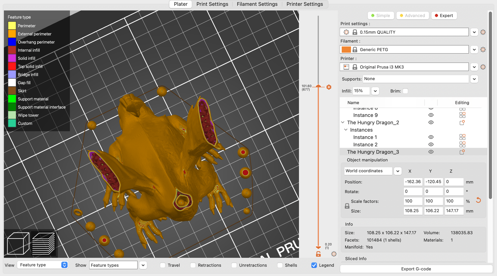
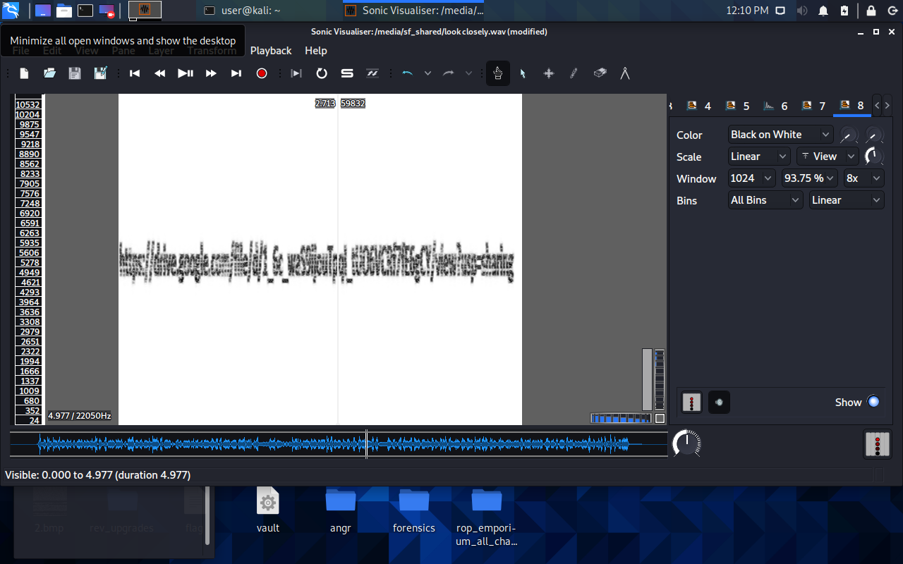
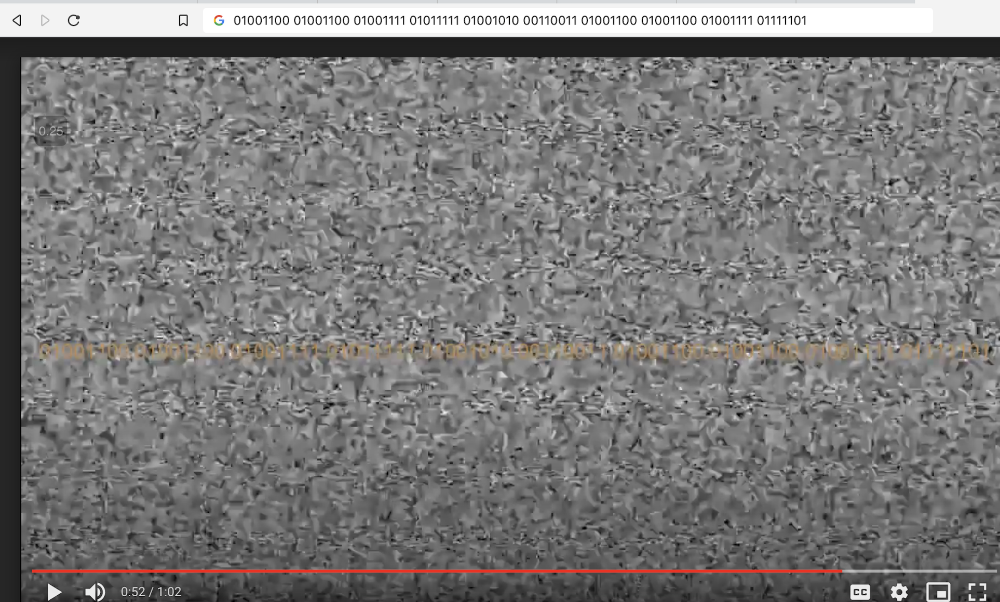

# KnightCTF 2022 – Misc Challenges

## Challenge 1: Hungry Dragon (50 points)

We are given a bunch of files related to a 3D model and the flag was the number of donuts (torus shapes) and candies (spheres) eaten by the dragon model

### Solution

1. Opening the `.3mf` file in Prusa Slicer and splitting all distinct objects showed

2. Some of the donuts and candies could not be completely separated and so slicing the model showed a few more donuts and candies inside the dragon
   

### Flag

```
KCTF{3_donut_11_candies}
```

## Challenge 2: Broken Datasheet (100)

An `.xlsx` file was given that was corrupted so no data was displayed

### Solution

- All Microsoft files like Word and Excel are essentially zip files holding a bunch of xml so
  I just ran `7z x *.xlsx` twice and the flag was in `sharedStrings.xml`

### Flag

```
KCTF{XLSX_Fil3$_4R3_Actually_0n3_Kind_0f_Zip_Fil3}
```

## Challenge 4: Unzip Me (100 points)

A file was given called `unzipme.zip` but it isn't actually a zip file.

Printing out the file contents with cat gives

```
KP�T,|�Glfgat.txCKFTs{_OOy_uWsPa3P_DHt_e1f3L
}KP?�T,|�G��lfgat.txKP6D\n
```

### Solution

1. It seems that some of the flag characters are mixed up with each other
   - KCTF --> CKFT
2. Each ith character has been swapped with the (i+1)th character so I just did a python script to reshuffle it

```
text = "lfgat.txCKFTs{_OOy_uWsPa3P_DHt_e1f3L}"
newText = ""
for i in range(0,len(text), 2):
    newText += text[i+1]
    newText += text[i]
print(newText)
```

### Flag

```
KCTF{sO_yOu_sWaPP3D_tHe_f1L3}
```

## Challenge 5: Look Closely (100 points)

A `.wav` file was given.

### Solution

1. Opening the wav file in Sonic Visualizer and looking at the spectrogram showed - some meddling with the settings was needed to get sufficient contrast to read the letters
   
2. Following the drive link showed a video with a bunch of static and two flashes of binary numbers
   
3. Replaying the video at 0.25x and notating the binary numbers and putting it into cyber chef gave the flag

### Flag

```
KCTF{H3LLO_H3LLO}
```
