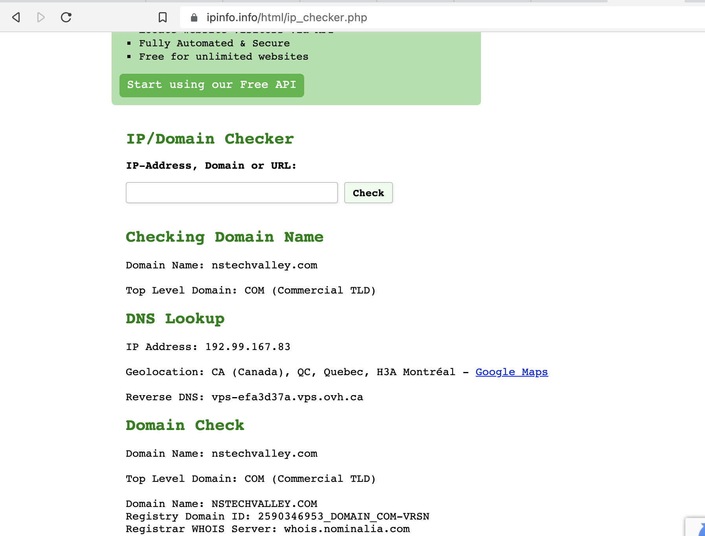
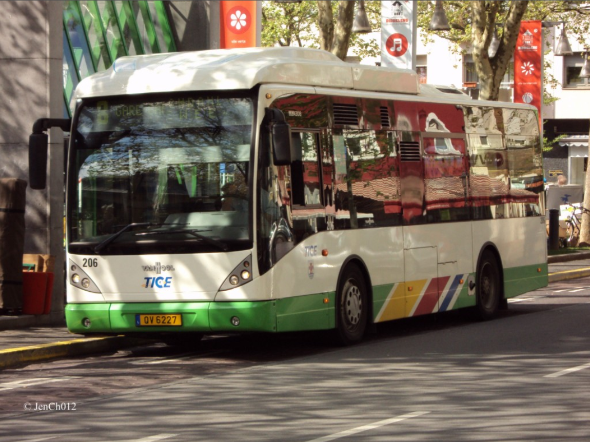
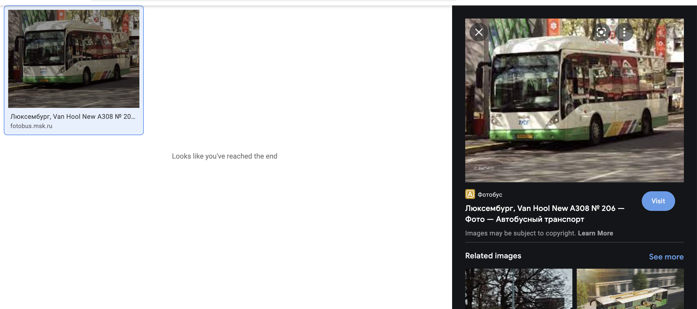
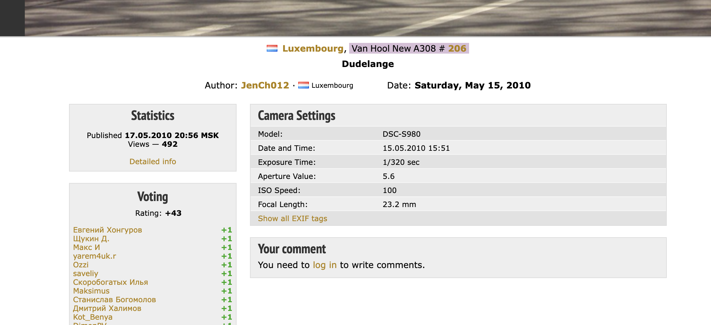

# KnightCTF 2022 – OSINT Challenges

## Challenge 1: Canada Server (50 points)

```
Our sponsor NS TechValley had some problems last year. Their Canada server was not working as expected. Can you find the IP address of that server?
```

### Solution

A simple search on existing ip finders of website revealed the ip address.



## Challenge 2: Find the Camera (100 points)

We are given a picture of a bus


```
Can you find the manufacturer and the model number of the camera that took the picture of this bus?
```

### Solution

- Exiftool did not reveal anything interesting about the image
- Searching the image on google revealed its original website in Russian
  
- The metadata of image was shown already on the site which included its model number
  
- Searching the model on google revealed that the manufacturer was Sony

### Flag

```
KCTF{SONY_DSC_S980}
```
