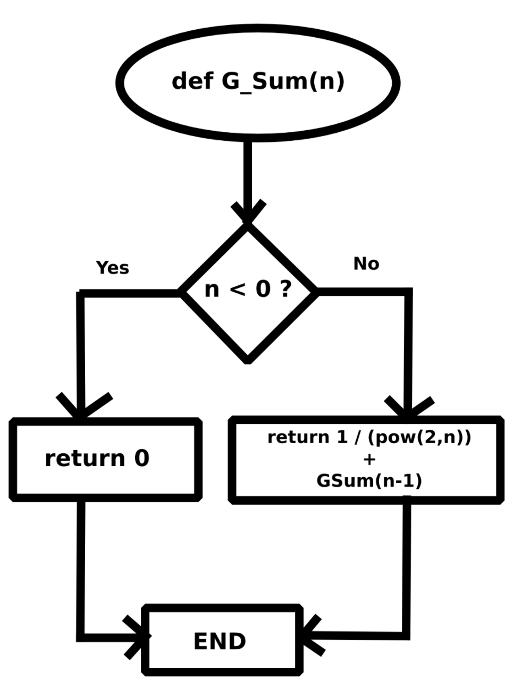

# KnightCTF 2022 – Programming Challenges

Most of the challenges were quite simple without much explanation needed.

## Challenge 1: Keep Calculating (25 points)

```
One of our clients needs a command line tool to do some math tasks. Can you create the tool by following pseudo code ?

Let x = 1
Let y = 2
Let answer += (x * y) + xy [here xy = 12]
Repeat this calculation till you have x = 666
The final answer will be the flag when x = 666
```

### Solution

```
answer = 0
for x in range(1,667):
    y = x+1
    answer += (x*y) + int(str(x)+str(y))
print(answer)
```

## Challenge 2: Time Complexity (25 points)

```
Find the time complexity of Algorithms.

procedure max (a1, a2, …, an: integers)
max := a1
for i :=2 to n
if max < a1 then max := ai
{max is the largest element}

Flag Format: KCTF{θ(...)}
```

### Flag

```
KCTF{θ(n)}
```

## Challenge 3: Reverse The Answer (50 points)

```
Let x = 1

Let calculation = (x*(x+1)) + (2 *(x + 1))

Let reversed_calc = reversed number of calculation [for example if calculation = 123, reversed_calc will be 321]

If reversed_calc can be divided by 4 without reminder then answer = answer + reversed_calc

Repeat all the calculations until you have x = 543

The final answer will be the flag when x = 543
```

### Solution

```
x = 1
answer = 0
for x in range(1,544):
    calc = x*(x+1) + 2*(x+1)
    reversed_calc = int(str(calc)[::-1])
    if(reversed_calc %4 == 0):
        answer += reversed_calc
print(answer)
```

## Challenge 4: Square Sum (50 points)

```
Have you ever heard the term "The sum of two squares"?

It's like the following :

4 = 0^2 + 2^2
8 = 2^2 + 2^2
16 = 0^2 + 4^2
----------------------------
5002 = 39^2 + 59^2 => 49^2 + 51^2 => 51^2 + 49^2 => 59^2 + 39^2
And so on. In the example of 16, if we add the square of 0 & 4 we get 16. So here we are getting two values 0 & 4. So that's the answer.

So write a program & find out the two values of 25000. Conditions are the following :

* Remove the duplicates
* Pick the third one
```

### Solution

```
x = 1
target = 25000
s = set()
results = []
for i in range(int(target**0.5)):
    s.add(i**2)

for i in range(target):
    if (target - i**2) in s:
        results.append((i, int((target-i**2)**0.5)))
print(results)
```

## Challenge 5: Something in Common (50 points)

```
Find the GCD of the following numbers and add up the all integers of that GCD and multiply with 1234.
Number 1: 21525625
Number 2: 30135875

Example: The GCD of 50 & 75 is 25.
Here, 2 + 5 = 7
So, the flag will be 7 x 1234 = 8638.
```

### Solution

```
def gcd(x, y):
    while(y):
        x,y = y, x%y
    return x

num = gcd(21525625,30135875)
res = 0
num_str = str(num)
for char in num_str:
    res += int(char)
print(res*1234)
```

## Challenge 6: Find the Number (50 points)

```
What would be the output if we input 25 in the function that is shown in the flowchart?
```



### Solution

```
def g_sum(n):
    if(n<0):
        return 0
    else:
        return (1/pow(2,n)) + g_sum(n-1)

print(g_sum(25))
```

## Challenge 7: Run the Program (50 points)

We are given some asm instructions and told to run it.

```
.MODEL SMALL
.DATA
    MAIN PROC
        MOV AH,2
        MOV DL,80
        SUB DL, 5
        INT 21H
        MOV DL, 70
        SUB DL, 3
        INT 21H
        MOV DL, 100
        SUB DL, 16
        INT 21H
        MOV DL, 100
        SUB DL, 30
        INT 21H
        MOV DL, 123
        INT 21H
        MOV DL, 75
        ADD DL, 50
        SUB DL, 60
        INT 21H
        MOV DL, 53
        INT 21H
        MOV DL, 53
        INT 21H
        MOV DL, 147
        SUB DL, 96
        INT 21H
        MOV DL, 80
        SUB DL, 3
        INT 21H
        MOV DL, 255
        MOV DH, 157
        SUB DL, DH
        INT 21H
        MOV DL, 255
        MOV DH, 147
        SUB DL, DH
        INT 21H
        MOV DH, 72
        MOV DL, 17
        ADD DL, DH
        INT 21H

        MOV DL, 130
        SUB DL, 5
        INT 21H


        MOV AH,4CH
        INT 21H

    MAIN ENDP
END MAIN
```

### Solution

- The flag is stored in the DL register
- Each `INT 21H` interrupt instruction separates the characters

### Flag

```
KCTF{A553MblY}
```

## Challenge 8: Loop in a Loop (100 points)

We are given a C++ file. Its very similar to the Crypto Jumble challenge.

```
#include <iostream>
using namespace std;

int main() {
	string flag;
	cout << "Enter the flag: ";
	cin >> flag;

	for (int i=0; i < flag.length(); i++) {
		for (int j=i; j < flag.length() - 1; j++) {
			char x = flag[j];
			flag[j] = flag[j+1];
			flag[j+1] = x;
		}
	}

	if (flag == "CFb5cp0rm1gK{1r4nT_m4}6")
		cout << "Congrats. That's the flag!" << endl;
	else
		cout << "Wrong flag. Bye" << endl;

	return 0;
}
```

### Solution

Pass in an array with indices as values and match the indices afterwards

```
target = "CFb5cp0rm1gK{1r4nT_m4}6"
flag = [i for i in range(len(target))]
for i in range(len(flag)):
    for j in range(i,len(flag)-1):
        x = flag[j]
        flag[j] = flag[j+1]
        flag[j+1] = x

arr = [0 for i in range(len(target))]
for i in range(len(flag)):
    arr[flag[i]] = target[i]
print(''.join(arr))
```

### Flag

```
KCTF{b451c_pr06r4mm1ng}
```
