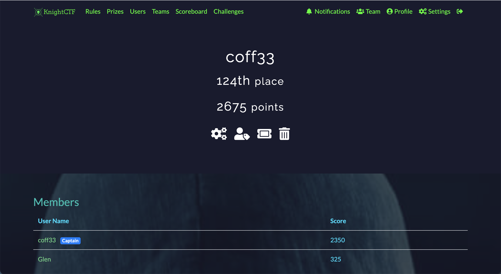

# KnightCTF

<em>21st Jan 2022 </em>

Organised by [Knight Squad](https://knightsquad.org/)

There were a few problems with the infra but the challenges were quite manageable. Most of the challenges were single methods to solutions but there were many many challenges (65)

Since many of the solutions are of just one exploit, I will be combining the relevant writeups done into each category

The categories that I tried were Reversing, Crypto, OSINT, Web, Misc, Programming and Stego.

Placed: 124th out of 752 teams

