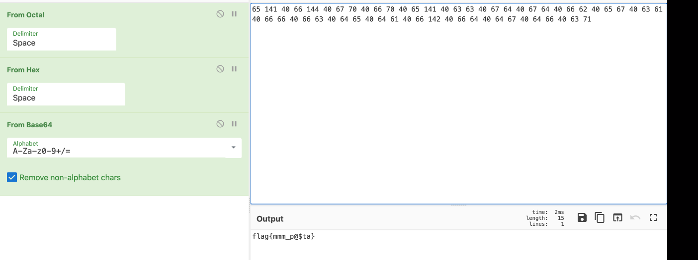
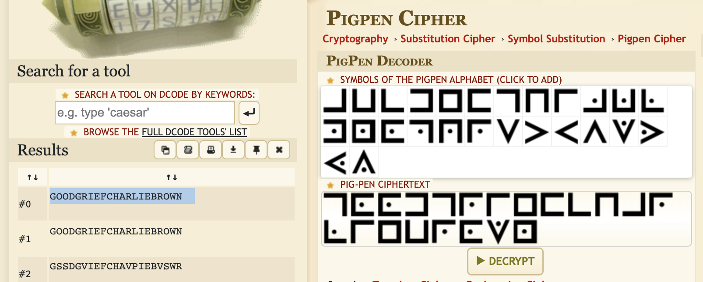
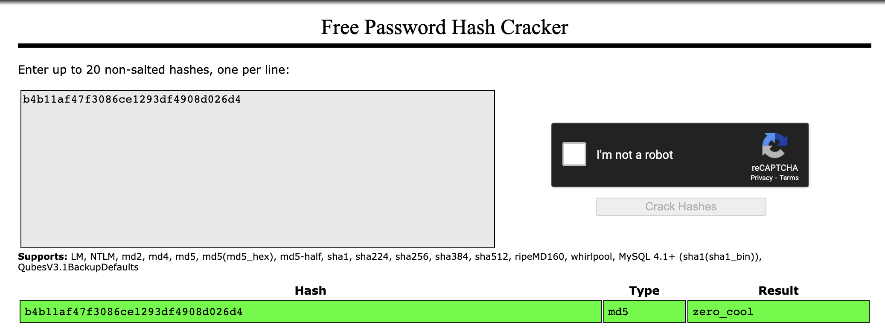
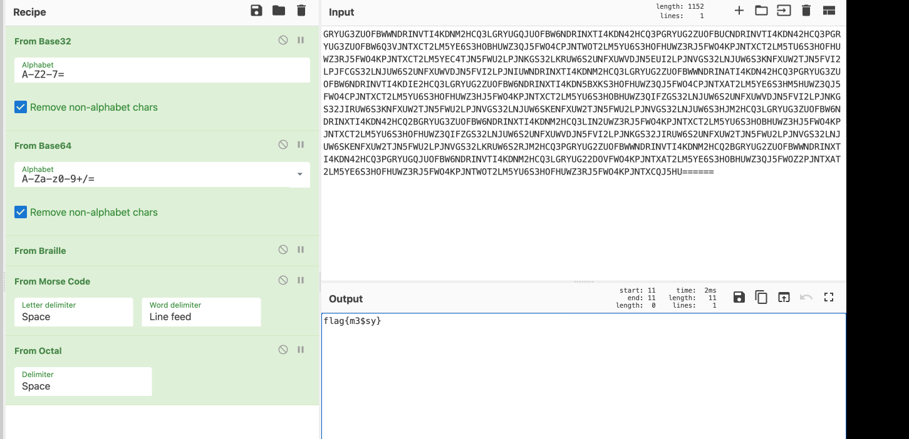
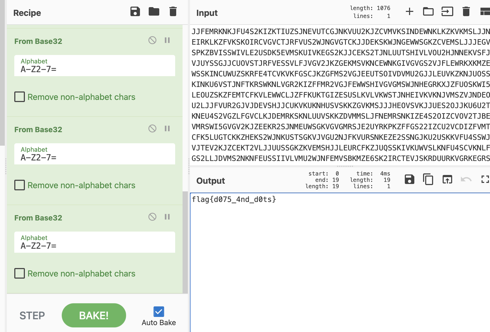

# MHSCTF 2022 – Crypto Challenges

## Challenge 1: Em Dee (10 points)

### Challenge Decsription

```
I have a good friend named Em. She loves secret codes, so when she challenged me this time, I was well up for it! She told me that she encoded the word "happy" as "56ab24c15b72a457069c5ea42fcfc640" and "sad" as "49f0bad299687c62334182178bfd75d8" (without the quotes) and challenged me to encode "mhsctf" using her method! I can't figure it out! What would it be? Enter your answer in flag format: "flag{...}"
```

# Solver

Just MD5 Sum "mhsctf"

# Flag

```
flag{fc3e3c405a66f8fe7cb7f17a838ea88c}
```

## Challenge 2: What's Cooking (10 points)

### Challenge Decsription

```
65 141 40 66 144 40 67 70 40 66 70 40 65 141 40 63 63 40 67 64 40 67 64 40 66 62 40 65 67 40 63 61 40 66 66 40 66 63 40 64 65 40 64 61 40 66 142 40 66 64 40 64 67 40 64 66 40 63 71
```

# Solver

Octal --> Hex --> Base64


# Flag

```
flag{flag{mmm_p@$ta}}
```

## Challenge 3: Peanuts (10 points)

### Challenge Decsription

```
Charlie Brown received this message from his good friend Pig-Pen, but it appears to be nonsense. What could it be? Remember to enter your answer in the "flag{...}" format; it's all lowercase.
```

# Solver

We are given a png image of pigpen images. Use pigpen decoder in dcode



# Flag

```
flag{goodgriefcharliebrown}
```

## Challenge 4: Crash Hacker (10 points)

### Challenge Decsription

```
Another super-secret message from Em! What does this one mean? b4b11af47f3086ce1293df4908d026d4 Remember to enter your answer in the "flag{...}" format! Hint: If at first you don't succeed, try, try again.
```

# Solver

Enter it into crack station



# Flag

```
flag{zero_cool}
```

## Challenge 5: What's Cooking 2 (10 points)

### Challenge Decsription

```
More layers of encryption! (Hint: there are 5 layers)

GRYUG3ZUOFBWWNDRINVTI4KDNM2HCQ3LGRYUGQJUOFBW6NDRINXTI4KDN42HCQ3PGRYUG2ZUOFBUCNDRINVTI4KDN42HCQ3PGRYUG3ZUOFBW6Q3VJNTXCT2LM5YE6S3HOBHUWZ3QJ5FWO4CPJNTWOT2LM5YU6S3HOFHUWZ3RJ5FWO4KPJNTXCT2LM5TU6S3HOFHUWZ3RJ5FWO4KPJNTXCT2LM5YEC4TJN5FWU2LPJNKGS32LKRUW6S2UNFXUWVDJN5EUI2LPJNVGS32LNJUW6S3KNFXUW2TJN5FVI2LPJFCGS32LNJUW6S2UNFXUWVDJN5FVI2LPJNIUWNDRINXTI4KDNM2HCQ3LGRYUG2ZUOFBWWNDRINATI4KDN42HCQ3PGRYUG3ZUOFBW6NDRINVTI4KDIE2HCQ3LGRYUG2ZUOFBW6NDRINXTI4KDN5BXKS3HOFHUWZ3QJ5FWO4CPJNTXAT2LM5YE6S3HM5HUWZ3QJ5FWO4CPJNTXCT2LM5YU6S3HOFHUWZ3HJ5FWO4KPJNTXCT2LM5YU6S3HOBHUWZ3QIFZGS32LNJUW6S2UNFXUWVDJN5FVI2LPJNKGS32JIRUW6S3KNFXUW2TJN5FWU2LPJNVGS32LNJUW6SKENFXUW2TJN5FWU2LPJNVGS32LNJUW6S3HJM2HCQ3LGRYUG3ZUOFBW6NDRINXTI4KDN42HCQ2BGRYUG3ZUOFBW6NDRINXTI4KDNM2HCQ3LIN2UWZ3RJ5FWO4KPJNTXCT2LM5YU6S3HOBHUWZ3HJ5FWO4KPJNTXCT2LM5YU6S3HOFHUWZ3QIFZGS32LNJUW6S2UNFXUWVDJN5FVI2LPJNKGS32JIRUW6S2UNFXUW2TJN5FWU2LPJNVGS32LNJUW6SKENFXUW2TJN5FWU2LPJNVGS32LKRUW6S2RJM2HCQ3PGRYUG2ZUOFBWWNDRINVTI4KDNM2HCQ2BGRYUG2ZUOFBWWNDRINXTI4KDN42HCQ3PGRYUGQJUOFBW6NDRINVTI4KDNM2HCQ3LGRYUG22DOVFWO4KPJNTXAT2LM5YE6S3HOBHUWZ3QJ5FWOZ2PJNTXAT2LM5YE6S3HOFHUWZ3RJ5FWO4KPJNTWOT2LM5YU6S3HOFHUWZ3RJ5FWO4KPJNTXCQJ5HU======
```

# Solver

Base32 --> Base64 --> Braille --> Morse Code --> Octal



# Flag

```
flag{m3$sy}
```

## Challenge 6: Weird Music (25 points)

### Challenge Decsription

```
Does this music sound familiar to you? It's a little bit different though. Remember to use the "flag{...}" format.
```

We are given a Midi file

# Solver

Duration of each note corresponds to morse code

Decoding it gives

```
-... . . .--. ..--.- -... --- --- .--.
```

# Flag

```
flag{beep_boop}
```

## Challenge 7: Green (30 points)

### Challenge Decsription

```
I'm green da ba dee da ba dah
```

We are given a png of a long strip of different green pixels

# Solver

Get each value of green from the image and transform to string by ASCII Code

```
from PIL import Image

img = Image.open("green.png")
pix = img.load()


arr = []
for i in range(img.size[0]):
    arr.append(pix[i, 0][1])

strings = []
for i in arr:
    strings.append(chr(i))
print(''.join(strings))

```

Base 32 Decoding like 5 times gives you the flag



# Flag

```
flag{d075_4nd_d0ts}
```
