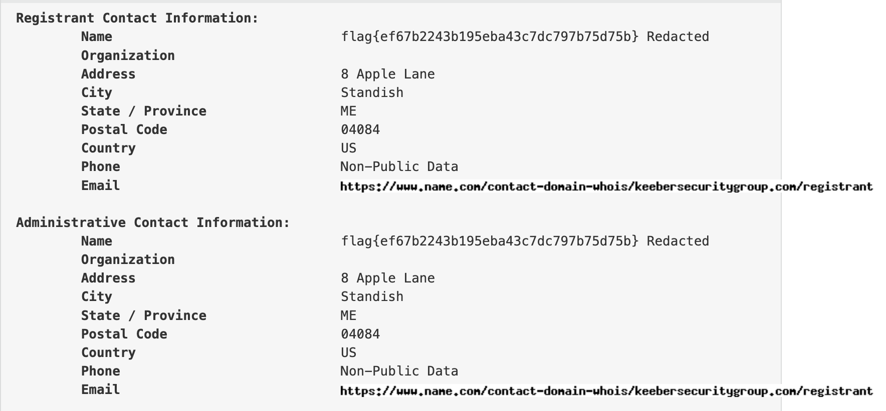
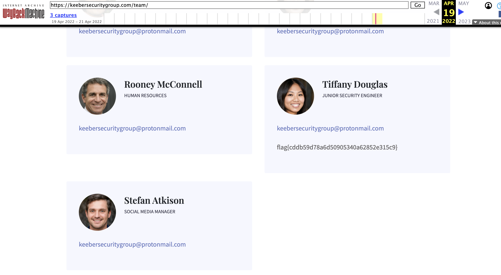
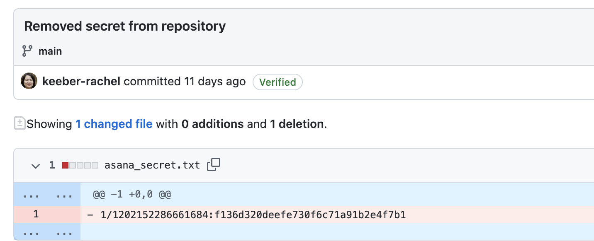
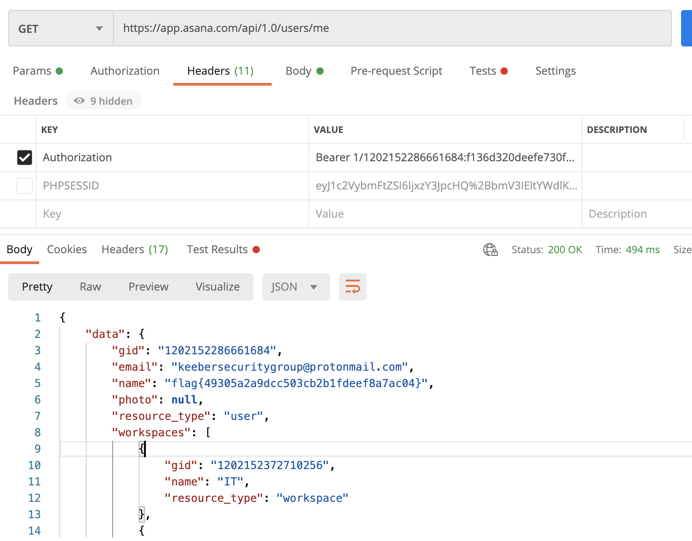
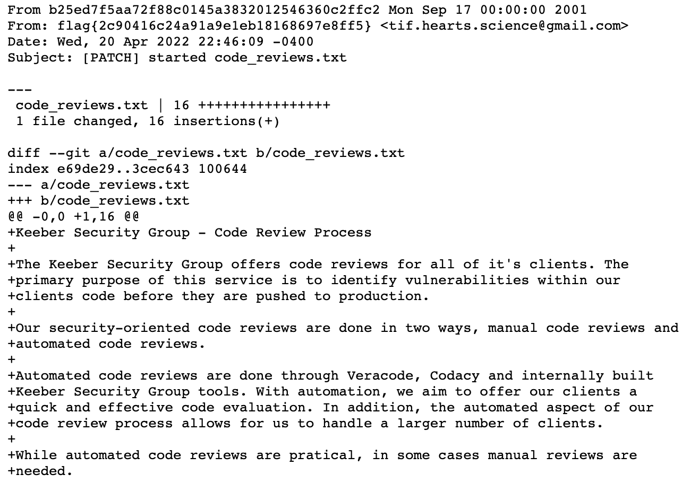
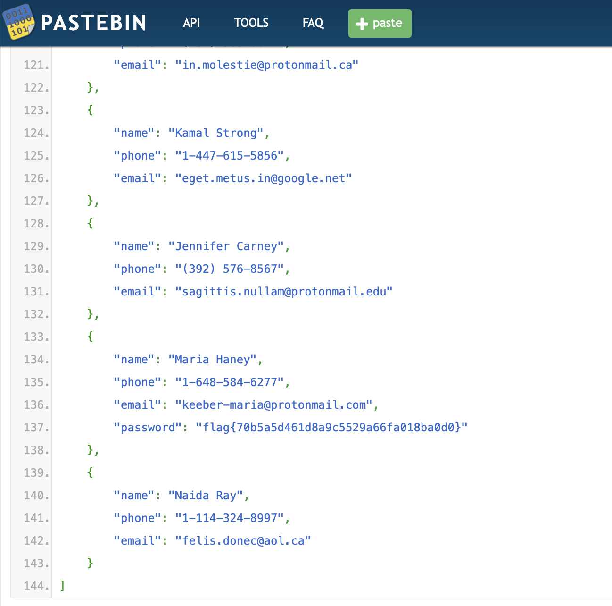

# NahamCon 2022 – OSINT Challenges

## Keeber Group Challenge 1

### Description

```
You have been applying to entry-level cybersecurity jobs focused on reconnaissance and open source intelligence (OSINT). Great news! You got an interview with a small cybersecurity company; the Keeber Security Group. Before interviewing, they want to test your skills through a series of challenges oriented around investigating the Keeber Security Group.

The first step in your investigation is to find more information about the company itself. All we know is that the company is named Keeber Security Group and they are a cybersecurity startup. To start, help us find the person who registered their domain. The flag is in regular format.
```

### Solve

1. Search up Keeber Security Group and find website [keebersecuritygroup.com](https://keebersecuritygroup.com/)
2. Search the website on [who.is](https://who.is/)



## Keeber Group Challenge 2

### Description

```
The Keeber Security Group is a new startup in its infant stages. The team is always changing and some people have left the company. The Keeber Security Group has been quick with changing their website to reflect these changes, but there must be some way to find ex-employees. Find an ex-employee through the group's website. The flag is in regular format.
```

### Solve

1. From their website, find their [github](https://github.com/keebersecuritygroup/)
2. Look through their commits on their repositories and realise that this [user](https://github.com/keeber-tiffany) is not listed on their website's [team page](https://keebersecuritygroup.com/team/)
3. Look at WayBack machine on the Teams page



## Keeber Group Challenge 3

### Description

```
The ex-employee you found was fired for "committing a secret to public github repositories". Find the committed secret, and use that to find confidential company information. The flag is in regular format.
```

### Solve

1. Look through the commits of Tiffany in the 3 repos that the company has
2. One commit stands out



3. Using the details, we can check out Asana API documentation and make authenticated requests to Asana Notes (after searching for a long time as to what the secret could be)



## Keeber Group Challenge 4

### Description

```
The ex-employee also left the company password database exposed to the public through GitHub. Since the password is shared throughout the company, it must be easy for employees to remember. The password used to encrypt the database is a single lowercase word somehow relating to the company. Make a custom word list using the Keeber Security Groups public facing information, and use it to open the password database The flag is in regular format.

(Hint: John the Ripper may have support for cracking .kdbx password hashes!)
```

### Solve

1. Use `keepass2john` to convert the .kdbx file [here](https://github.com/keebersecuritygroup/password-manager) to a hash that `john` can crack
2. Use `cewl` to generate wordlist off their website (to no avail)

```
cewl -d 5 -m 5 -w lower.txt https://keebersecuritygroup.com/ --lowercase
```

3. Notice that the [security-evaluation repo](https://github.com/keebersecuritygroup/security-evaluation-workflow) has many strange words that could be the password
4. Convert the words there to a wordlist (copied to all text pages to a single file) and crack the .kdbx using john

```python
with open("all.txt", "r") as f:
    data = f.read()


data = data.replace('.', '')
data = data.replace(":", '')
data = data.replace(",", '')
data = data.replace("'s", '')

arr = data.split()
arr = [i.strip().lower() for i in arr]
arr = [i for i in arr if len(i) > 3]
arr = list(set(arr))

print(len(arr))
with open("wordlist.txt", "w") as f:
    for i in arr:
        f.write(i + "\n")
```

and get the password

```
ksg_passwd_db:craccurrelss
```

## Keeber Group Challenge 5

### Description

```
The ex-employee in focus made other mistakes while using the company's GitHub. All employees were supposed to commit code using the keeber-@protonmail.com email assigned to them. They made some commits without following this practice. Find the personal email of this employee through GitHub. The flag is in regular format.
```

### Solve

1. Look at all the commits made by Tiffany and add `.patch` to the end of the commit link to see the email
2. Example [link](https://github.com/keebersecuritygroup/security-evaluation-workflow/commit/b25ed7f5aa72f88c0145a3832012546360c2ffc2.patch)



## Keeber Group Challenge 6

### Description

```
After all of the damage the ex-employee's mistakes caused to the company, the Keeber Security Group is suing them for negligence! In order to file a proper lawsuit, we need to know where they are so someone can go and serve them. Can you find the ex-employee’s new workplace? The flag is in regular format, and can be found in a recent yelp review of their new workplace.

(Hint: You will need to pivot off of the email found in the past challenge!)
```

### Solve

1. Search the email on yelp and find the review which contains the flag

## Keeber Group Challenge 7

### Description

```
Multiple employees have gotten strange phishing emails from the same phishing scheme. Use the email corresponding to the phishing email to find the true identity of the scammer. The flag is in regular format.

(Note: This challenge can be solved without paying for anything!)
```

### Solve

1. Search the email `cheerios.fanatic1941@gmail.com` on [https://epieos.com/](https://epieos.com/)
2. Find that the user's name is Isaac Anderson
3. Holohe shows that such a user exists, and the flag is on his account

## Keeber Group Challenge 8

### Description

```
Despite all of the time we spend teaching people about phishing, someone at Keeber fell for one! Maria responded to the email and sent some of her personal information. Pivot off of what you found in the previous challenge to find where Maria's personal information was posted. The flag is in regular format.
```

### Solve

1. Search the myspace username `cereal_lover1990` on [Instant Usernames](https://instantusername.com/)
2. Find that the username is on pastebin
3. Flag is on one of his pastes


