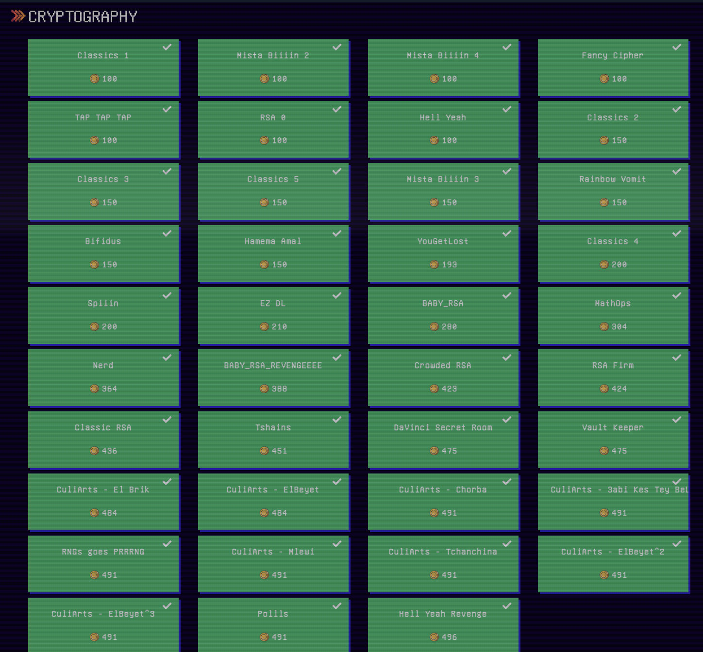

### In Progress

# Securinets Esprit CyberLeague 2022 – Crypto Challenges

We managed to clear all the Crypto challenges! Because I joined a bit late, I only solved from `T-shains` to `Polllis`.



Because there are many challenges, I will just outline the main vulnerability.

## Challenge 1: T-shains

### Description/Source

```python
flag = b64encode(flag)
enc = b""
for i in range(len(flag)):
	enc += bytes([flag[i] ^ flag[(i+1) %len(flag)]])
enc = b64encode(enc)
# Z1oYPRg5GS1qfAcHCgIJF2p7e3wKHWloaH4hIQoCMzwaFnho
```

This can be easily bruteforced. Guess the first character of the flag, and then using that derive the full decryption of the guessed flag. If the resulting base64 is able to be decoded to ascii then it likely is correct. A slight optimization would be to move on to the next guess once the decoded character is not within the printable ASCII range (33 - 127)

### Solver

```python
from base64 import b64decode
c = "Z1oYPRg5GS1qfAcHCgIJF2p7e3wKHWloaH4hIQoCMzwaFnho"
c = b64decode(c)


printable = "0123456789abcdefghijklmnopqrstuvwxyzABCDEFGHIJKLMNOPQRSTUVWXYZ!\"#$%&'()*+,-./:;<=>?@[\\]^_`{|}~"
for i in list(printable):
    flag = i
    fail = False
    for idx in range(len(c)):
        char = chr(c[idx] ^ ord(flag[-1]))
        if 33<= ord(char) <= 127:
            flag += char
        else:
            fail = True
            break
    try:
        print(b64decode(flag).decode('utf-8'))
    except:
        pass


```

### Flag

```
Securinets{Shi1In_cH41N_b6464_Ch41n!!}
```

## Challenge 2: DaVinci Secret Room

### Description/Source

```python
from Crypto.Cipher import AES
from Crypto.Util.Padding import pad,unpad
from secrets import flag
import random
import os

BLOCK_SIZE = 16
KEY = os.urandom(BLOCK_SIZE)

def encrypt(msg):
	iv = os.urandom(BLOCK_SIZE)
	cipher = AES.new(KEY, AES.MODE_CBC, iv)
	return (iv + cipher.encrypt(pad(msg, BLOCK_SIZE))).hex()


def decrypt(data):
	iv = data[:BLOCK_SIZE]
	cipher = AES.new(KEY, AES.MODE_CBC, iv)
	return unpad(cipher.decrypt(data[BLOCK_SIZE:]), BLOCK_SIZE)

def parse(enc_token):
	dec = decrypt(enc_token)
	splitted_token = dec.split(b"|")
	assert len(splitted_token) == 2, "Please enter a token in the format encrypt(name|rm=int)"
	assert splitted_token[1].startswith(b"rm="), "no room is found"
	name, room = splitted_token[0], splitted_token[1][3:].decode()
	return name, int(room)

def menu():
	print("\n==================== DaVinci House - Entry ====================")
	print("1. Show Rooms")
	print("2. Get Room Access Token")
	print("3. Enter Room")
	print("4. Quit")

	choice = int(input("> "))

	return choice

def showRooms():
	print("\n*** Davinci House - Available Rooms ***")

	print("  Room 1: Monalisa Room")
	print("  Room 2: The Last Supper Room")
	print("  Room 3: Vitruvian Man Room")
	print("  Room 4: Salvator Mundi Room")
	print("  Room 1337: Secret Room")

def getRoomAccess():
	print("*** DaVinci House - Registration Gate ***")

	name = input("Name : ").encode()
	assert not b"davinci" in name.lower(), "No you're Not DaVinci, FRAUD!"

	room = int(input("Room number : "))
	assert 1 <= room <= 4, "Where you think can go ?"
	token = name + b"|" + b"rm=" + str(room).encode()

	return encrypt(token)

def enterRoom():
	print("\n*** Davinci House - Enter a Room ***")
	token = bytes.fromhex(input("Give your secret token (hex): "))
	name, room = parse(token)
	if name == b"DaVinci":
		if room == 1337:
			print("You made the impossible! Welcome to DaVinci's secret room, now take this ...")
			print(flag)
			print("And RUUN!")
			exit()
		else:
			print("Yeah Davinci can go anywhere in his house!\n")
	else:
		if room == 1337:
			print("Get lost!\n")
		else:
			print(f"Welcome to room {room}, enjoy !\n")


def welcome():
	welcome = "Welcome to"
	welcome += """
    ___               _               _
   /   \ __ _ /\   /\(_) _ __    ___ (_)   /\  /\ ___   _   _  ___   ___
  / /\ // _` |\ \ / /| || '_ \  / __|| |  / /_/ // _ \ | | | |/ __| / _ \\
 / /_//| (_| | \ V / | || | | || (__ | | / __  /| (_) || |_| |\__ \|  __/
/___,'  \__,_|  \_/  |_||_| |_| \___||_| \/ /_/  \___/  \__,_||___/ \___|

"""

	welcome += "\nDaVinci gives you the one and only opportunity to visit his house"
	welcome += "\nAnd discover his paintings. All the his work is divided into 5 rooms."
	welcome += "\nBut there is one room that he refused to open."

	print(welcome)

def main():
	welcome()


	for i in range(3):
		try:
			choice = menu()
			if choice == 1:
				showRooms()

			if choice == 2:
				enc_token = getRoomAccess()
				print("Here is your token, use it carefully:", enc_token)

			if choice == 3:
				enterRoom()

			if choice == 4:
				print("\nSee next time!")
				exit()
		except Exception as e:
			print(e)
			print("\nDon't cause problems. Bye!")
			exit()

if __name__ == "__main__":
	main()
```

We are supposed to bypass 2 checks, to enter room 1337, and be authenticated as DaVinci. The first one is a standard CBC bit flipping attack (change one character of the previous block to induce a change in the next block), to bypass the hardcoded check.

The second vulnerability of how to enter room 1337 is that when you first get the encryption of the first bit flipping payload, you can extend the payload even more and pad it smartly, such that you will be able to discard the unnecessary characters at the back in order to bypass the `len(splitted_token) == 2` check

```python
def getRoomAccess():
	print("*** DaVinci House - Registration Gate ***")

	name = input("Name : ").encode()
	assert not b"davinci" in name.lower(), "No you're Not DaVinci, FRAUD!"

	room = int(input("Room number : "))
	assert 1 <= room <= 4, "Where you think can go ?"
	token = name + b"|" + b"rm=" + str(room).encode()

	return encrypt(token)

def parse(enc_token):
	dec = decrypt(enc_token)
	splitted_token = dec.split(b"|")
	assert len(splitted_token) == 2, "Please enter a token in the format encrypt(name|rm=int)"
	assert splitted_token[1].startswith(b"rm="), "no room is found"
	name, room = splitted_token[0], splitted_token[1][3:].decode()
	return name, int(room)
```

By sending in

```python
name = b"A"*16+ b"EaVinci|rm=1337\x01" #to ensure correct padding
room = b'1'
```

It will give the encryption of

```
IV + 16 As + EaVinci|rm=1337|000000000000|rm=1
```

Then you can just trim off the unnecessary blocks and leave the desired block.

### Solver

```python
from pwn import *
from libnum import n2s, s2n

p = remote("20.65.65.163" ,1005)
text1 = b"A"*16+ b"EaVinci|rm=1337\x01"
#msg = IV + 16 As + EaVinci|rm=1337|000000000000|rm=1
p.recvuntil(b">")
p.sendline(b'2')
p.recvuntil(b"Name : ")
p.sendline(text1)
print("sent name")
p.sendlineafter(b"Room number : ", b"1")
print("Sent room")
line = p.recvline().strip().decode('utf-8')
token = line.split(": ")[1]
print(token)
# token = p.recvline().strip().decode('utf-8')
xor = ord('D') ^ ord('E')

token = token[32:-32] #remove the initial iv and the padding behind
token = hex(int(token[:2], 16) ^ xor)[2:]+token[2:]
print(token)
p.interactive()
```

## Challenge 3: Vault Keeper

### Description/Source

```python
from Crypto.Util.number import getPrime, long_to_bytes, inverse, getRandomNBitInteger
from secrets import flag

class RSA:
    def __init__(self):
        self.p = getPrime(512)
        self.q = getPrime(512)
        self.e = 0x10001
        self.n = self.p * self.q
        self.d = inverse(self.e, (self.p-1)*(self.q-1))
        self.DaVinciSecretPass = b"Gimme The Ultimate Secret"

    def sign(self, data):
        return pow(data, self.d, self.n)

    def verify(self, data, sig):
        return self.sign(data) == sig

def welcome():
    welcom = ""
    welcom += """
 __   __   ______     __  __     __         ______      __  __     ______     ______     ______   ______
/\ \ / /  /\  __ \   /\ \/\ \   /\ \       /\__  _\    /\ \/ /    /\  ___\   /\  ___\   /\  == \ /\  == \
\ \ \\'/   \ \  __ \  \ \ \_\ \  \ \ \____  \/_/\ \/    \ \  _"-.  \ \  __\   \ \  __\   \ \  _-/ \ \  __<
 \ \__|    \ \_\ \_\  \ \_____\  \ \_____\    \ \_\     \ \_\ \_\  \ \_____\  \ \_____\  \ \_\    \ \_\ \_\
  \/_/      \/_/\/_/   \/_____/   \/_____/     \/_/      \/_/\/_/   \/_____/   \/_____/   \/_/     \/_/ /_/

    """
    welcom += "Leonardo is a trust paranoiac. He build a machine for authentication. He claims that is unhackable.\n"

    print(welcom)


def SignSecret(cipher):
    print("\n --------- Sign -------------")
    user_secret = int(input(" Enter a secret to sign (hex): "), 16)
    assert 0 < user_secret < cipher.n
    if cipher.DaVinciSecretPass in long_to_bytes(user_secret):
        print(" Get Lost!")
    else:
        print(" Signed secret :",hex(cipher.sign(user_secret)))

def VerifySecret(cipher):
    print("\n --------- Verify -------------")
    user_secret = int(input(" Enter a secret to verify (hex): "), 16)
    user_signature = int(input(" Enter a signature (hex): "), 16)
    vrf = cipher.verify(user_secret, user_signature)
    if vrf :
        if cipher.DaVinciSecretPass == long_to_bytes(user_secret):
            print(" You own it!")
            print(flag)
            print("RUN ...")
            exit()
        else:
            print(" Ok!")
    else:
        print(" Get Lost liar!")

def menu():
	print("\n ==================== Secret Keeper - Options ====================")
	print(" 1. Sign a secret")
	print(" 2. Verify a secret")
	print(" 3. Quit")

	choice = int(input("> "))

	return choice

def main():
    welcome()
    PainterVault = RSA()
    print(" N :", hex(PainterVault.n))
    print(" e :", hex(PainterVault.e))
    for i in range(4):
        try:
            choice = menu()
            if choice == 1:
                SignSecret(PainterVault)
            if choice == 2:
                VerifySecret(PainterVault)
            if choice == 3:
                print(" Bye Bye.")
                exit()
        except:
            print(' Do not miss behave! Bye.')
            exit()

if __name__ == "__main__":
    main()
```

We need to forge a message. We are allowed to encrypt anything other than the actual target message. This can be simply done due to the homomorphic multiplication property of RSA encryption. Since the target message in `long integer` is divisble by 2, get the encryption of the factors and multiply them together.

### Solver

```python
from pwn import *
from math import gcd
from libnum import s2n

target = s2n(b"Gimme The Ultimate Secret")
m1 = hex(target//2)[2:]
m2 = 2


p = remote("20.65.65.163",1006)
p.recvuntil(b'N :')
n = int(p.recvline().strip(), 16)
p.recvuntil(b'e :')
e = int(p.recvline().strip(), 16)
print("Got n:", n)
print("Got e:", e)

p.sendlineafter(b'>', b'1')
p.sendlineafter(b'secret to sign (hex):', str(m1).encode('utf-8'))
p.recvuntil(b'secret :')
c1 = int(p.recvline().strip()[2:], 16)

p.sendlineafter(b'>', b'1')
p.sendlineafter(b'secret to sign (hex):',str(m2).encode('utf-8'))
p.recvuntil(b'secret :')
c2 = int(p.recvline().strip()[2:], 16)

print("got c1:", c1)
print("got c2:", c2)

forged = hex((c1*c2) % n)[2:]
print(forged)
# p.interactive()
p.sendlineafter(b'>', b'2')
p.sendlineafter(b'verify (hex): ', (hex(target)[2:]).encode('utf-8'))
p.sendlineafter(b"signature (hex):", forged.encode('utf-8'))
p.interactive()

p.close()

```

### Flag

```
Securinets{Y0u_Sh0uld_n3veR_truSt_aNy0n3_f0r_y0uR_s3crEts}
```

## Challenge 4: CuliArts - El Brik

### Description/Source

```python

```

### Solver

```python

```

### Flag

```python

```

## Challenge 5: CuliArts - El Beyet

### Description/Source

```python

```

### Solver

```python

```

### Flag

```python

```

## Challenge 6: CuliArts - Chorba

### Description/Source

```python

```

### Solver

```python

```

### Flag

```python

```

## Challenge 7: CuliArts - 3abi Kes Tey BeLouz

### Description/Source

```python

```

### Solver

```python

```

### Flag

```python

```

## Challenge 8: RNGs goes PRRRNG

### Description/Source

```python

```

### Solver

```python

```

### Flag

```python

```

## Challenge 9: CuliArts - Mlewi

### Description/Source

```python

```

### Solver

```python

```

### Flag

```python

```

## Challenge 10: CuliArts - Tchanchina

### Description/Source

We are given a remote to connect to where we are given 30 random questions and we have to give an answer YES/NO. There is a delay in timing depending on your answer so it is a basic kind of side channel attack. If the response takes more than 1 second, your guess is correct, otherwise it is wrong. The entire challenge can be solved in 2 rounds, once to get all the answers / calibrate, the second round to give the correct answers

### Solver

```python
import time
from pwn import *

p = remote("20.203.26.7", 10010)

p.recvuntil(b'EGIN QUIZ')
p.recvline()
p.recvline()

d = {}
y = b'Yes'
n = b'No'
p.recvuntil(b'.')

def getQuestion(i):
    qn = p.recvuntil(b'>')
    t1 = time.time()
    p.sendline(y)
    p.recvuntil(b'.')
    t2 = time.time()
    if int(t2-t1) > 1:
        d[qn] = y
    else:
        d[qn] = n
    print(f"Qn {i} {qn}: {d[qn]}")

def getAnswers(i):
    qn = p.recvuntil(b'>')
    p.sendline(d[qn])
    print(f"Qn {i}, Sending ans to {qn}: {d[qn]}")
    if i != 30:
        p.recvuntil(b'.')

for i in range(30):
    getQuestion(i+1)


for i in range(30):
    getAnswers(i+1)
p.interactive()
```

### Flag

```python
Securinets{T1K_T0K_0uR_Ch3F_h1s_T1m3_1s_V4lU4bL3_AnD_y0u_w4st3_1t!_Wh4At_3VaH_Y0u_go0Ot_It}
```

## Challenge 11: CuliArts - El Beyet^2

### Description/Source

```python

```

### Solver

```python

```

### Flag

```python

```

## Challenge 12: El Beyet^3

### Description/Source

```python

```

### Solver

```python

```

### Flag

```python

```

## Challenge 13: Polllis

### Description/Source

```python

```

### Solver

```python

```

### Flag

```python

```
